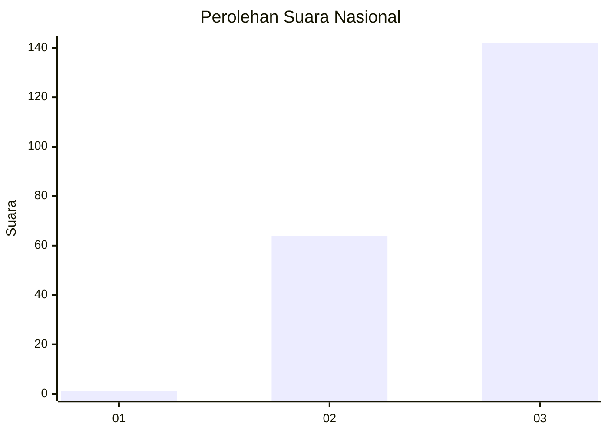
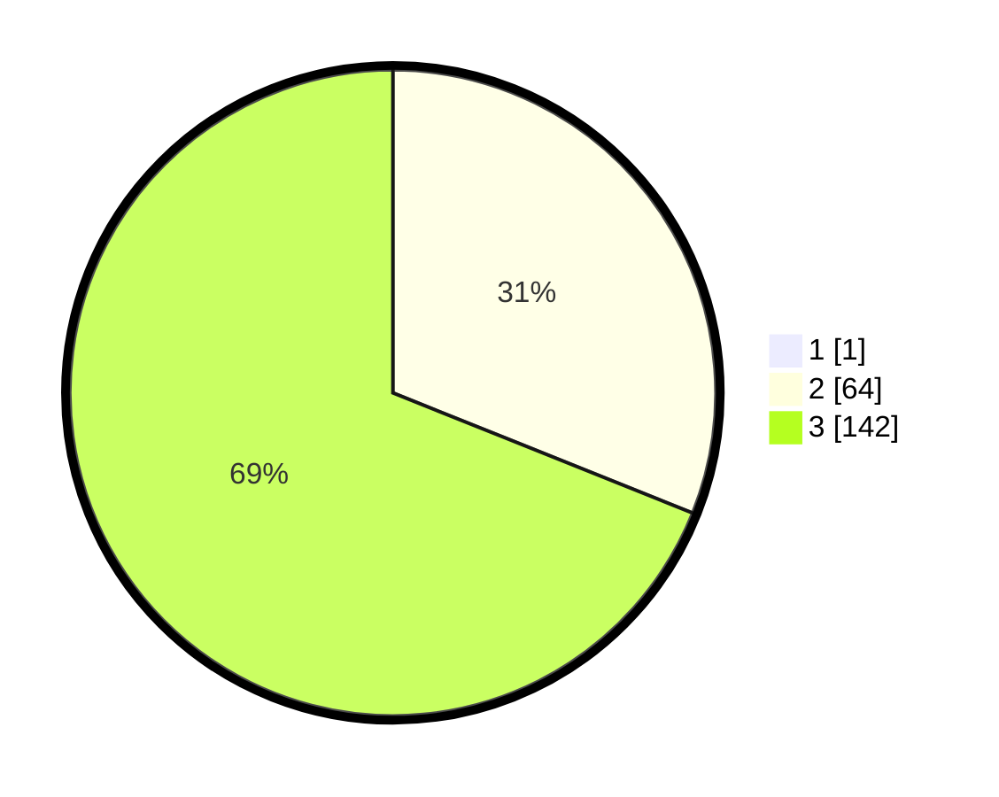

# Hasil

## Grafik

## Tabel

| No. | Nama Paslon    | Suara | Suara (raw) | Persentase |
|:--- |:-------------- | -----:| -----------:| ----------:|
| 1   | ANIES MUHAIMIN | 1     | [1][p-1]    | 0,48       |
| 2   | PRABOWO GIBRAN | 64    | [64][p-2]   | 30,92      |
| 3   | GANJAR MAHFUD  | 142   | [142][p-3]  | 68,60      |

[p-1]: https://github.com/gigit-pemilu/pemilu-2024/blob/main/pilpres/hitung-suara/sub/51-bali/sub/07-karangasem/sub/03-manggis/sub/2012-sengkidu/sub/003-tps/sub/paslon-1.txt
[p-2]: https://github.com/gigit-pemilu/pemilu-2024/blob/main/pilpres/hitung-suara/sub/51-bali/sub/07-karangasem/sub/03-manggis/sub/2012-sengkidu/sub/003-tps/sub/paslon-2.txt
[p-3]: https://github.com/gigit-pemilu/pemilu-2024/blob/main/pilpres/hitung-suara/sub/51-bali/sub/07-karangasem/sub/03-manggis/sub/2012-sengkidu/sub/003-tps/sub/paslon-3.txt

## Foto C Plano

https://sirekap-obj-formc.kpu.go.id/6fc2/pemilu/ppwp/51/07/03/20/12/5107032012003-20240220-160643--e92143f0-7e71-4c20-8764-a877abac5fb9.jpg

https://sirekap-obj-formc.kpu.go.id/6fc2/pemilu/ppwp/51/07/03/20/12/5107032012003-20240220-161022--cff7f6a3-f987-4322-9d10-08fc672d8331.jpg

https://sirekap-obj-formc.kpu.go.id/6fc2/pemilu/ppwp/51/07/03/20/12/5107032012003-20240220-161153--f980f8d1-5649-4371-a8ca-1883727a47c9.jpg

## Metadata

| Key        | Value               |
| ---------- | ------------------- |
| Time Stamp | 2024-02-24 22:31:28 |

