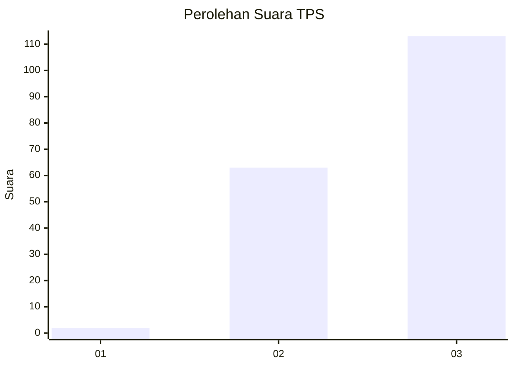
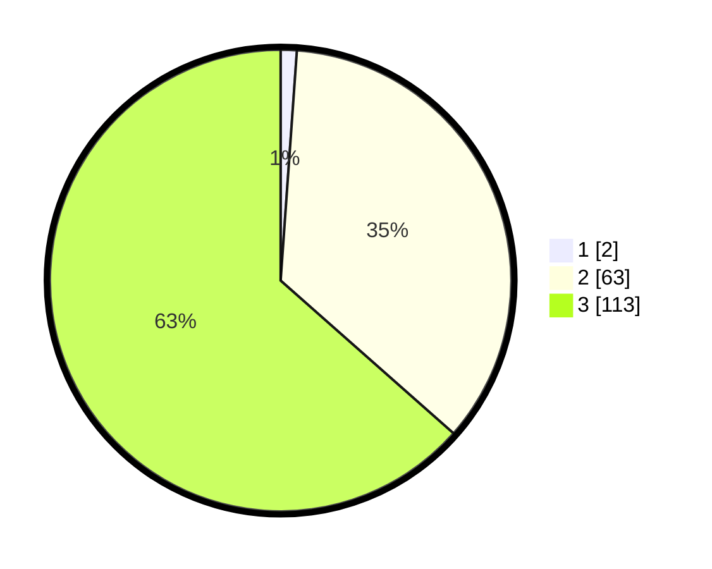

# Hasil

## Grafik

## Tabel

| No. | Nama Paslon    | Suara | Suara (raw) | Persentase |
|:--- |:-------------- | -----:| -----------:| ----------:|
| 1   | ANIES MUHAIMIN | 2     | [2][p-1]    | 1,12       |
| 2   | PRABOWO GIBRAN | 63    | [63][p-2]   | 35,39      |
| 3   | GANJAR MAHFUD  | 113   | [113][p-3]  | 63,48      |

[p-1]: https://github.com/gigit-pemilu/pemilu-2024-51-bali/blob/main/pilpres/hitung-suara/sub/51-bali/sub/07-karangasem/sub/03-manggis/sub/2012-sengkidu/sub/006-tps/sub/paslon-1.txt
[p-2]: https://github.com/gigit-pemilu/pemilu-2024-51-bali/blob/main/pilpres/hitung-suara/sub/51-bali/sub/07-karangasem/sub/03-manggis/sub/2012-sengkidu/sub/006-tps/sub/paslon-2.txt
[p-3]: https://github.com/gigit-pemilu/pemilu-2024-51-bali/blob/main/pilpres/hitung-suara/sub/51-bali/sub/07-karangasem/sub/03-manggis/sub/2012-sengkidu/sub/006-tps/sub/paslon-3.txt

## Foto C Plano

https://sirekap-obj-formc.kpu.go.id/0617/pemilu/ppwp/51/07/03/20/12/5107032012006-20240214-141055--f82b4e49-3901-4f93-98a8-29e9fa557b6f.jpg

https://sirekap-obj-formc.kpu.go.id/0617/pemilu/ppwp/51/07/03/20/12/5107032012006-20240214-141105--f8574c6a-6e86-4775-a5c8-ec86d30853d9.jpg

https://sirekap-obj-formc.kpu.go.id/0617/pemilu/ppwp/51/07/03/20/12/5107032012006-20240214-141041--2859d2fd-3641-4cd4-9faf-05ecbe07afab.jpg

## Metadata

| Key        | Value               |
| ---------- | ------------------- |
| Time Stamp | 2024-02-16 12:51:22 |

