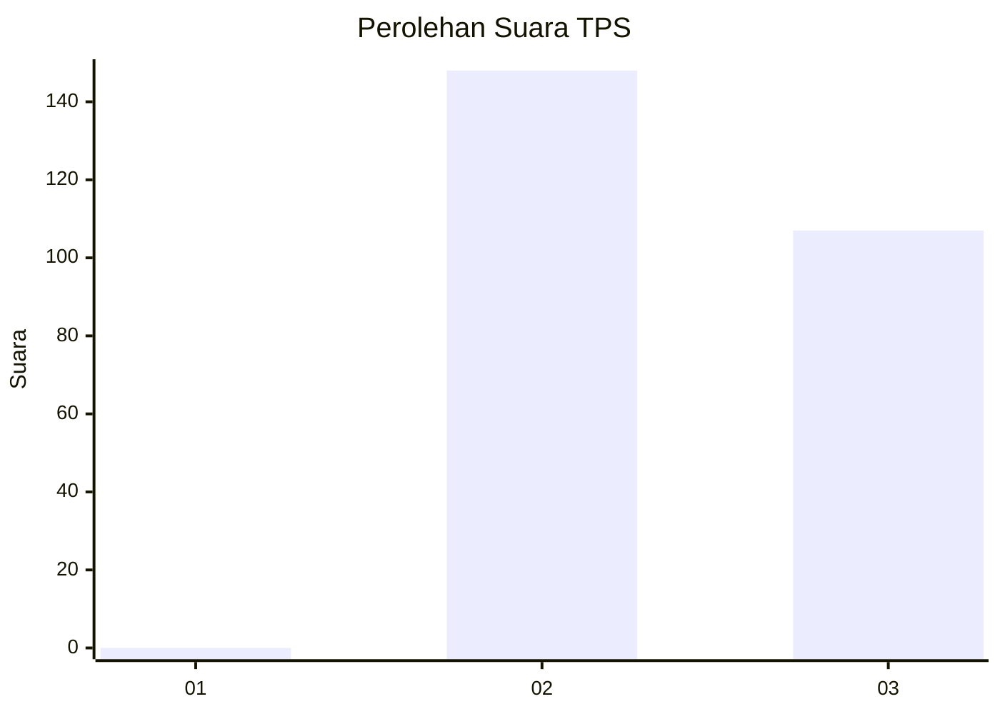
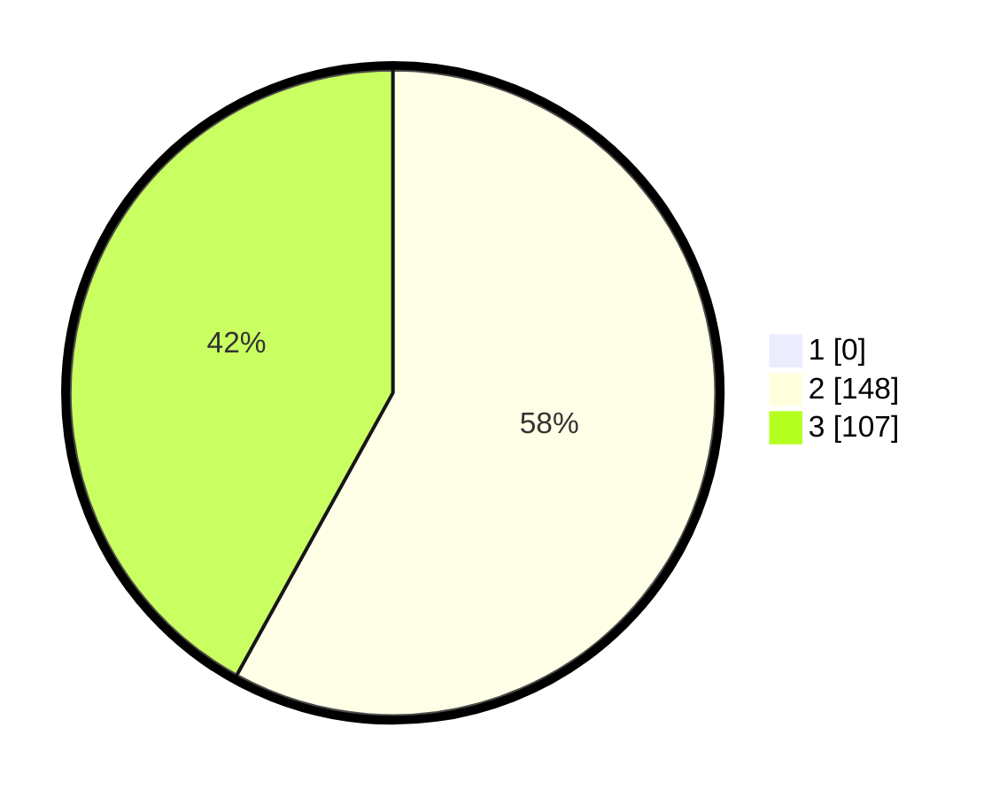

# Hasil

## Grafik

## Tabel

| No. | Nama Paslon    | Suara | Suara (raw) | Persentase |
|:--- |:-------------- | -----:| -----------:| ----------:|
| 1   | ANIES MUHAIMIN | 0     | [0][p-1]    | 0,00       |
| 2   | PRABOWO GIBRAN | 148   | [148][p-2]  | 58,04      |
| 3   | GANJAR MAHFUD  | 107   | [107][p-3]  | 41,96      |

[p-1]: https://github.com/gigit-pemilu/pemilu-2024-51-bali/blob/main/pilpres/hitung-suara/sub/51-bali/sub/07-karangasem/sub/04-karangasem/sub/1002-subagan/sub/001-tps/sub/paslon-1.txt
[p-2]: https://github.com/gigit-pemilu/pemilu-2024-51-bali/blob/main/pilpres/hitung-suara/sub/51-bali/sub/07-karangasem/sub/04-karangasem/sub/1002-subagan/sub/001-tps/sub/paslon-2.txt
[p-3]: https://github.com/gigit-pemilu/pemilu-2024-51-bali/blob/main/pilpres/hitung-suara/sub/51-bali/sub/07-karangasem/sub/04-karangasem/sub/1002-subagan/sub/001-tps/sub/paslon-3.txt

## Foto C Plano

https://sirekap-obj-formc.kpu.go.id/b253/pemilu/ppwp/51/07/04/10/02/5107041002001-20240216-062132--1950f1c4-be2c-4598-9792-b91bfb491e70.jpg

https://sirekap-obj-formc.kpu.go.id/b253/pemilu/ppwp/51/07/04/10/02/5107041002001-20240216-062133--93e3f527-a40d-4482-ab37-97047c62511c.jpg

https://sirekap-obj-formc.kpu.go.id/b253/pemilu/ppwp/51/07/04/10/02/5107041002001-20240216-062132--e53e3562-71b9-44da-a7f4-39608377c942.jpg

## Metadata

| Key        | Value               |
| ---------- | ------------------- |
| Time Stamp | 2024-02-16 10:00:28 |

## DATA PEMILIH TETAP

Jumlah pemilih dalam DPT: **263**.
 * L: **135**.
 * P: **128**.

## DATA PENGGUNA HAK PILIH

Jumlah pengguna hak pilih dalam DPT: **245**.
 * L: **126**.
 * P: **119**.

Jumlah pengguna hak pilih dalam DPTb: **0**.
 * L: **0**.
 * P: **0**.

Jumlah pengguna hak pilih dalam DPK: **17**.
 * L: **7**.
 * P: **70**.

Jumlah pengguna hak pilih: **262**.
 * L: **133**.
 * P: **129**.

## JUMLAH SUARA SAH DAN TIDAK SAH

JUMLAH SELURUH SUARA SAH: **255**.

JUMLAH SUARA TIDAK SAH: **7**.

JUMLAH SELURUH SUARA SAH DAN SUARA TIDAK SAH: **262**.

