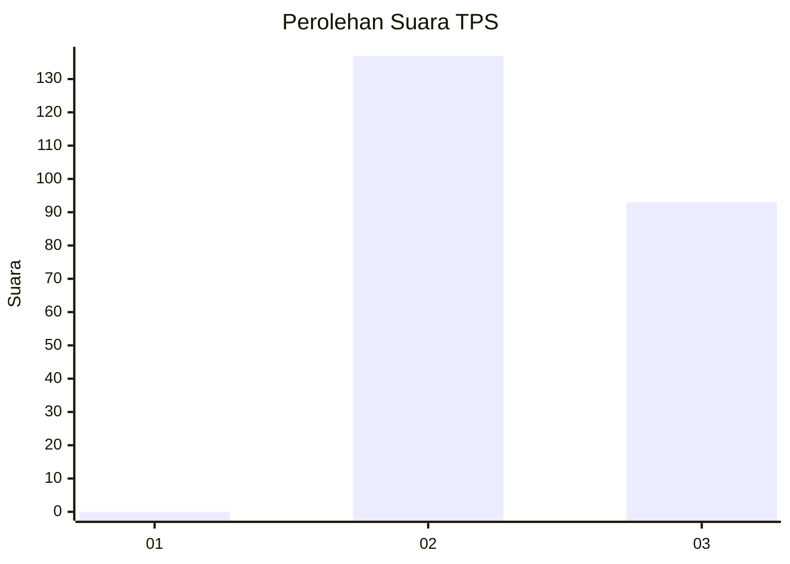
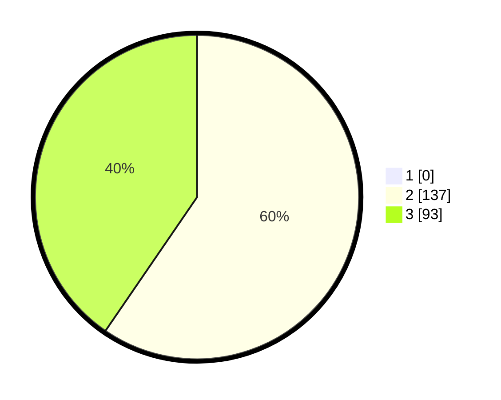

# Hasil

## Grafik

## Tabel

| No. | Nama Paslon    | Suara | Suara (raw) | Persentase |
|:--- |:-------------- | -----:| -----------:| ----------:|
| 1   | ANIES MUHAIMIN | 0     | [0][p-1]    | 0,00       |
| 2   | PRABOWO GIBRAN | 137   | [137][p-2]  | 59,57      |
| 3   | GANJAR MAHFUD  | 93    | [93][p-3]   | 40,43      |

[p-1]: https://github.com/gigit-pemilu/pemilu-2024-51-bali/blob/main/pilpres/hitung-suara/sub/51-bali/sub/07-karangasem/sub/04-karangasem/sub/1002-subagan/sub/006-tps/sub/paslon-1.txt
[p-2]: https://github.com/gigit-pemilu/pemilu-2024-51-bali/blob/main/pilpres/hitung-suara/sub/51-bali/sub/07-karangasem/sub/04-karangasem/sub/1002-subagan/sub/006-tps/sub/paslon-2.txt
[p-3]: https://github.com/gigit-pemilu/pemilu-2024-51-bali/blob/main/pilpres/hitung-suara/sub/51-bali/sub/07-karangasem/sub/04-karangasem/sub/1002-subagan/sub/006-tps/sub/paslon-3.txt

## Foto C Plano

https://sirekap-obj-formc.kpu.go.id/91ef/pemilu/ppwp/51/07/04/10/02/5107041002006-20240214-132911--b0d66db8-1302-4097-981e-16f34285112d.jpg

https://sirekap-obj-formc.kpu.go.id/91ef/pemilu/ppwp/51/07/04/10/02/5107041002006-20240214-133000--f851a2cf-3094-4595-b0b4-142125f859d0.jpg

https://sirekap-obj-formc.kpu.go.id/91ef/pemilu/ppwp/51/07/04/10/02/5107041002006-20240214-133041--ae9f88ed-4ebd-4a53-88c1-03ad013ad4a7.jpg

## Metadata

| Key        | Value               |
| ---------- | ------------------- |
| Time Stamp | 2024-02-14 21:46:01 |

## DATA PEMILIH TETAP

Jumlah pemilih dalam DPT: **250**.
 * L: **126**.
 * P: **124**.

## DATA PENGGUNA HAK PILIH

Jumlah pengguna hak pilih dalam DPT: **227**.
 * L: **114**.
 * P: **113**.

Jumlah pengguna hak pilih dalam DPTb: **0**.
 * L: **0**.
 * P: **0**.

Jumlah pengguna hak pilih dalam DPK: **7**.
 * L: **3**.
 * P: **4**.

Jumlah pengguna hak pilih: **234**.
 * L: **117**.
 * P: **117**.

## JUMLAH SUARA SAH DAN TIDAK SAH

JUMLAH SELURUH SUARA SAH: **230**.

JUMLAH SUARA TIDAK SAH: **4**.

JUMLAH SELURUH SUARA SAH DAN SUARA TIDAK SAH: **234**.

