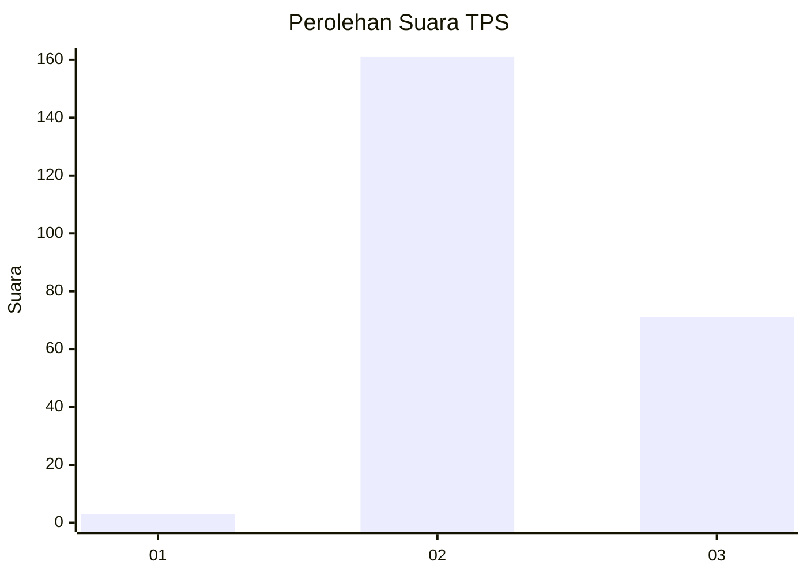

# Hasil

## Grafik

## Tabel

| No. | Nama Paslon    | Suara | Suara (raw) | Persentase |
|:--- |:-------------- | -----:| -----------:| ----------:|
| 1   | ANIES MUHAIMIN | 3     | [3][p-1]    | 1,28       |
| 2   | PRABOWO GIBRAN | 161   | [161][p-2]  | 68,51      |
| 3   | GANJAR MAHFUD  | 71    | [71][p-3]   | 30,21      |

[p-1]: https://github.com/gigit-pemilu/pemilu-2024-51-bali/blob/main/pilpres/hitung-suara/sub/51-bali/sub/07-karangasem/sub/04-karangasem/sub/1002-subagan/sub/009-tps/sub/paslon-1.txt
[p-2]: https://github.com/gigit-pemilu/pemilu-2024-51-bali/blob/main/pilpres/hitung-suara/sub/51-bali/sub/07-karangasem/sub/04-karangasem/sub/1002-subagan/sub/009-tps/sub/paslon-2.txt
[p-3]: https://github.com/gigit-pemilu/pemilu-2024-51-bali/blob/main/pilpres/hitung-suara/sub/51-bali/sub/07-karangasem/sub/04-karangasem/sub/1002-subagan/sub/009-tps/sub/paslon-3.txt

## Foto C Plano

https://sirekap-obj-formc.kpu.go.id/30c0/pemilu/ppwp/51/07/04/10/02/5107041002009-20240214-203830--d667c011-2fcd-426a-a202-188525920000.jpg

https://sirekap-obj-formc.kpu.go.id/30c0/pemilu/ppwp/51/07/04/10/02/5107041002009-20240214-203926--25866d48-22e8-46b0-8345-71fc95714d12.jpg

https://sirekap-obj-formc.kpu.go.id/30c0/pemilu/ppwp/51/07/04/10/02/5107041002009-20240214-204008--64fef7c9-d672-4cd5-b670-f1262c31afe0.jpg

## Metadata

| Key        | Value               |
| ---------- | ------------------- |
| Time Stamp | 2024-02-17 16:00:02 |

