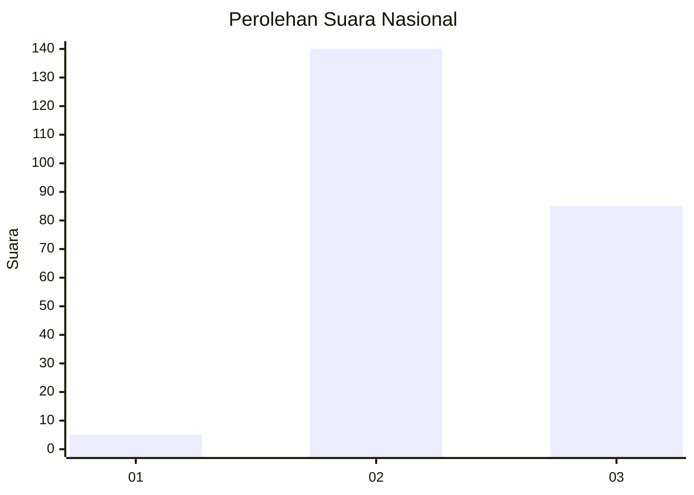
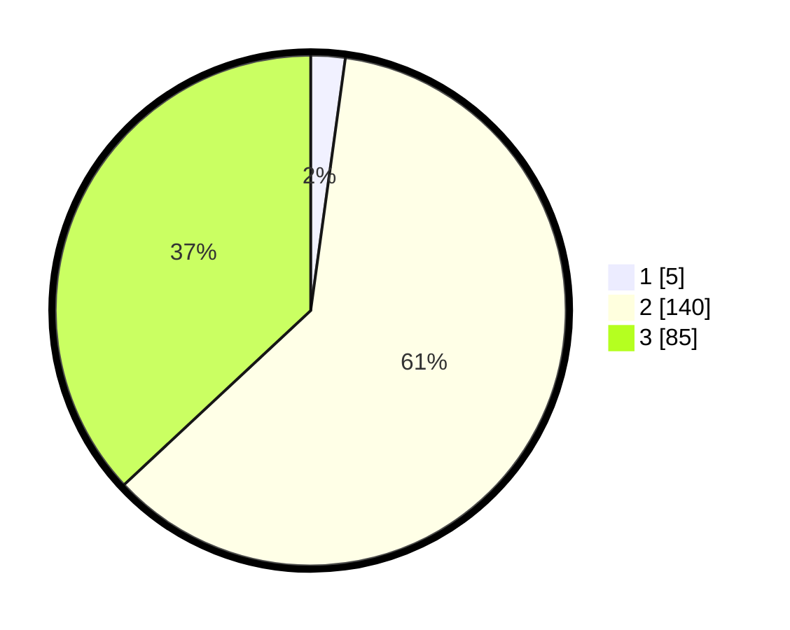

# Hasil

## Grafik

## Tabel

| No. | Nama Paslon    | Suara | Suara (raw) | Persentase |
|:--- |:-------------- | -----:| -----------:| ----------:|
| 1   | ANIES MUHAIMIN | 5     | [5][p-1]    | 2,17       |
| 2   | PRABOWO GIBRAN | 140   | [140][p-2]  | 60,87      |
| 3   | GANJAR MAHFUD  | 85    | [85][p-3]   | 36,96      |

[p-1]: https://github.com/gigit-pemilu/pemilu-2024/blob/main/pilpres/hitung-suara/sub/51-bali/sub/07-karangasem/sub/04-karangasem/sub/1002-subagan/sub/010-tps/sub/paslon-1.txt
[p-2]: https://github.com/gigit-pemilu/pemilu-2024/blob/main/pilpres/hitung-suara/sub/51-bali/sub/07-karangasem/sub/04-karangasem/sub/1002-subagan/sub/010-tps/sub/paslon-2.txt
[p-3]: https://github.com/gigit-pemilu/pemilu-2024/blob/main/pilpres/hitung-suara/sub/51-bali/sub/07-karangasem/sub/04-karangasem/sub/1002-subagan/sub/010-tps/sub/paslon-3.txt

## Foto C Plano

https://sirekap-obj-formc.kpu.go.id/6fb6/pemilu/ppwp/51/07/04/10/02/5107041002010-20240214-222143--8e850af2-7010-45f4-b8cf-9ce012870c6f.jpg

https://sirekap-obj-formc.kpu.go.id/6fb6/pemilu/ppwp/51/07/04/10/02/5107041002010-20240214-221946--9ce71607-28b9-4fbf-aee4-31bb27423d38.jpg

https://sirekap-obj-formc.kpu.go.id/6fb6/pemilu/ppwp/51/07/04/10/02/5107041002010-20240214-221759--621f9b31-e4ea-4089-82eb-11e076324654.jpg

## Metadata

| Key        | Value               |
| ---------- | ------------------- |
| Time Stamp | 2024-02-17 16:00:02 |

