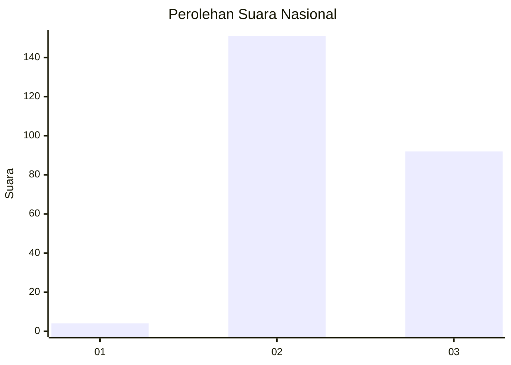
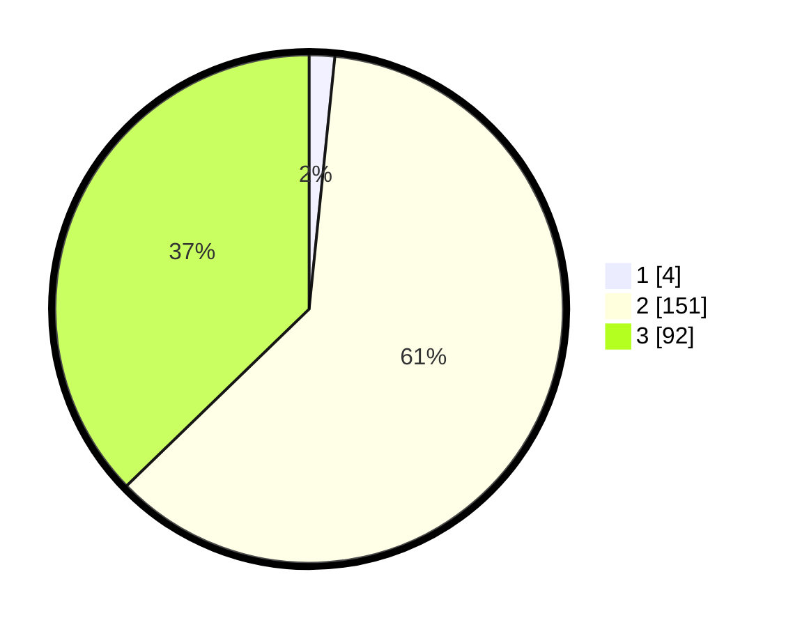

# Hasil

## Grafik

## Tabel

| No. | Nama Paslon    | Suara | Suara (raw) | Persentase |
|:--- |:-------------- | -----:| -----------:| ----------:|
| 1   | ANIES MUHAIMIN | 4     | [4][p-1]    | 1,62       |
| 2   | PRABOWO GIBRAN | 151   | [151][p-2]  | 61,13      |
| 3   | GANJAR MAHFUD  | 92    | [92][p-3]   | 37,25      |

[p-1]: https://github.com/gigit-pemilu/pemilu-2024/blob/main/pilpres/hitung-suara/sub/51-bali/sub/07-karangasem/sub/04-karangasem/sub/1002-subagan/sub/011-tps/sub/paslon-1.txt
[p-2]: https://github.com/gigit-pemilu/pemilu-2024/blob/main/pilpres/hitung-suara/sub/51-bali/sub/07-karangasem/sub/04-karangasem/sub/1002-subagan/sub/011-tps/sub/paslon-2.txt
[p-3]: https://github.com/gigit-pemilu/pemilu-2024/blob/main/pilpres/hitung-suara/sub/51-bali/sub/07-karangasem/sub/04-karangasem/sub/1002-subagan/sub/011-tps/sub/paslon-3.txt

## Foto C Plano

https://sirekap-obj-formc.kpu.go.id/8138/pemilu/ppwp/51/07/04/10/02/5107041002011-20240214-192743--295d454e-a172-467e-b1db-e25a270f9666.jpg

https://sirekap-obj-formc.kpu.go.id/8138/pemilu/ppwp/51/07/04/10/02/5107041002011-20240214-193250--53f7eb8e-ea49-437f-807c-4eb473652c1a.jpg

https://sirekap-obj-formc.kpu.go.id/8138/pemilu/ppwp/51/07/04/10/02/5107041002011-20240214-193452--6f791985-4b1a-4af1-933f-96b0d92f8b50.jpg

## Metadata

| Key        | Value               |
| ---------- | ------------------- |
| Time Stamp | 2024-02-14 21:46:01 |

## DATA PEMILIH TETAP

Jumlah pemilih dalam DPT: **275**.
 * L: **141**.
 * P: **134**.

## DATA PENGGUNA HAK PILIH

Jumlah pengguna hak pilih dalam DPT: **248**.
 * L: **127**.
 * P: **121**.

Jumlah pengguna hak pilih dalam DPTb: **10**.
 * L: **3**.
 * P: **7**.

Jumlah pengguna hak pilih dalam DPK: **2**.
 * L: **1**.
 * P: **1**.

Jumlah pengguna hak pilih: **260**.
 * L: **131**.
 * P: **129**.

## JUMLAH SUARA SAH DAN TIDAK SAH

JUMLAH SELURUH SUARA SAH: **247**.

JUMLAH SUARA TIDAK SAH: **13**.

JUMLAH SELURUH SUARA SAH DAN SUARA TIDAK SAH: **260**.

