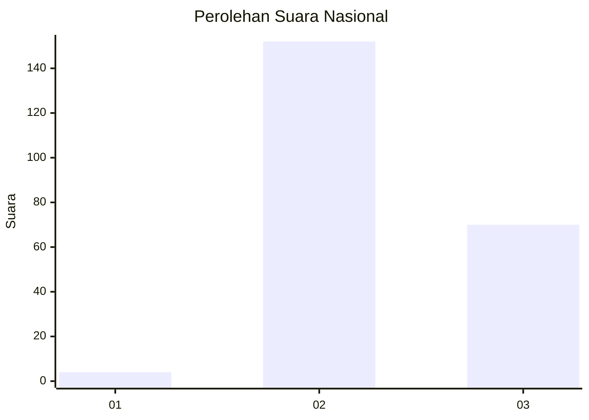
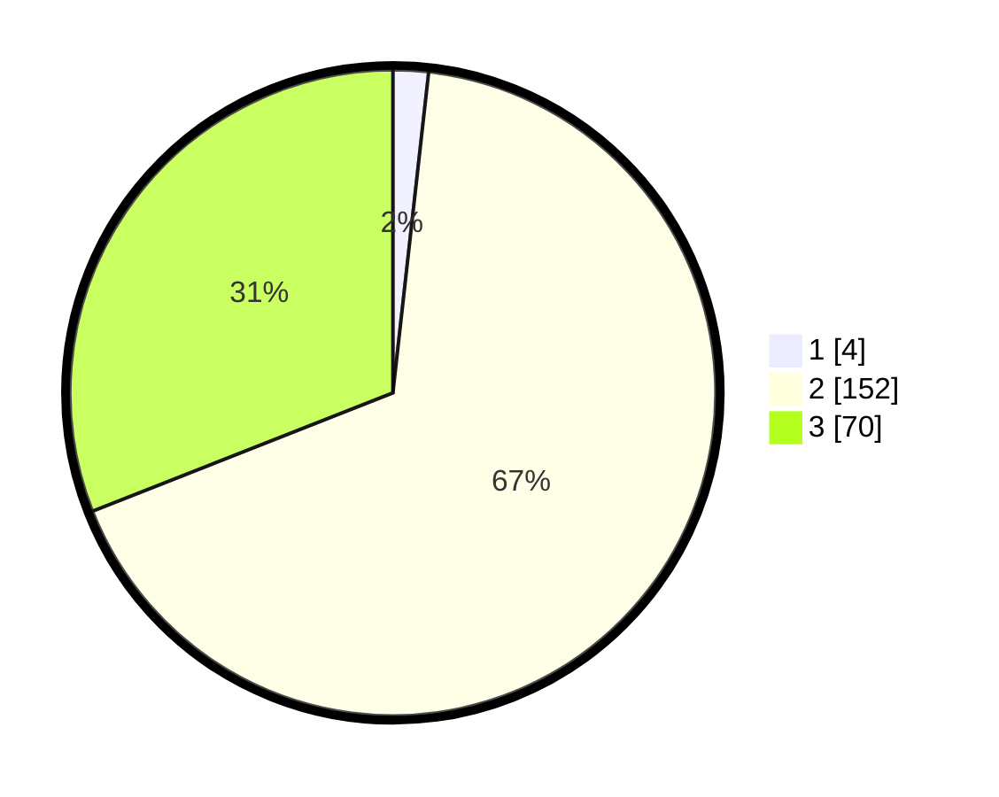

# Hasil

## Grafik

## Tabel

| No. | Nama Paslon    | Suara | Suara (raw) | Persentase |
|:--- |:-------------- | -----:| -----------:| ----------:|
| 1   | ANIES MUHAIMIN | 4     | [4][p-1]    | 1,77       |
| 2   | PRABOWO GIBRAN | 152   | [152][p-2]  | 67,26      |
| 3   | GANJAR MAHFUD  | 70    | [70][p-3]   | 30,97      |

[p-1]: https://github.com/gigit-pemilu/pemilu-2024/blob/main/pilpres/hitung-suara/sub/51-bali/sub/07-karangasem/sub/04-karangasem/sub/1002-subagan/sub/019-tps/sub/paslon-1.txt
[p-2]: https://github.com/gigit-pemilu/pemilu-2024/blob/main/pilpres/hitung-suara/sub/51-bali/sub/07-karangasem/sub/04-karangasem/sub/1002-subagan/sub/019-tps/sub/paslon-2.txt
[p-3]: https://github.com/gigit-pemilu/pemilu-2024/blob/main/pilpres/hitung-suara/sub/51-bali/sub/07-karangasem/sub/04-karangasem/sub/1002-subagan/sub/019-tps/sub/paslon-3.txt

## Foto C Plano

https://sirekap-obj-formc.kpu.go.id/2598/pemilu/ppwp/51/07/04/10/02/5107041002019-20240215-063433--b58ef9f3-5597-448a-99bd-cb26a18b4d9f.jpg

https://sirekap-obj-formc.kpu.go.id/2598/pemilu/ppwp/51/07/04/10/02/5107041002019-20240215-063922--4cf49c7e-1b0c-4be9-9196-8509bc98c0e4.jpg

https://sirekap-obj-formc.kpu.go.id/2598/pemilu/ppwp/51/07/04/10/02/5107041002019-20240215-063941--5cef98f8-0d63-4ba5-b0e4-1d5bf896c00b.jpg

## Metadata

| Key        | Value               |
| ---------- | ------------------- |
| Time Stamp | 2024-02-17 16:00:02 |

