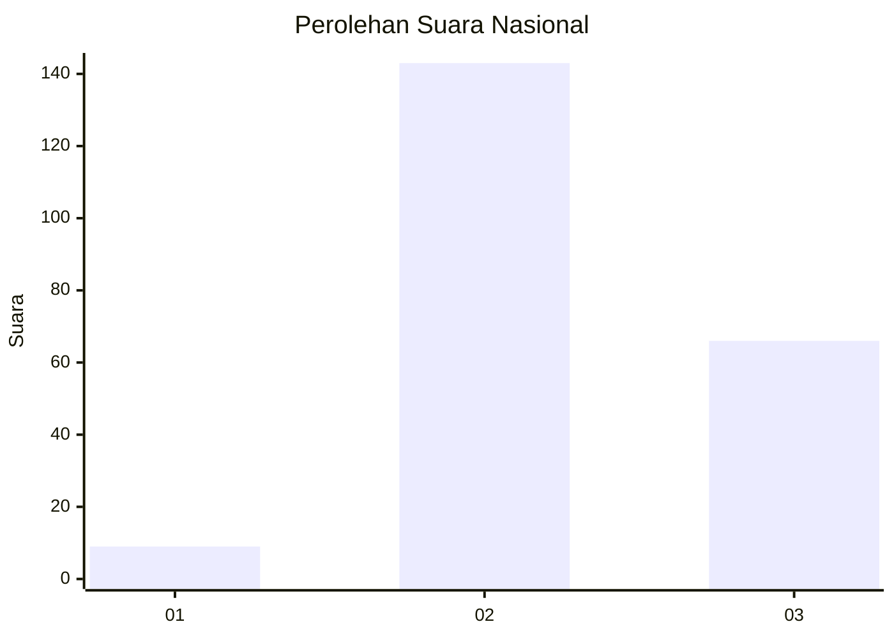

# Hasil

## Grafik

## Tabel

| No. | Nama Paslon    | Suara | Suara (raw) | Persentase |
|:--- |:-------------- | -----:| -----------:| ----------:|
| 1   | ANIES MUHAIMIN | 9     | [9][p-1]    | 4,13       |
| 2   | PRABOWO GIBRAN | 143   | [143][p-2]  | 65,60      |
| 3   | GANJAR MAHFUD  | 66    | [66][p-3]   | 30,28      |

[p-1]: https://github.com/gigit-pemilu/pemilu-2024/blob/main/pilpres/hitung-suara/sub/51-bali/sub/07-karangasem/sub/04-karangasem/sub/1002-subagan/sub/021-tps/sub/paslon-1.txt
[p-2]: https://github.com/gigit-pemilu/pemilu-2024/blob/main/pilpres/hitung-suara/sub/51-bali/sub/07-karangasem/sub/04-karangasem/sub/1002-subagan/sub/021-tps/sub/paslon-2.txt
[p-3]: https://github.com/gigit-pemilu/pemilu-2024/blob/main/pilpres/hitung-suara/sub/51-bali/sub/07-karangasem/sub/04-karangasem/sub/1002-subagan/sub/021-tps/sub/paslon-3.txt

## Foto C Plano

https://sirekap-obj-formc.kpu.go.id/3e00/pemilu/ppwp/51/07/04/10/02/5107041002021-20240214-223051--656be51d-cb9f-47e7-a722-db066f04631c.jpg

https://sirekap-obj-formc.kpu.go.id/3e00/pemilu/ppwp/51/07/04/10/02/5107041002021-20240214-223056--9bfbb900-ce80-4aff-b5a9-c84988db31b0.jpg

https://sirekap-obj-formc.kpu.go.id/3e00/pemilu/ppwp/51/07/04/10/02/5107041002021-20240214-223100--1073f4ed-726a-4093-9afa-51b821e6e4f3.jpg

## Metadata

| Key        | Value               |
| ---------- | ------------------- |
| Time Stamp | 2024-02-19 06:16:00 |

