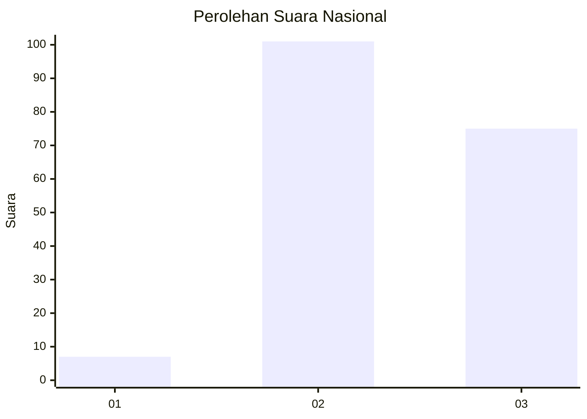
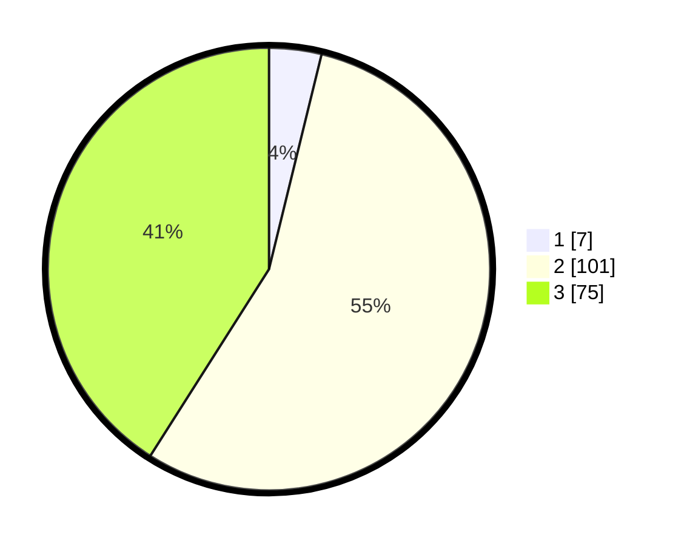

# Hasil

## Grafik

## Tabel

| No. | Nama Paslon    | Suara | Suara (raw) | Persentase |
|:--- |:-------------- | -----:| -----------:| ----------:|
| 1   | ANIES MUHAIMIN | 7     | [7][p-1]    | 3,83       |
| 2   | PRABOWO GIBRAN | 101   | [101][p-2]  | 55,19      |
| 3   | GANJAR MAHFUD  | 75    | [75][p-3]   | 40,98      |

[p-1]: https://github.com/gigit-pemilu/pemilu-2024/blob/main/pilpres/hitung-suara/sub/51-bali/sub/07-karangasem/sub/04-karangasem/sub/1002-subagan/sub/032-tps/sub/paslon-1.txt
[p-2]: https://github.com/gigit-pemilu/pemilu-2024/blob/main/pilpres/hitung-suara/sub/51-bali/sub/07-karangasem/sub/04-karangasem/sub/1002-subagan/sub/032-tps/sub/paslon-2.txt
[p-3]: https://github.com/gigit-pemilu/pemilu-2024/blob/main/pilpres/hitung-suara/sub/51-bali/sub/07-karangasem/sub/04-karangasem/sub/1002-subagan/sub/032-tps/sub/paslon-3.txt

## Foto C Plano

https://sirekap-obj-formc.kpu.go.id/3e92/pemilu/ppwp/51/07/04/10/02/5107041002032-20240215-093424--9d181b84-7987-4408-b765-c734ec3a5439.jpg

https://sirekap-obj-formc.kpu.go.id/3e92/pemilu/ppwp/51/07/04/10/02/5107041002032-20240215-094547--4a1db707-6ca7-48b2-87ac-2b772f09d5e2.jpg

https://sirekap-obj-formc.kpu.go.id/3e92/pemilu/ppwp/51/07/04/10/02/5107041002032-20240215-094651--809e1e86-fea0-41a8-8762-bca38f44abf6.jpg

## Metadata

| Key        | Value               |
| ---------- | ------------------- |
| Time Stamp | 2024-02-25 12:00:00 |

