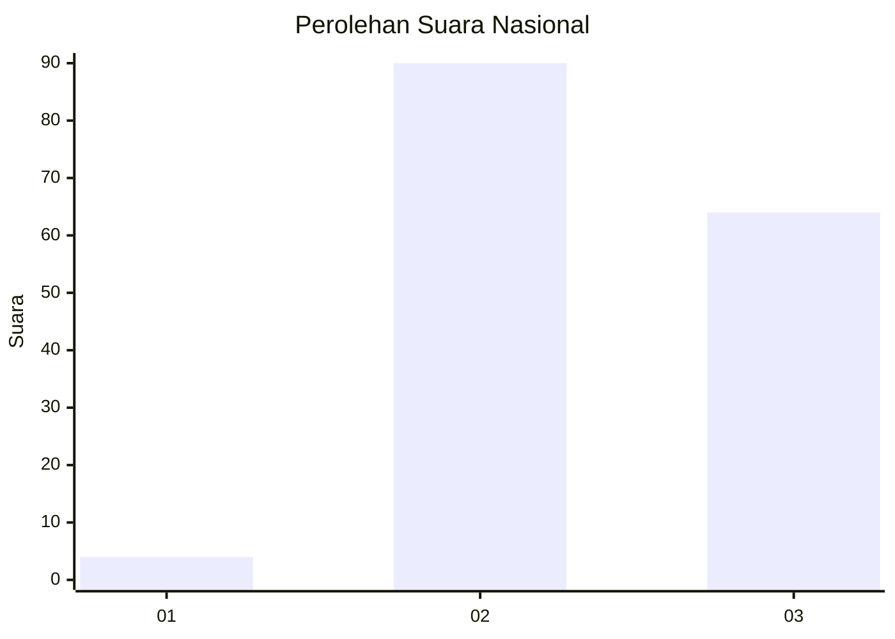
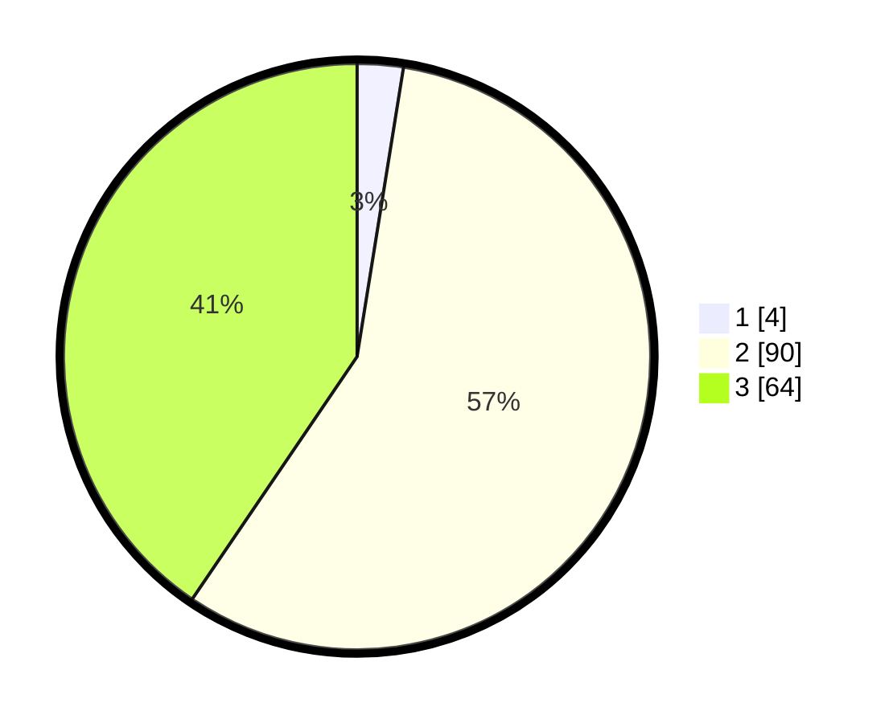

# Hasil

## Grafik

## Tabel

| No. | Nama Paslon    | Suara | Suara (raw) | Persentase |
|:--- |:-------------- | -----:| -----------:| ----------:|
| 1   | ANIES MUHAIMIN | 4     | [4][p-1]    | 2,53       |
| 2   | PRABOWO GIBRAN | 90    | [90][p-2]   | 56,96      |
| 3   | GANJAR MAHFUD  | 64    | [64][p-3]   | 40,51      |

[p-1]: https://github.com/gigit-pemilu/pemilu-2024/blob/main/pilpres/hitung-suara/sub/51-bali/sub/07-karangasem/sub/04-karangasem/sub/1002-subagan/sub/033-tps/sub/paslon-1.txt
[p-2]: https://github.com/gigit-pemilu/pemilu-2024/blob/main/pilpres/hitung-suara/sub/51-bali/sub/07-karangasem/sub/04-karangasem/sub/1002-subagan/sub/033-tps/sub/paslon-2.txt
[p-3]: https://github.com/gigit-pemilu/pemilu-2024/blob/main/pilpres/hitung-suara/sub/51-bali/sub/07-karangasem/sub/04-karangasem/sub/1002-subagan/sub/033-tps/sub/paslon-3.txt

## Foto C Plano

https://sirekap-obj-formc.kpu.go.id/b0f6/pemilu/ppwp/51/07/04/10/02/5107041002033-20240214-195411--8a9204cf-4635-46e2-82dd-4e75534097f5.jpg

https://sirekap-obj-formc.kpu.go.id/b0f6/pemilu/ppwp/51/07/04/10/02/5107041002033-20240214-195250--c7296164-9a17-4969-a924-9f922c816dea.jpg

https://sirekap-obj-formc.kpu.go.id/b0f6/pemilu/ppwp/51/07/04/10/02/5107041002033-20240214-194842--0fdce03c-d732-4bee-915f-1b5098270dae.jpg

## Metadata

| Key        | Value               |
| ---------- | ------------------- |
| Time Stamp | 2024-02-17 16:00:02 |

