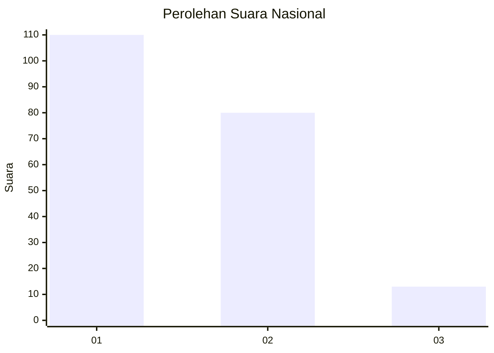
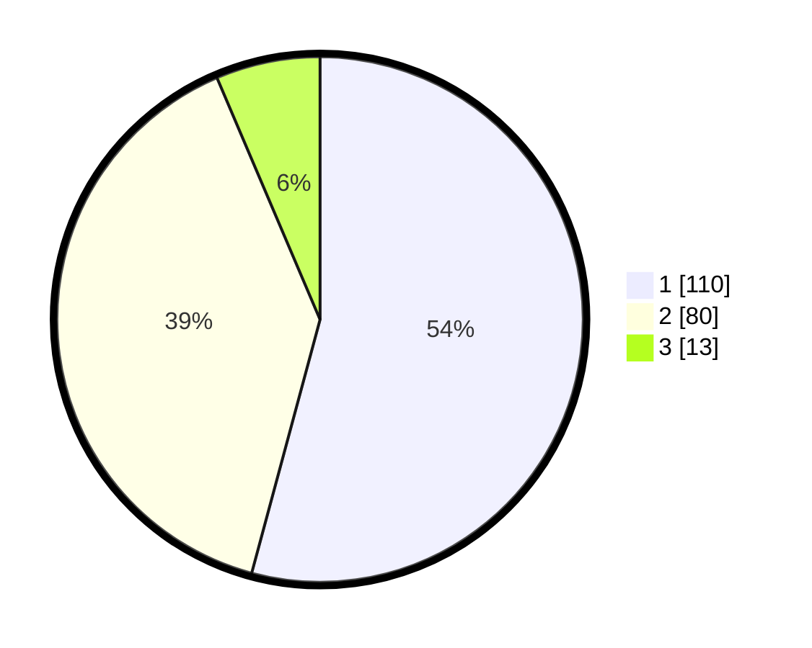

# Hasil

## Grafik

## Tabel

| No. | Nama Paslon    | Suara | Suara (raw) | Persentase |
|:--- |:-------------- | -----:| -----------:| ----------:|
| 1   | ANIES MUHAIMIN | 110   | [110][p-1]  | 54,19      |
| 2   | PRABOWO GIBRAN | 80    | [80][p-2]   | 39,41      |
| 3   | GANJAR MAHFUD  | 13    | [13][p-3]   | 6,40       |

[p-1]: https://github.com/gigit-pemilu/pemilu-2024/blob/main/pilpres/hitung-suara/sub/51-bali/sub/07-karangasem/sub/04-karangasem/sub/1002-subagan/sub/036-tps/sub/paslon-1.txt
[p-2]: https://github.com/gigit-pemilu/pemilu-2024/blob/main/pilpres/hitung-suara/sub/51-bali/sub/07-karangasem/sub/04-karangasem/sub/1002-subagan/sub/036-tps/sub/paslon-2.txt
[p-3]: https://github.com/gigit-pemilu/pemilu-2024/blob/main/pilpres/hitung-suara/sub/51-bali/sub/07-karangasem/sub/04-karangasem/sub/1002-subagan/sub/036-tps/sub/paslon-3.txt

## Foto C Plano

https://sirekap-obj-formc.kpu.go.id/947d/pemilu/ppwp/51/07/04/10/02/5107041002036-20240215-011452--241e4125-7094-413d-933b-980ef4a0343b.jpg

https://sirekap-obj-formc.kpu.go.id/947d/pemilu/ppwp/51/07/04/10/02/5107041002036-20240215-011538--cd5a7894-692e-4b1f-9e4f-f6bd06ed17ce.jpg

https://sirekap-obj-formc.kpu.go.id/947d/pemilu/ppwp/51/07/04/10/02/5107041002036-20240215-011559--da8219e5-cc8c-4b6e-bc83-e07e6cecef9a.jpg

## Metadata

| Key        | Value               |
| ---------- | ------------------- |
| Time Stamp | 2024-02-17 16:00:02 |

