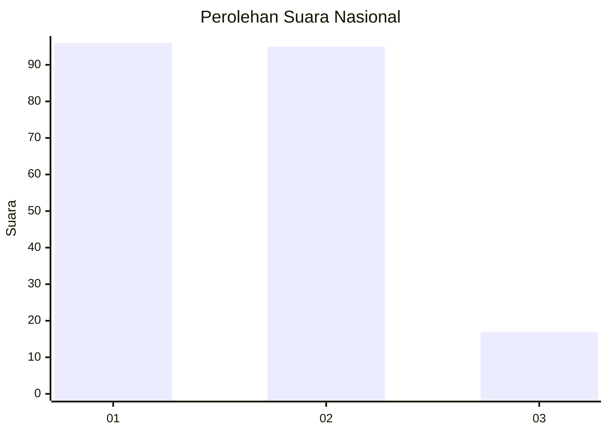
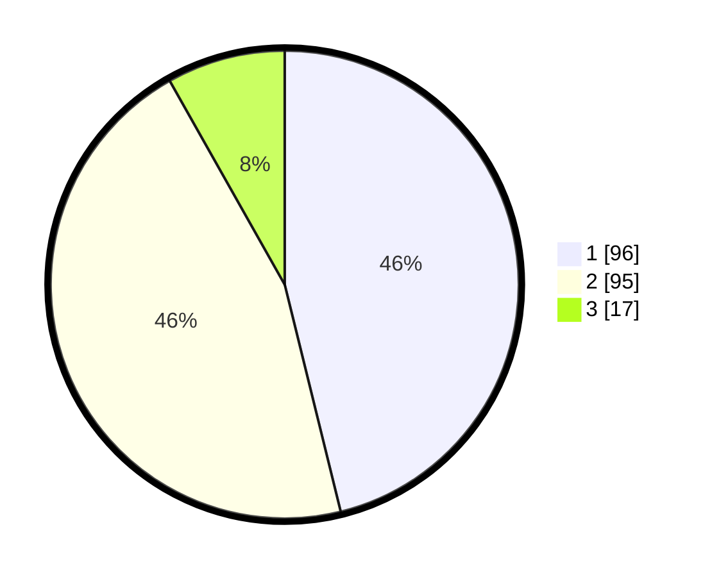

# Hasil

## Grafik

## Tabel

| No. | Nama Paslon    | Suara | Suara (raw) | Persentase |
|:--- |:-------------- | -----:| -----------:| ----------:|
| 1   | ANIES MUHAIMIN | 96    | [96][p-1]   | 46,15      |
| 2   | PRABOWO GIBRAN | 95    | [95][p-2]   | 45,67      |
| 3   | GANJAR MAHFUD  | 17    | [17][p-3]   | 8,17       |

[p-1]: https://github.com/gigit-pemilu/pemilu-2024/blob/main/pilpres/hitung-suara/sub/51-bali/sub/07-karangasem/sub/04-karangasem/sub/1002-subagan/sub/041-tps/sub/paslon-1.txt
[p-2]: https://github.com/gigit-pemilu/pemilu-2024/blob/main/pilpres/hitung-suara/sub/51-bali/sub/07-karangasem/sub/04-karangasem/sub/1002-subagan/sub/041-tps/sub/paslon-2.txt
[p-3]: https://github.com/gigit-pemilu/pemilu-2024/blob/main/pilpres/hitung-suara/sub/51-bali/sub/07-karangasem/sub/04-karangasem/sub/1002-subagan/sub/041-tps/sub/paslon-3.txt

## Foto C Plano

https://sirekap-obj-formc.kpu.go.id/fbb8/pemilu/ppwp/51/07/04/10/02/5107041002041-20240215-030941--dfe86c03-56f0-4928-8471-e767951f3d11.jpg

https://sirekap-obj-formc.kpu.go.id/fbb8/pemilu/ppwp/51/07/04/10/02/5107041002041-20240215-031002--898e903b-ba1c-49c2-894e-74c0f1240fb8.jpg

https://sirekap-obj-formc.kpu.go.id/fbb8/pemilu/ppwp/51/07/04/10/02/5107041002041-20240215-030951--708e5fdd-b7bb-4ac4-9964-fa15b96132f1.jpg

## Metadata

| Key        | Value               |
| ---------- | ------------------- |
| Time Stamp | 2024-02-16 10:00:28 |

## DATA PEMILIH TETAP

Jumlah pemilih dalam DPT: **236**.
 * L: **118**.
 * P: **118**.

## DATA PENGGUNA HAK PILIH

Jumlah pengguna hak pilih dalam DPT: **209**.
 * L: **107**.
 * P: **102**.

Jumlah pengguna hak pilih dalam DPTb: **0**.
 * L: **0**.
 * P: **0**.

Jumlah pengguna hak pilih dalam DPK: **1**.
 * L: **0**.
 * P: **1**.

Jumlah pengguna hak pilih: **210**.
 * L: **107**.
 * P: **103**.

## JUMLAH SUARA SAH DAN TIDAK SAH

JUMLAH SELURUH SUARA SAH: **208**.

JUMLAH SUARA TIDAK SAH: **2**.

JUMLAH SELURUH SUARA SAH DAN SUARA TIDAK SAH: **210**.

