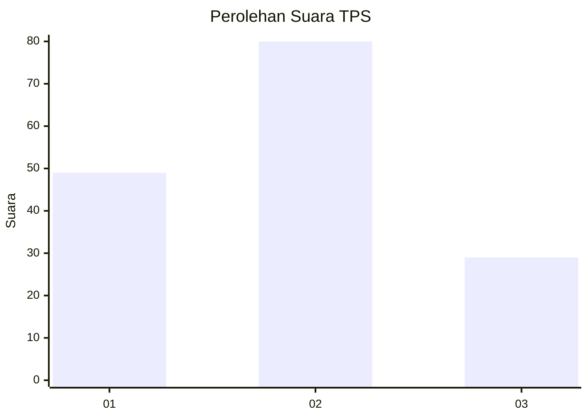
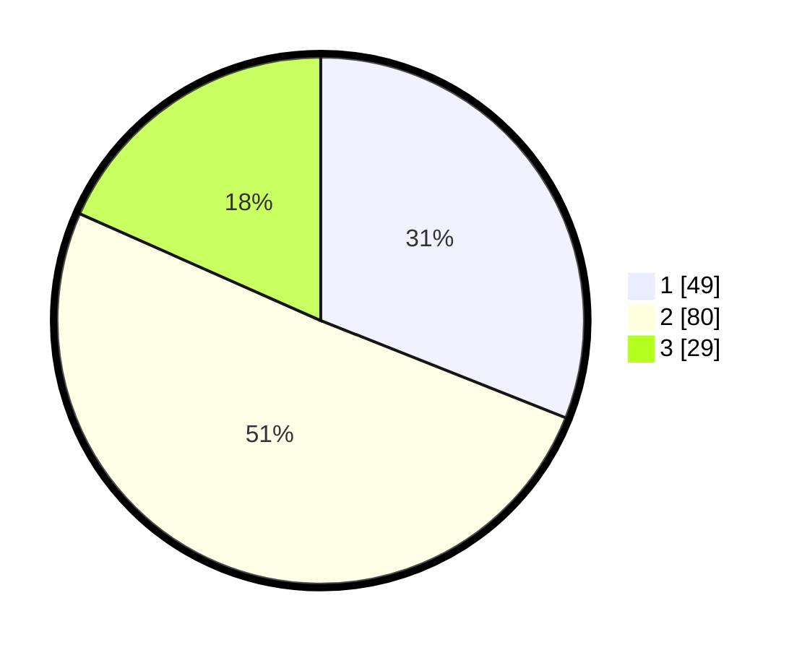

# Hasil

## Grafik

## Tabel

| No. | Nama Paslon    | Suara | Suara (raw) | Persentase |
|:--- |:-------------- | -----:| -----------:| ----------:|
| 1   | ANIES MUHAIMIN | 49    | [49][p-1]   | 31,01      |
| 2   | PRABOWO GIBRAN | 80    | [80][p-2]   | 50,63      |
| 3   | GANJAR MAHFUD  | 29    | [29][p-3]   | 18,35      |

[p-1]: https://github.com/gigit-pemilu/pemilu-2024-51-bali/blob/main/pilpres/hitung-suara/sub/51-bali/sub/07-karangasem/sub/04-karangasem/sub/1002-subagan/sub/043-tps/sub/paslon-1.txt
[p-2]: https://github.com/gigit-pemilu/pemilu-2024-51-bali/blob/main/pilpres/hitung-suara/sub/51-bali/sub/07-karangasem/sub/04-karangasem/sub/1002-subagan/sub/043-tps/sub/paslon-2.txt
[p-3]: https://github.com/gigit-pemilu/pemilu-2024-51-bali/blob/main/pilpres/hitung-suara/sub/51-bali/sub/07-karangasem/sub/04-karangasem/sub/1002-subagan/sub/043-tps/sub/paslon-3.txt

## Foto C Plano

https://sirekap-obj-formc.kpu.go.id/3d64/pemilu/ppwp/51/07/04/10/02/5107041002043-20240216-003731--af18704d-9af8-4e52-aa6d-bd69bf44e095.jpg

https://sirekap-obj-formc.kpu.go.id/3d64/pemilu/ppwp/51/07/04/10/02/5107041002043-20240216-003733--d5016b2a-921e-46e1-8404-4cbc44fd5c60.jpg

https://sirekap-obj-formc.kpu.go.id/3d64/pemilu/ppwp/51/07/04/10/02/5107041002043-20240216-003732--02dfa525-dc9d-4c3b-89be-b8fe79d9b068.jpg

## Metadata

| Key        | Value               |
| ---------- | ------------------- |
| Time Stamp | 2024-02-16 10:00:28 |

## DATA PEMILIH TETAP

Jumlah pemilih dalam DPT: **163**.
 * L: **78**.
 * P: **85**.

## DATA PENGGUNA HAK PILIH

Jumlah pengguna hak pilih dalam DPT: **159**.
 * L: **76**.
 * P: **83**.

Jumlah pengguna hak pilih dalam DPTb: **3**.
 * L: **2**.
 * P: **1**.

Jumlah pengguna hak pilih dalam DPK: **1**.
 * L: **0**.
 * P: **1**.

Jumlah pengguna hak pilih: **163**.
 * L: **78**.
 * P: **85**.

## JUMLAH SUARA SAH DAN TIDAK SAH

JUMLAH SELURUH SUARA SAH: **158**.

JUMLAH SUARA TIDAK SAH: **5**.

JUMLAH SELURUH SUARA SAH DAN SUARA TIDAK SAH: **163**.

