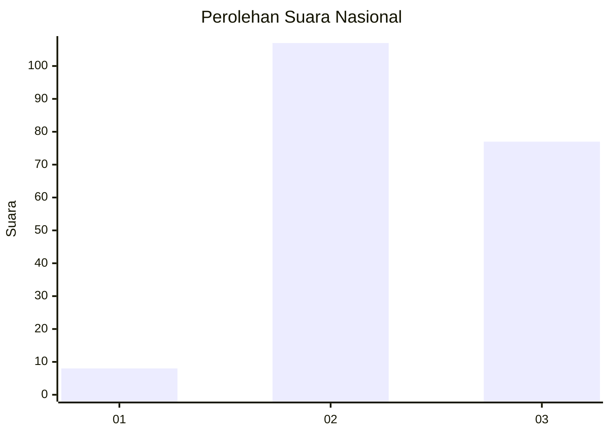
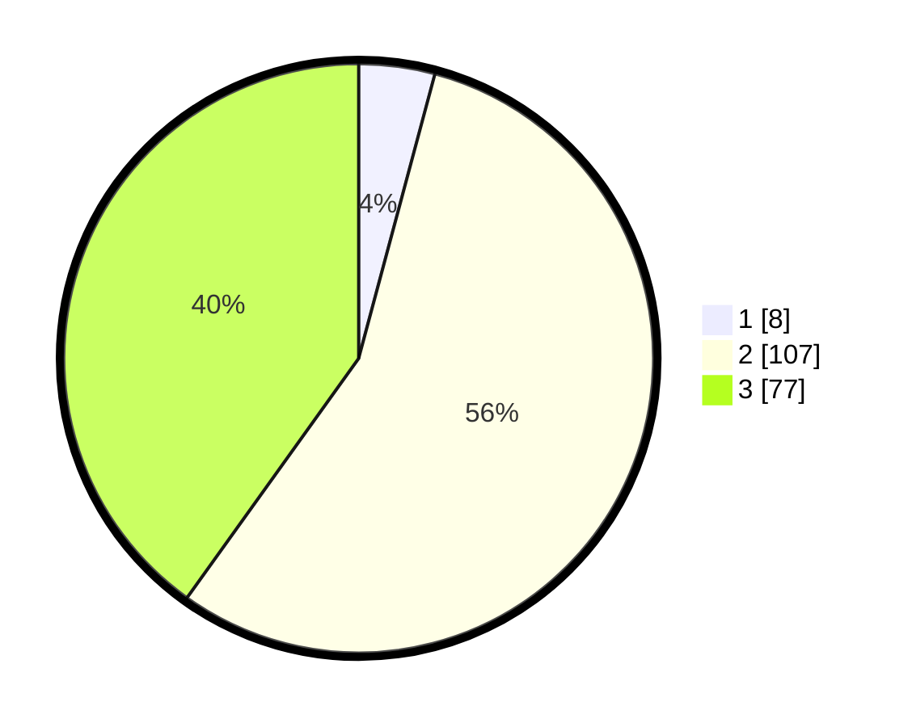

# Hasil

## Grafik

## Tabel

| No. | Nama Paslon    | Suara | Suara (raw) | Persentase |
|:--- |:-------------- | -----:| -----------:| ----------:|
| 1   | ANIES MUHAIMIN | 8     | [8][p-1]    | 4,17       |
| 2   | PRABOWO GIBRAN | 107   | [107][p-2]  | 55,73      |
| 3   | GANJAR MAHFUD  | 77    | [77][p-3]   | 40,10      |

[p-1]: https://github.com/gigit-pemilu/pemilu-2024/blob/main/pilpres/hitung-suara/sub/51-bali/sub/07-karangasem/sub/04-karangasem/sub/1002-subagan/sub/051-tps/sub/paslon-1.txt
[p-2]: https://github.com/gigit-pemilu/pemilu-2024/blob/main/pilpres/hitung-suara/sub/51-bali/sub/07-karangasem/sub/04-karangasem/sub/1002-subagan/sub/051-tps/sub/paslon-2.txt
[p-3]: https://github.com/gigit-pemilu/pemilu-2024/blob/main/pilpres/hitung-suara/sub/51-bali/sub/07-karangasem/sub/04-karangasem/sub/1002-subagan/sub/051-tps/sub/paslon-3.txt

## Foto C Plano

https://sirekap-obj-formc.kpu.go.id/dae7/pemilu/ppwp/51/07/04/10/02/5107041002051-20240216-145321--68e212a6-6d7c-40f5-bc79-b0f45769a6e8.jpg

https://sirekap-obj-formc.kpu.go.id/dae7/pemilu/ppwp/51/07/04/10/02/5107041002051-20240216-145323--349322f5-8117-4f8a-be40-5b3f5f3982dd.jpg

https://sirekap-obj-formc.kpu.go.id/dae7/pemilu/ppwp/51/07/04/10/02/5107041002051-20240216-145322--b3f0797e-5f8c-4b0a-a005-5fbc49ceaa09.jpg

## Metadata

| Key        | Value               |
| ---------- | ------------------- |
| Time Stamp | 2024-02-17 10:30:03 |

## DATA PEMILIH TETAP

Jumlah pemilih dalam DPT: **274**.
 * L: **122**.
 * P: **152**.

## DATA PENGGUNA HAK PILIH

Jumlah pengguna hak pilih dalam DPT: **193**.
 * L: **88**.
 * P: **105**.

Jumlah pengguna hak pilih dalam DPTb: **0**.
 * L: **0**.
 * P: **0**.

Jumlah pengguna hak pilih dalam DPK: **0**.
 * L: **0**.
 * P: **0**.

Jumlah pengguna hak pilih: **193**.
 * L: **88**.
 * P: **105**.

## JUMLAH SUARA SAH DAN TIDAK SAH

JUMLAH SELURUH SUARA SAH: **192**.

JUMLAH SUARA TIDAK SAH: **1**.

JUMLAH SELURUH SUARA SAH DAN SUARA TIDAK SAH: **193**.

