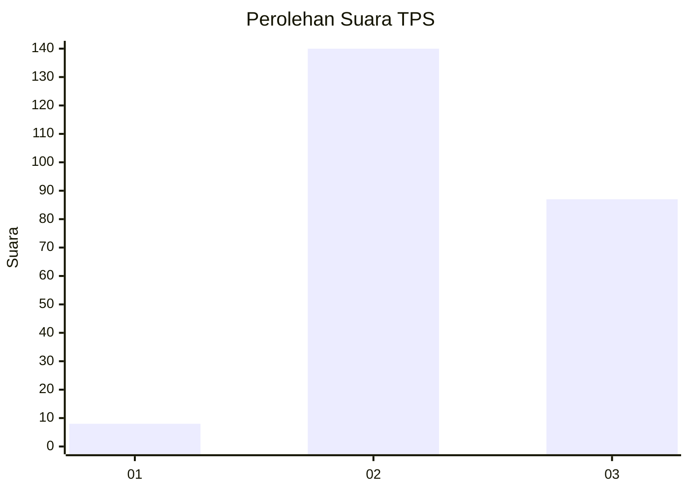
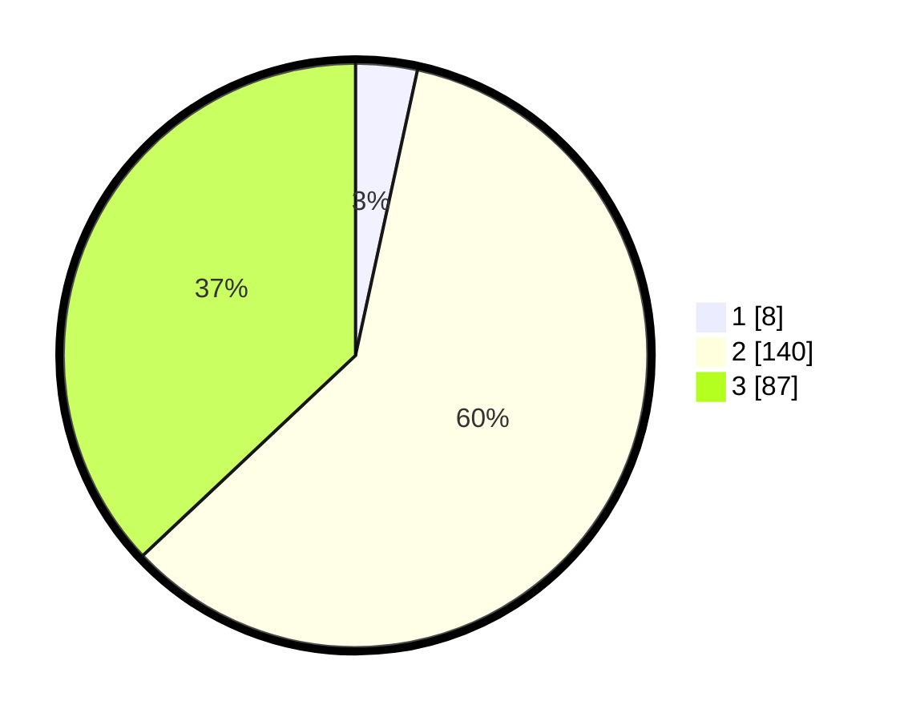

# Hasil

## Grafik

## Tabel

| No. | Nama Paslon    | Suara | Suara (raw) | Persentase |
|:--- |:-------------- | -----:| -----------:| ----------:|
| 1   | ANIES MUHAIMIN | 8     | [8][p-1]    | 3,40       |
| 2   | PRABOWO GIBRAN | 140   | [140][p-2]  | 59,57      |
| 3   | GANJAR MAHFUD  | 87    | [87][p-3]   | 37,02      |

[p-1]: https://github.com/gigit-pemilu/pemilu-2024-51-bali/blob/main/pilpres/hitung-suara/sub/51-bali/sub/07-karangasem/sub/04-karangasem/sub/1003-padangkerta/sub/005-tps/sub/paslon-1.txt
[p-2]: https://github.com/gigit-pemilu/pemilu-2024-51-bali/blob/main/pilpres/hitung-suara/sub/51-bali/sub/07-karangasem/sub/04-karangasem/sub/1003-padangkerta/sub/005-tps/sub/paslon-2.txt
[p-3]: https://github.com/gigit-pemilu/pemilu-2024-51-bali/blob/main/pilpres/hitung-suara/sub/51-bali/sub/07-karangasem/sub/04-karangasem/sub/1003-padangkerta/sub/005-tps/sub/paslon-3.txt

## Foto C Plano

https://sirekap-obj-formc.kpu.go.id/c864/pemilu/ppwp/51/07/04/10/03/5107041003005-20240215-043112--199e0276-ec80-47fa-932c-c0020b612557.jpg

https://sirekap-obj-formc.kpu.go.id/c864/pemilu/ppwp/51/07/04/10/03/5107041003005-20240215-043309--9a7377fe-02b0-4ede-a2e1-59ca3fa70fbf.jpg

https://sirekap-obj-formc.kpu.go.id/c864/pemilu/ppwp/51/07/04/10/03/5107041003005-20240215-043432--01f95a40-e5c9-47c2-92fe-b74d182b072c.jpg

## Metadata

| Key        | Value               |
| ---------- | ------------------- |
| Time Stamp | 2024-02-17 16:00:02 |

