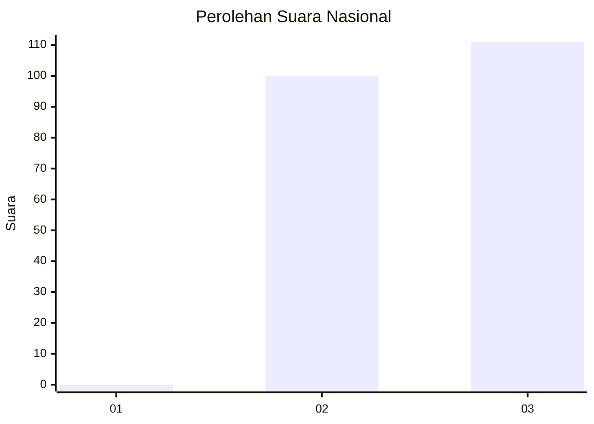
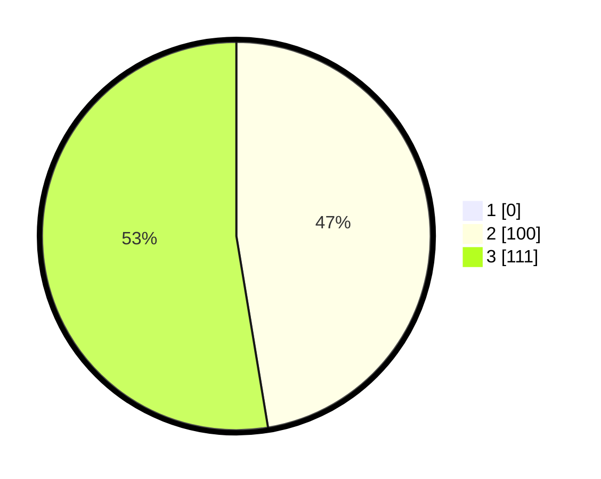

# Hasil

## Grafik

## Tabel

| No. | Nama Paslon    | Suara | Suara (raw) | Persentase |
|:--- |:-------------- | -----:| -----------:| ----------:|
| 1   | ANIES MUHAIMIN | 0     | [0][p-1]    | 0,00       |
| 2   | PRABOWO GIBRAN | 100   | [100][p-2]  | 47,39      |
| 3   | GANJAR MAHFUD  | 111   | [111][p-3]  | 52,61      |

[p-1]: https://github.com/gigit-pemilu/pemilu-2024/blob/main/pilpres/hitung-suara/sub/51-bali/sub/07-karangasem/sub/04-karangasem/sub/1003-padangkerta/sub/008-tps/sub/paslon-1.txt
[p-2]: https://github.com/gigit-pemilu/pemilu-2024/blob/main/pilpres/hitung-suara/sub/51-bali/sub/07-karangasem/sub/04-karangasem/sub/1003-padangkerta/sub/008-tps/sub/paslon-2.txt
[p-3]: https://github.com/gigit-pemilu/pemilu-2024/blob/main/pilpres/hitung-suara/sub/51-bali/sub/07-karangasem/sub/04-karangasem/sub/1003-padangkerta/sub/008-tps/sub/paslon-3.txt

## Foto C Plano

https://sirekap-obj-formc.kpu.go.id/a46c/pemilu/ppwp/51/07/04/10/03/5107041003008-20240215-015551--2acf15b4-9b40-4cd3-b465-716e7fec94b9.jpg

https://sirekap-obj-formc.kpu.go.id/a46c/pemilu/ppwp/51/07/04/10/03/5107041003008-20240215-015929--ce048239-af9e-4422-9cd2-47e9e34a0e3d.jpg

https://sirekap-obj-formc.kpu.go.id/a46c/pemilu/ppwp/51/07/04/10/03/5107041003008-20240215-020040--82d7816f-b2b9-4f6d-8683-b935290099a0.jpg

## Metadata

| Key        | Value               |
| ---------- | ------------------- |
| Time Stamp | 2024-02-17 16:00:02 |

