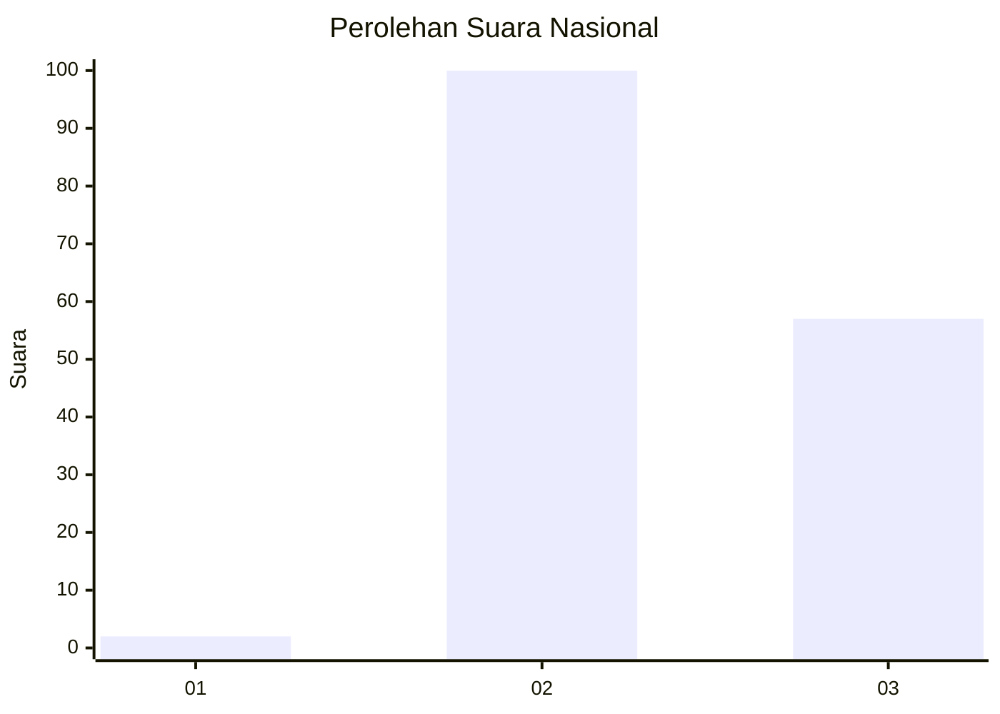
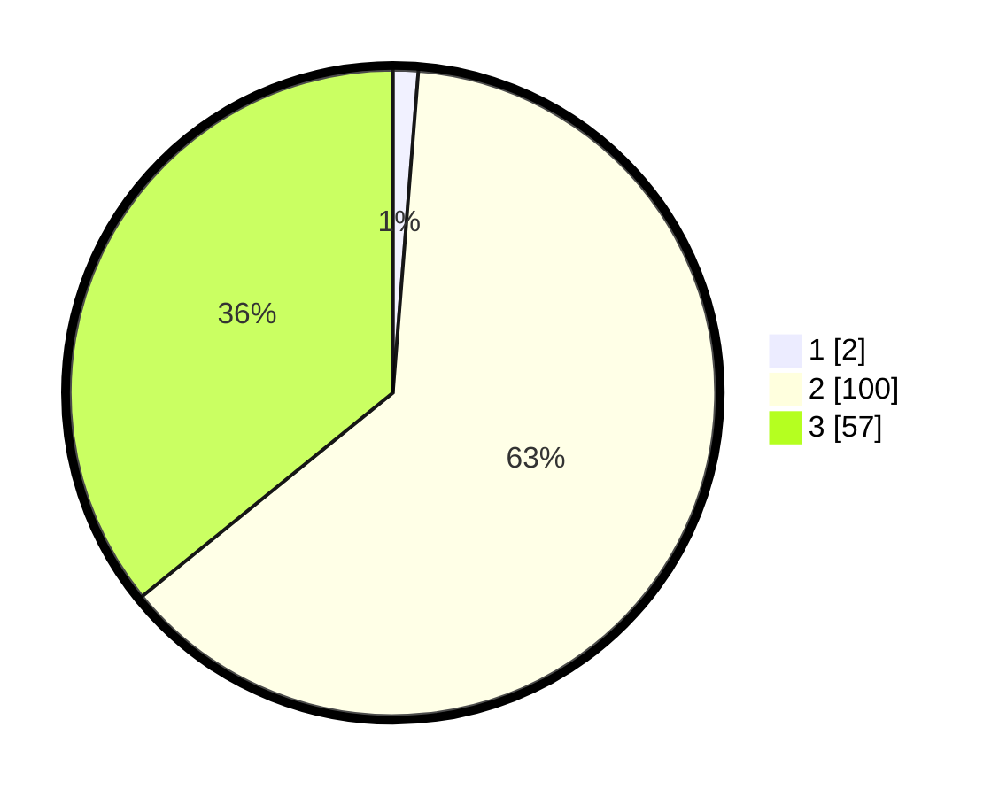

# Hasil

## Grafik

## Tabel

| No. | Nama Paslon    | Suara | Suara (raw) | Persentase |
|:--- |:-------------- | -----:| -----------:| ----------:|
| 1   | ANIES MUHAIMIN | 2     | [2][p-1]    | 1,26       |
| 2   | PRABOWO GIBRAN | 100   | [100][p-2]  | 62,89      |
| 3   | GANJAR MAHFUD  | 57    | [57][p-3]   | 35,85      |

[p-1]: https://github.com/gigit-pemilu/pemilu-2024/blob/main/pilpres/hitung-suara/sub/51-bali/sub/07-karangasem/sub/04-karangasem/sub/1003-padangkerta/sub/010-tps/sub/paslon-1.txt
[p-2]: https://github.com/gigit-pemilu/pemilu-2024/blob/main/pilpres/hitung-suara/sub/51-bali/sub/07-karangasem/sub/04-karangasem/sub/1003-padangkerta/sub/010-tps/sub/paslon-2.txt
[p-3]: https://github.com/gigit-pemilu/pemilu-2024/blob/main/pilpres/hitung-suara/sub/51-bali/sub/07-karangasem/sub/04-karangasem/sub/1003-padangkerta/sub/010-tps/sub/paslon-3.txt

## Foto C Plano

https://sirekap-obj-formc.kpu.go.id/9634/pemilu/ppwp/51/07/04/10/03/5107041003010-20240214-231740--190cbcab-390f-4669-bbc1-b682d23b821d.jpg

https://sirekap-obj-formc.kpu.go.id/9634/pemilu/ppwp/51/07/04/10/03/5107041003010-20240214-232045--fd563464-4ab5-4c30-a0fc-f4b40f5cb83b.jpg

https://sirekap-obj-formc.kpu.go.id/9634/pemilu/ppwp/51/07/04/10/03/5107041003010-20240214-232548--7b8788d5-4e21-4f55-840d-dc0e0ac8e121.jpg

## Metadata

| Key        | Value               |
| ---------- | ------------------- |
| Time Stamp | 2024-02-17 10:30:03 |

## DATA PEMILIH TETAP

Jumlah pemilih dalam DPT: **189**.
 * L: **95**.
 * P: **94**.

## DATA PENGGUNA HAK PILIH

Jumlah pengguna hak pilih dalam DPT: **158**.
 * L: **79**.
 * P: **79**.

Jumlah pengguna hak pilih dalam DPTb: **0**.
 * L: **0**.
 * P: **0**.

Jumlah pengguna hak pilih dalam DPK: **4**.
 * L: **1**.
 * P: **3**.

Jumlah pengguna hak pilih: **162**.
 * L: **80**.
 * P: **82**.

## JUMLAH SUARA SAH DAN TIDAK SAH

JUMLAH SELURUH SUARA SAH: **159**.

JUMLAH SUARA TIDAK SAH: **3**.

JUMLAH SELURUH SUARA SAH DAN SUARA TIDAK SAH: **162**.

