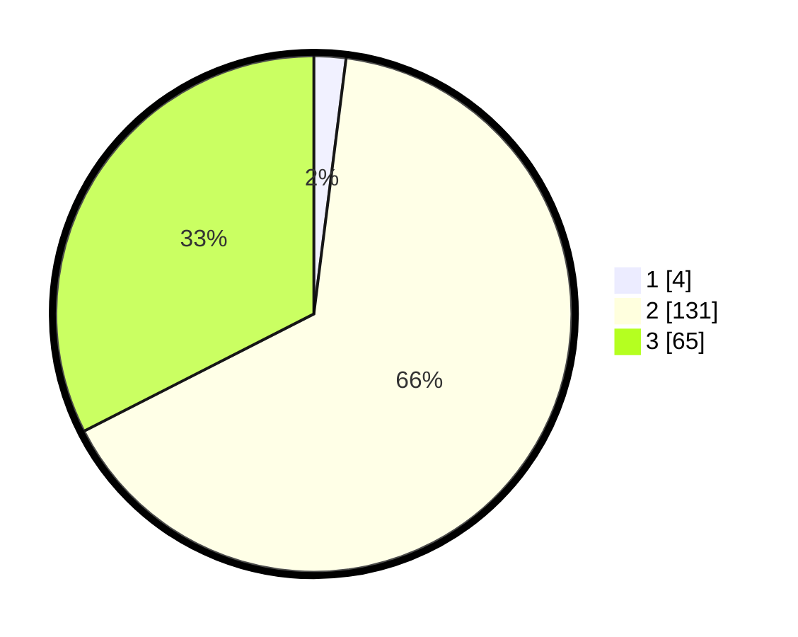

# Hasil

## Grafik

## Tabel

| No. | Nama Paslon    | Suara | Suara (raw) | Persentase |
|:--- |:-------------- | -----:| -----------:| ----------:|
| 1   | ANIES MUHAIMIN | 4     | [4][p-1]    | 2,00       |
| 2   | PRABOWO GIBRAN | 131   | [131][p-2]  | 65,50      |
| 3   | GANJAR MAHFUD  | 65    | [65][p-3]   | 32,50      |

[p-1]: https://github.com/gigit-pemilu/pemilu-2024-51-bali/blob/main/pilpres/hitung-suara/sub/51-bali/sub/07-karangasem/sub/04-karangasem/sub/1003-padangkerta/sub/016-tps/sub/paslon-1.txt
[p-2]: https://github.com/gigit-pemilu/pemilu-2024-51-bali/blob/main/pilpres/hitung-suara/sub/51-bali/sub/07-karangasem/sub/04-karangasem/sub/1003-padangkerta/sub/016-tps/sub/paslon-2.txt
[p-3]: https://github.com/gigit-pemilu/pemilu-2024-51-bali/blob/main/pilpres/hitung-suara/sub/51-bali/sub/07-karangasem/sub/04-karangasem/sub/1003-padangkerta/sub/016-tps/sub/paslon-3.txt

## Foto C Plano

https://sirekap-obj-formc.kpu.go.id/3daa/pemilu/ppwp/51/07/04/10/03/5107041003016-20240217-112700--986ea2e2-76d4-462e-8b33-01c1637ea0cf.jpg

https://sirekap-obj-formc.kpu.go.id/3daa/pemilu/ppwp/51/07/04/10/03/5107041003016-20240217-112707--7a9516bb-3033-4701-9a59-820ca99fba7c.jpg

https://sirekap-obj-formc.kpu.go.id/3daa/pemilu/ppwp/51/07/04/10/03/5107041003016-20240214-132330--cf32e452-1750-4575-a553-ca005a0f02d3.jpg

## Metadata

| Key        | Value               |
| ---------- | ------------------- |
| Time Stamp | 2024-02-17 16:00:02 |

