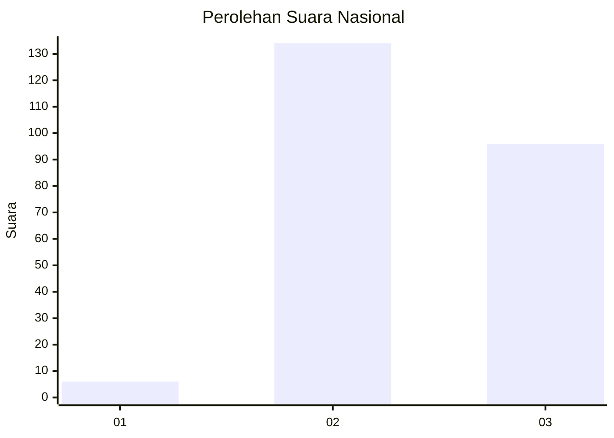
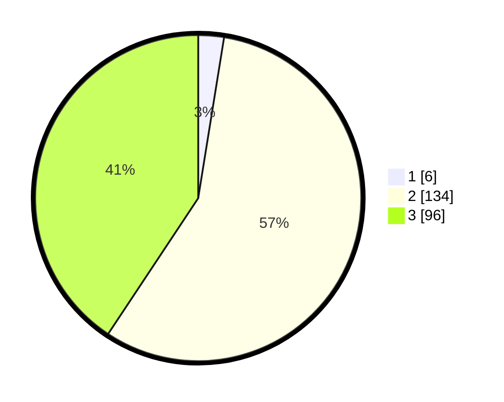

# Hasil

## Grafik

## Tabel

| No. | Nama Paslon    | Suara | Suara (raw) | Persentase |
|:--- |:-------------- | -----:| -----------:| ----------:|
| 1   | ANIES MUHAIMIN | 6     | [6][p-1]    | 2,54       |
| 2   | PRABOWO GIBRAN | 134   | [134][p-2]  | 56,78      |
| 3   | GANJAR MAHFUD  | 96    | [96][p-3]   | 40,68      |

[p-1]: https://github.com/gigit-pemilu/pemilu-2024/blob/main/pilpres/hitung-suara/sub/51-bali/sub/07-karangasem/sub/04-karangasem/sub/1004-karangasem/sub/001-tps/sub/paslon-1.txt
[p-2]: https://github.com/gigit-pemilu/pemilu-2024/blob/main/pilpres/hitung-suara/sub/51-bali/sub/07-karangasem/sub/04-karangasem/sub/1004-karangasem/sub/001-tps/sub/paslon-2.txt
[p-3]: https://github.com/gigit-pemilu/pemilu-2024/blob/main/pilpres/hitung-suara/sub/51-bali/sub/07-karangasem/sub/04-karangasem/sub/1004-karangasem/sub/001-tps/sub/paslon-3.txt

## Foto C Plano

https://sirekap-obj-formc.kpu.go.id/32c2/pemilu/ppwp/51/07/04/10/04/5107041004001-20240214-231939--a406d6ee-6e99-43a2-a2e4-ad9f9d27d488.jpg

https://sirekap-obj-formc.kpu.go.id/32c2/pemilu/ppwp/51/07/04/10/04/5107041004001-20240214-232152--82ad32c3-15fe-41b2-98da-a2b564257dbf.jpg

https://sirekap-obj-formc.kpu.go.id/32c2/pemilu/ppwp/51/07/04/10/04/5107041004001-20240214-232144--1b16b24d-af89-448a-98cf-3e32ad7850d7.jpg

## Metadata

| Key        | Value               |
| ---------- | ------------------- |
| Time Stamp | 2024-02-17 16:00:02 |

