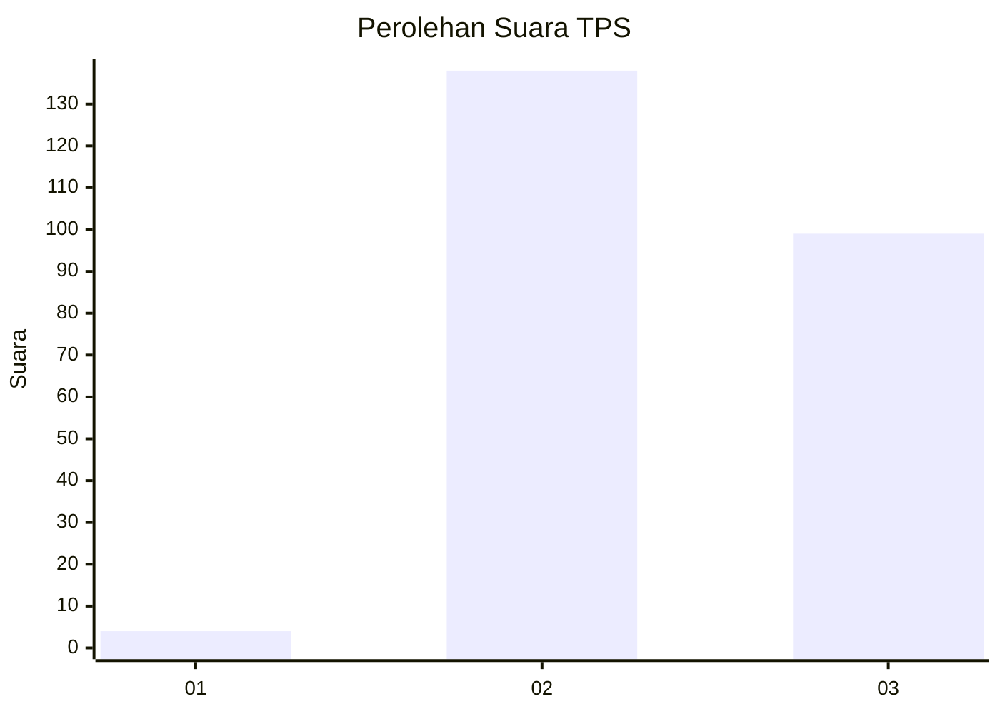
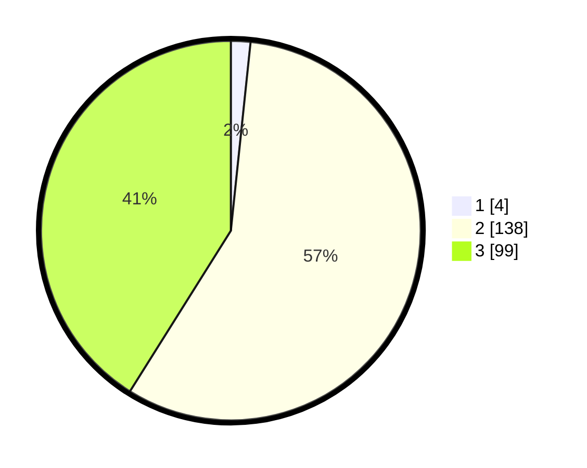

# Hasil

## Grafik

## Tabel

| No. | Nama Paslon    | Suara | Suara (raw) | Persentase |
|:--- |:-------------- | -----:| -----------:| ----------:|
| 1   | ANIES MUHAIMIN | 4     | [4][p-1]    | 1,66       |
| 2   | PRABOWO GIBRAN | 138   | [138][p-2]  | 57,26      |
| 3   | GANJAR MAHFUD  | 99    | [99][p-3]   | 41,08      |

[p-1]: https://github.com/gigit-pemilu/pemilu-2024-51-bali/blob/main/pilpres/hitung-suara/sub/51-bali/sub/07-karangasem/sub/04-karangasem/sub/1004-karangasem/sub/002-tps/sub/paslon-1.txt
[p-2]: https://github.com/gigit-pemilu/pemilu-2024-51-bali/blob/main/pilpres/hitung-suara/sub/51-bali/sub/07-karangasem/sub/04-karangasem/sub/1004-karangasem/sub/002-tps/sub/paslon-2.txt
[p-3]: https://github.com/gigit-pemilu/pemilu-2024-51-bali/blob/main/pilpres/hitung-suara/sub/51-bali/sub/07-karangasem/sub/04-karangasem/sub/1004-karangasem/sub/002-tps/sub/paslon-3.txt

## Foto C Plano

https://sirekap-obj-formc.kpu.go.id/0ee7/pemilu/ppwp/51/07/04/10/04/5107041004002-20240214-233615--c94b4263-0a37-4548-a0a0-0b8e6a8bbdcc.jpg

https://sirekap-obj-formc.kpu.go.id/0ee7/pemilu/ppwp/51/07/04/10/04/5107041004002-20240214-233826--855c5f70-c4a8-47d3-babb-fce05e660992.jpg

https://sirekap-obj-formc.kpu.go.id/0ee7/pemilu/ppwp/51/07/04/10/04/5107041004002-20240214-234001--0242c36c-84dc-4c4e-b5ea-4faa55291029.jpg

## Metadata

| Key        | Value               |
| ---------- | ------------------- |
| Time Stamp | 2024-02-17 16:00:02 |

