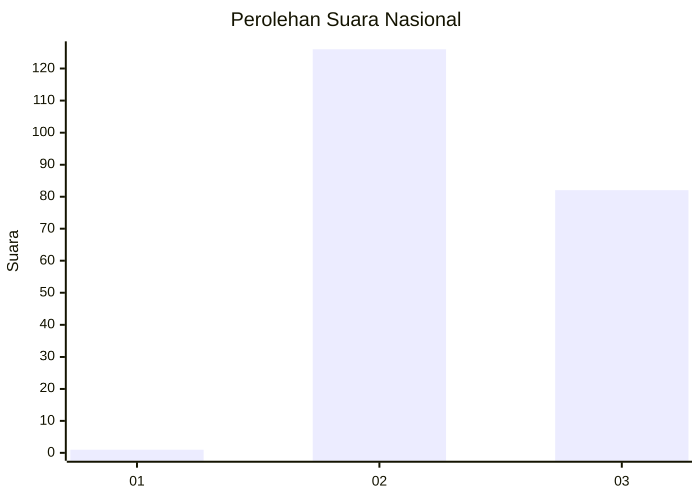
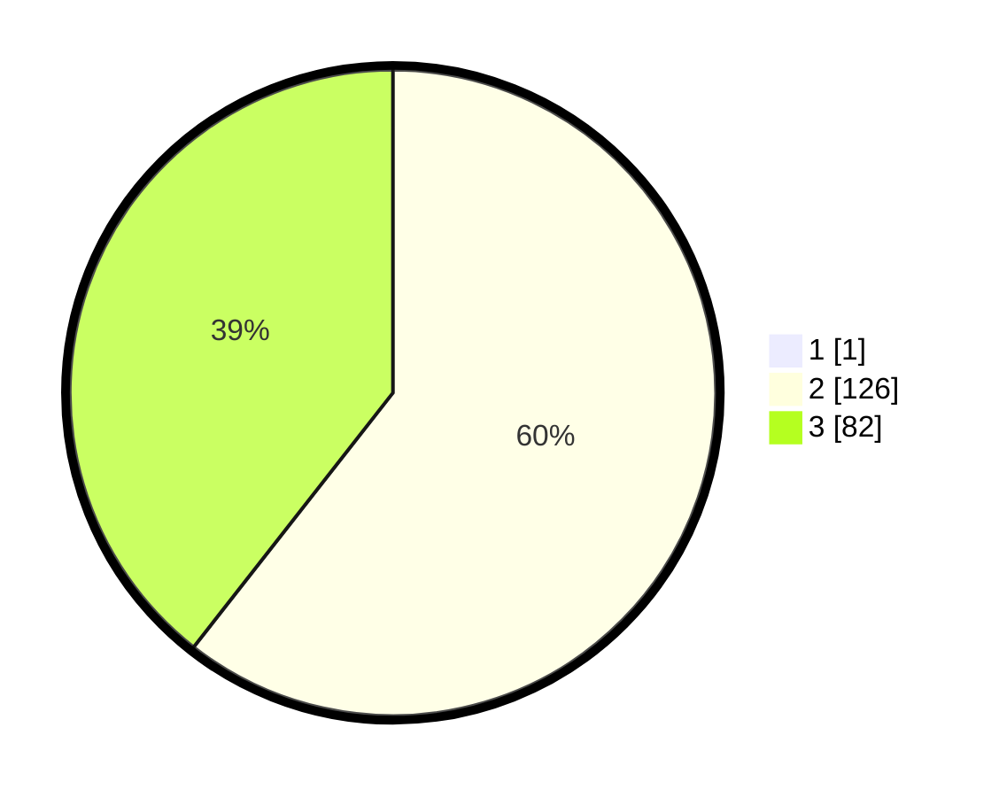

# Hasil

## Grafik

## Tabel

| No. | Nama Paslon    | Suara | Suara (raw) | Persentase |
|:--- |:-------------- | -----:| -----------:| ----------:|
| 1   | ANIES MUHAIMIN | 1     | [1][p-1]    | 0,48       |
| 2   | PRABOWO GIBRAN | 126   | [126][p-2]  | 60,29      |
| 3   | GANJAR MAHFUD  | 82    | [82][p-3]   | 39,23      |

[p-1]: https://github.com/gigit-pemilu/pemilu-2024/blob/main/pilpres/hitung-suara/sub/51-bali/sub/07-karangasem/sub/04-karangasem/sub/1004-karangasem/sub/003-tps/sub/paslon-1.txt
[p-2]: https://github.com/gigit-pemilu/pemilu-2024/blob/main/pilpres/hitung-suara/sub/51-bali/sub/07-karangasem/sub/04-karangasem/sub/1004-karangasem/sub/003-tps/sub/paslon-2.txt
[p-3]: https://github.com/gigit-pemilu/pemilu-2024/blob/main/pilpres/hitung-suara/sub/51-bali/sub/07-karangasem/sub/04-karangasem/sub/1004-karangasem/sub/003-tps/sub/paslon-3.txt

## Foto C Plano

https://sirekap-obj-formc.kpu.go.id/d952/pemilu/ppwp/51/07/04/10/04/5107041004003-20240214-214140--96e91126-ed1f-4297-b5a7-f94a0f46be7f.jpg

https://sirekap-obj-formc.kpu.go.id/d952/pemilu/ppwp/51/07/04/10/04/5107041004003-20240214-214206--76cdd075-a2b0-43a0-b07a-b5868ca900a0.jpg

https://sirekap-obj-formc.kpu.go.id/d952/pemilu/ppwp/51/07/04/10/04/5107041004003-20240214-214300--5f3c9bb5-5f40-4e56-a063-66c2acd2bf4c.jpg

## Metadata

| Key        | Value               |
| ---------- | ------------------- |
| Time Stamp | 2024-02-24 22:31:28 |

