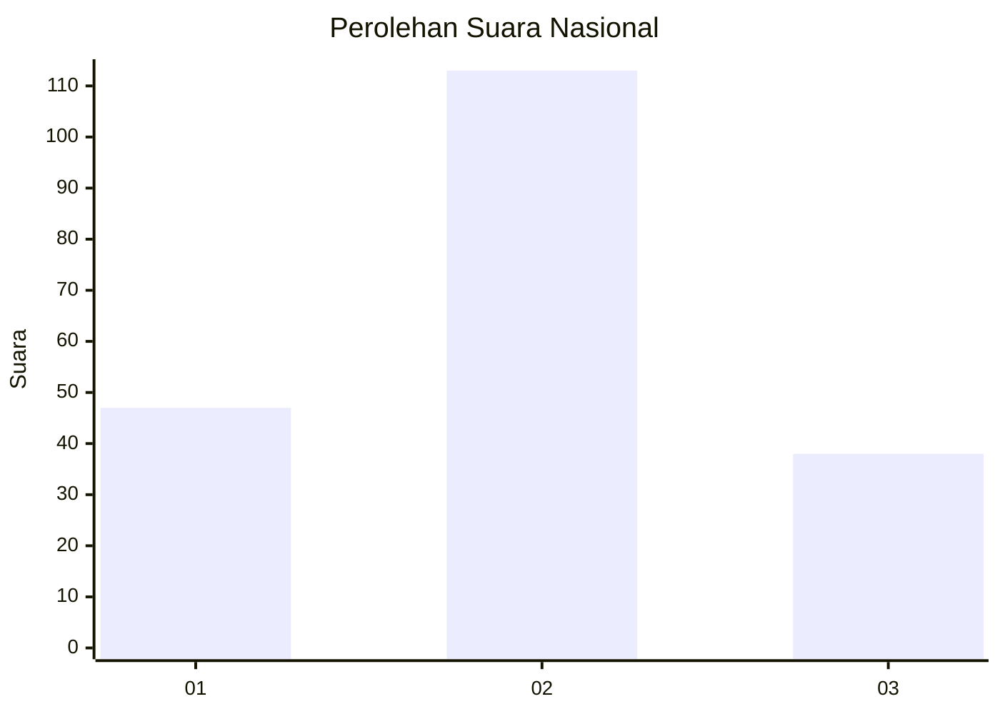
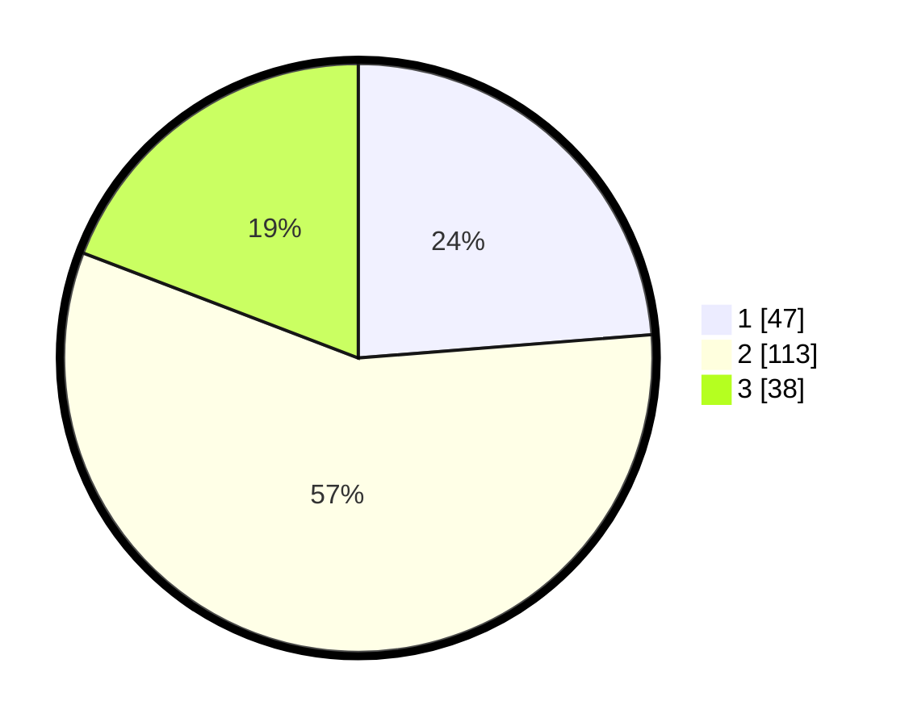

# Hasil

## Grafik

## Tabel

| No. | Nama Paslon    | Suara | Suara (raw) | Persentase |
|:--- |:-------------- | -----:| -----------:| ----------:|
| 1   | ANIES MUHAIMIN | 47    | [47][p-1]   | 23,74      |
| 2   | PRABOWO GIBRAN | 113   | [113][p-2]  | 57,07      |
| 3   | GANJAR MAHFUD  | 38    | [38][p-3]   | 19,19      |

[p-1]: https://github.com/gigit-pemilu/pemilu-2024/blob/main/pilpres/hitung-suara/sub/51-bali/sub/07-karangasem/sub/04-karangasem/sub/1004-karangasem/sub/004-tps/sub/paslon-1.txt
[p-2]: https://github.com/gigit-pemilu/pemilu-2024/blob/main/pilpres/hitung-suara/sub/51-bali/sub/07-karangasem/sub/04-karangasem/sub/1004-karangasem/sub/004-tps/sub/paslon-2.txt
[p-3]: https://github.com/gigit-pemilu/pemilu-2024/blob/main/pilpres/hitung-suara/sub/51-bali/sub/07-karangasem/sub/04-karangasem/sub/1004-karangasem/sub/004-tps/sub/paslon-3.txt

## Foto C Plano

https://sirekap-obj-formc.kpu.go.id/a576/pemilu/ppwp/51/07/04/10/04/5107041004004-20240216-155506--648a6028-b89c-497d-823c-891f1b9380cf.jpg

https://sirekap-obj-formc.kpu.go.id/a576/pemilu/ppwp/51/07/04/10/04/5107041004004-20240216-155507--280cc072-5465-4376-9fa8-7f1f139a4ba9.jpg

https://sirekap-obj-formc.kpu.go.id/a576/pemilu/ppwp/51/07/04/10/04/5107041004004-20240216-155507--52867bba-71fb-4f11-8f0f-ad7315f505f7.jpg

## Metadata

| Key        | Value               |
| ---------- | ------------------- |
| Time Stamp | 2024-02-17 10:30:03 |

## DATA PEMILIH TETAP

Jumlah pemilih dalam DPT: **213**.
 * L: **105**.
 * P: **108**.

## DATA PENGGUNA HAK PILIH

Jumlah pengguna hak pilih dalam DPT: **191**.
 * L: **96**.
 * P: **95**.

Jumlah pengguna hak pilih dalam DPTb: **10**.
 * L: **9**.
 * P: **1**.

Jumlah pengguna hak pilih dalam DPK: **4**.
 * L: **2**.
 * P: **2**.

Jumlah pengguna hak pilih: **205**.
 * L: **107**.
 * P: **98**.

## JUMLAH SUARA SAH DAN TIDAK SAH

JUMLAH SELURUH SUARA SAH: **198**.

JUMLAH SUARA TIDAK SAH: **7**.

JUMLAH SELURUH SUARA SAH DAN SUARA TIDAK SAH: **205**.

