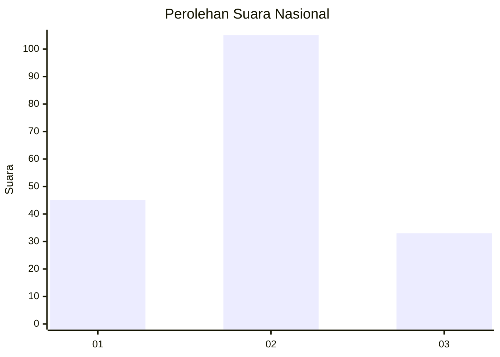
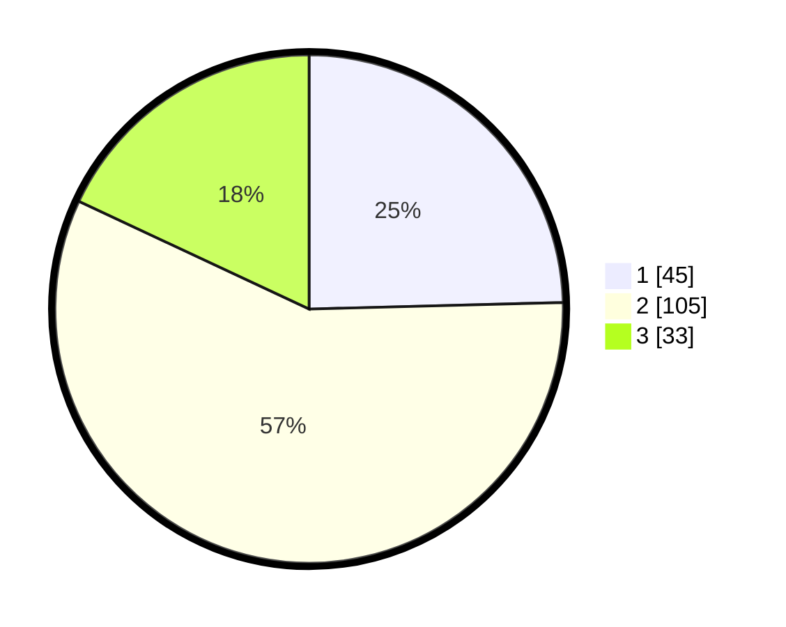

# Hasil

## Grafik

## Tabel

| No. | Nama Paslon    | Suara | Suara (raw) | Persentase |
|:--- |:-------------- | -----:| -----------:| ----------:|
| 1   | ANIES MUHAIMIN | 45    | [45][p-1]   | 24,59      |
| 2   | PRABOWO GIBRAN | 105   | [105][p-2]  | 57,38      |
| 3   | GANJAR MAHFUD  | 33    | [33][p-3]   | 18,03      |

[p-1]: https://github.com/gigit-pemilu/pemilu-2024/blob/main/pilpres/hitung-suara/sub/51-bali/sub/07-karangasem/sub/04-karangasem/sub/1004-karangasem/sub/005-tps/sub/paslon-1.txt
[p-2]: https://github.com/gigit-pemilu/pemilu-2024/blob/main/pilpres/hitung-suara/sub/51-bali/sub/07-karangasem/sub/04-karangasem/sub/1004-karangasem/sub/005-tps/sub/paslon-2.txt
[p-3]: https://github.com/gigit-pemilu/pemilu-2024/blob/main/pilpres/hitung-suara/sub/51-bali/sub/07-karangasem/sub/04-karangasem/sub/1004-karangasem/sub/005-tps/sub/paslon-3.txt

## Foto C Plano

https://sirekap-obj-formc.kpu.go.id/9863/pemilu/ppwp/51/07/04/10/04/5107041004005-20240214-204650--1cad4e38-2f3a-4fa7-b7ab-47ea2c586e6f.jpg

https://sirekap-obj-formc.kpu.go.id/9863/pemilu/ppwp/51/07/04/10/04/5107041004005-20240214-204741--4995a499-4999-4ecc-95b4-2a8952b6636e.jpg

https://sirekap-obj-formc.kpu.go.id/9863/pemilu/ppwp/51/07/04/10/04/5107041004005-20240214-204820--9e4d7f44-2a8a-45a3-a3cd-f42548f554b7.jpg

## Metadata

| Key        | Value               |
| ---------- | ------------------- |
| Time Stamp | 2024-02-15 00:41:44 |

## DATA PEMILIH TETAP

Jumlah pemilih dalam DPT: **210**.
 * L: **121**.
 * P: **89**.

## DATA PENGGUNA HAK PILIH

Jumlah pengguna hak pilih dalam DPT: **183**.
 * L: **104**.
 * P: **79**.

Jumlah pengguna hak pilih dalam DPTb: **10**.
 * L: **10**.
 * P: **0**.

Jumlah pengguna hak pilih dalam DPK: **1**.
 * L: **1**.
 * P: **0**.

Jumlah pengguna hak pilih: **194**.
 * L: **115**.
 * P: **79**.

## JUMLAH SUARA SAH DAN TIDAK SAH

JUMLAH SELURUH SUARA SAH: **183**.

JUMLAH SUARA TIDAK SAH: **11**.

JUMLAH SELURUH SUARA SAH DAN SUARA TIDAK SAH: **194**.

