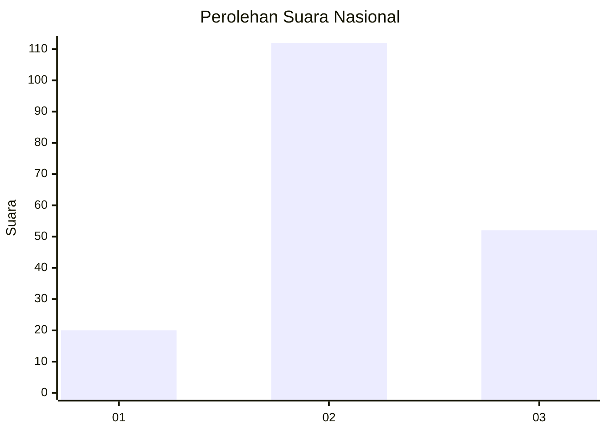
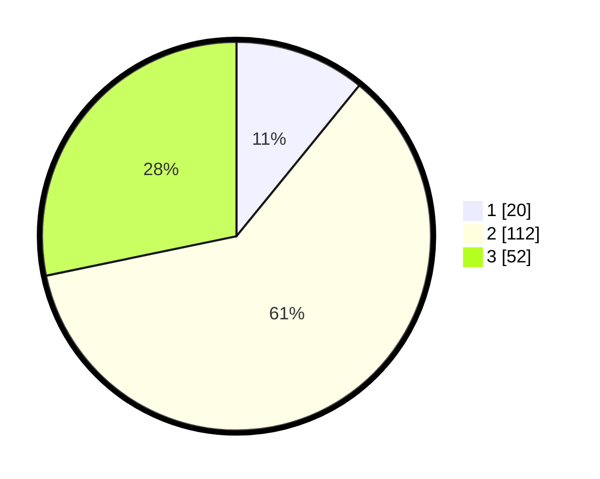

# Hasil

## Grafik

## Tabel

| No. | Nama Paslon    | Suara | Suara (raw) | Persentase |
|:--- |:-------------- | -----:| -----------:| ----------:|
| 1   | ANIES MUHAIMIN | 20    | [20][p-1]   | 10,87      |
| 2   | PRABOWO GIBRAN | 112   | [112][p-2]  | 60,87      |
| 3   | GANJAR MAHFUD  | 52    | [52][p-3]   | 28,26      |

[p-1]: https://github.com/gigit-pemilu/pemilu-2024/blob/main/pilpres/hitung-suara/sub/51-bali/sub/07-karangasem/sub/04-karangasem/sub/1004-karangasem/sub/006-tps/sub/paslon-1.txt
[p-2]: https://github.com/gigit-pemilu/pemilu-2024/blob/main/pilpres/hitung-suara/sub/51-bali/sub/07-karangasem/sub/04-karangasem/sub/1004-karangasem/sub/006-tps/sub/paslon-2.txt
[p-3]: https://github.com/gigit-pemilu/pemilu-2024/blob/main/pilpres/hitung-suara/sub/51-bali/sub/07-karangasem/sub/04-karangasem/sub/1004-karangasem/sub/006-tps/sub/paslon-3.txt

## Foto C Plano

https://sirekap-obj-formc.kpu.go.id/b592/pemilu/ppwp/51/07/04/10/04/5107041004006-20240214-190544--d51c9f15-8a0e-47b3-aa40-72b0c9f3a3a0.jpg

https://sirekap-obj-formc.kpu.go.id/b592/pemilu/ppwp/51/07/04/10/04/5107041004006-20240214-190550--3fe73635-420b-42e1-bc73-78d1f616c1fa.jpg

https://sirekap-obj-formc.kpu.go.id/b592/pemilu/ppwp/51/07/04/10/04/5107041004006-20240214-193805--3a136e9c-8c86-439a-93e1-64b11f1f7ba1.jpg

## Metadata

| Key        | Value               |
| ---------- | ------------------- |
| Time Stamp | 2024-02-14 21:46:01 |

## DATA PEMILIH TETAP

Jumlah pemilih dalam DPT: **209**.
 * L: **105**.
 * P: **104**.

## DATA PENGGUNA HAK PILIH

Jumlah pengguna hak pilih dalam DPT: **185**.
 * L: **90**.
 * P: **95**.

Jumlah pengguna hak pilih dalam DPTb: **10**.
 * L: **8**.
 * P: **2**.

Jumlah pengguna hak pilih dalam DPK: **1**.
 * L: **0**.
 * P: **1**.

Jumlah pengguna hak pilih: **196**.
 * L: **98**.
 * P: **98**.

## JUMLAH SUARA SAH DAN TIDAK SAH

JUMLAH SELURUH SUARA SAH: **184**.

JUMLAH SUARA TIDAK SAH: **12**.

JUMLAH SELURUH SUARA SAH DAN SUARA TIDAK SAH: **196**.

