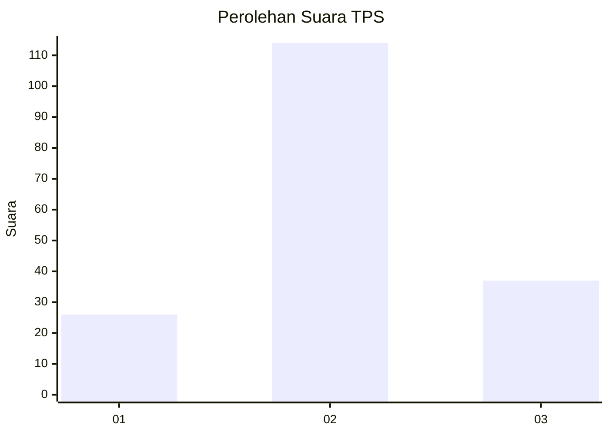
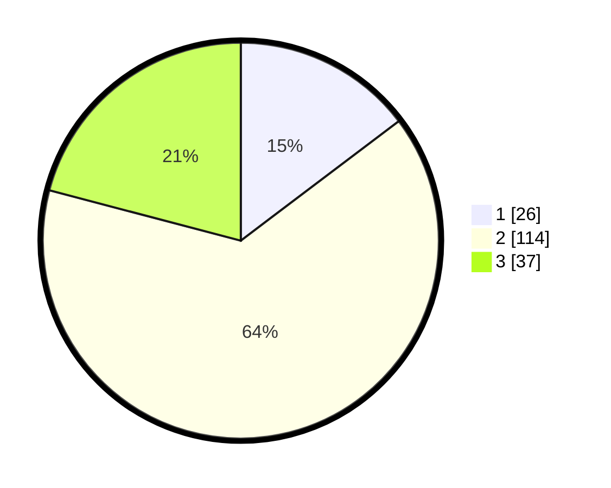

# Hasil

## Grafik

## Tabel

| No. | Nama Paslon    | Suara | Suara (raw) | Persentase |
|:--- |:-------------- | -----:| -----------:| ----------:|
| 1   | ANIES MUHAIMIN | 26    | [26][p-1]   | 14,69      |
| 2   | PRABOWO GIBRAN | 114   | [114][p-2]  | 64,41      |
| 3   | GANJAR MAHFUD  | 37    | [37][p-3]   | 20,90      |

[p-1]: https://github.com/gigit-pemilu/pemilu-2024-51-bali/blob/main/pilpres/hitung-suara/sub/51-bali/sub/07-karangasem/sub/04-karangasem/sub/1004-karangasem/sub/012-tps/sub/paslon-1.txt
[p-2]: https://github.com/gigit-pemilu/pemilu-2024-51-bali/blob/main/pilpres/hitung-suara/sub/51-bali/sub/07-karangasem/sub/04-karangasem/sub/1004-karangasem/sub/012-tps/sub/paslon-2.txt
[p-3]: https://github.com/gigit-pemilu/pemilu-2024-51-bali/blob/main/pilpres/hitung-suara/sub/51-bali/sub/07-karangasem/sub/04-karangasem/sub/1004-karangasem/sub/012-tps/sub/paslon-3.txt

## Foto C Plano

https://sirekap-obj-formc.kpu.go.id/79cd/pemilu/ppwp/51/07/04/10/04/5107041004012-20240214-224134--006c33c0-0c85-4935-a296-5b215e9150b1.jpg

https://sirekap-obj-formc.kpu.go.id/79cd/pemilu/ppwp/51/07/04/10/04/5107041004012-20240215-023200--7e6cec15-167d-4a40-92e9-5687714db176.jpg

https://sirekap-obj-formc.kpu.go.id/79cd/pemilu/ppwp/51/07/04/10/04/5107041004012-20240217-043132--55216e6f-308b-41d9-875b-0d4d2c123bb4.jpg

## Metadata

| Key        | Value               |
| ---------- | ------------------- |
| Time Stamp | 2024-02-17 04:42:04 |

