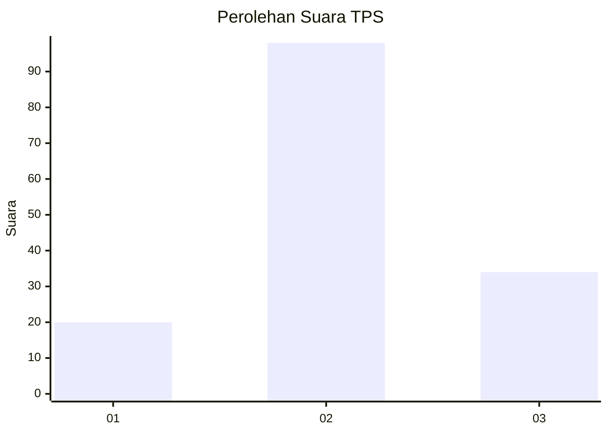
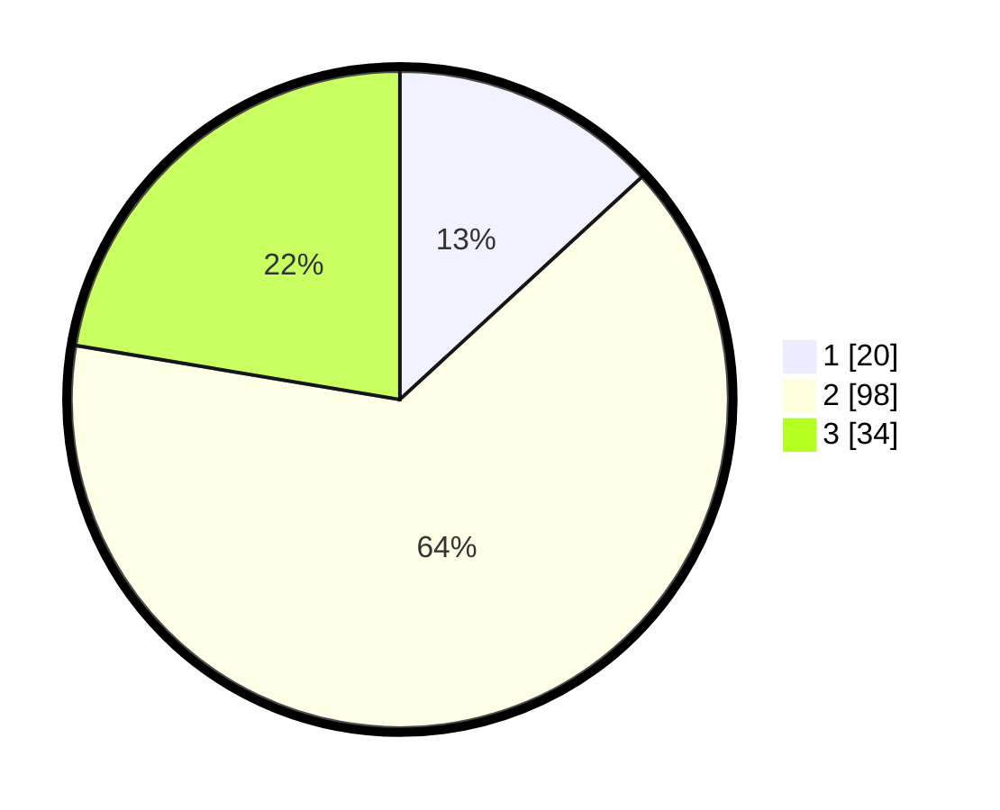

# Hasil

## Grafik

## Tabel

| No. | Nama Paslon    | Suara | Suara (raw) | Persentase |
|:--- |:-------------- | -----:| -----------:| ----------:|
| 1   | ANIES MUHAIMIN | 20    | [20][p-1]   | 13,16      |
| 2   | PRABOWO GIBRAN | 98    | [98][p-2]   | 64,47      |
| 3   | GANJAR MAHFUD  | 34    | [34][p-3]   | 22,37      |

[p-1]: https://github.com/gigit-pemilu/pemilu-2024-51-bali/blob/main/pilpres/hitung-suara/sub/51-bali/sub/07-karangasem/sub/04-karangasem/sub/1004-karangasem/sub/014-tps/sub/paslon-1.txt
[p-2]: https://github.com/gigit-pemilu/pemilu-2024-51-bali/blob/main/pilpres/hitung-suara/sub/51-bali/sub/07-karangasem/sub/04-karangasem/sub/1004-karangasem/sub/014-tps/sub/paslon-2.txt
[p-3]: https://github.com/gigit-pemilu/pemilu-2024-51-bali/blob/main/pilpres/hitung-suara/sub/51-bali/sub/07-karangasem/sub/04-karangasem/sub/1004-karangasem/sub/014-tps/sub/paslon-3.txt

## Foto C Plano

https://sirekap-obj-formc.kpu.go.id/1808/pemilu/ppwp/51/07/04/10/04/5107041004014-20240214-220922--894a2e8d-d047-43ff-a0b0-bccf68bcd86a.jpg

https://sirekap-obj-formc.kpu.go.id/1808/pemilu/ppwp/51/07/04/10/04/5107041004014-20240214-220759--f91887cf-e04e-4c36-84cf-6a7d0c3ed92f.jpg

https://sirekap-obj-formc.kpu.go.id/1808/pemilu/ppwp/51/07/04/10/04/5107041004014-20240214-220852--35744073-8886-42f8-98d9-eb4f96d0f950.jpg

## Metadata

| Key        | Value               |
| ---------- | ------------------- |
| Time Stamp | 2024-02-17 10:30:03 |

## DATA PEMILIH TETAP

Jumlah pemilih dalam DPT: **192**.
 * L: **90**.
 * P: **102**.

## DATA PENGGUNA HAK PILIH

Jumlah pengguna hak pilih dalam DPT: **155**.
 * L: **73**.
 * P: **82**.

Jumlah pengguna hak pilih dalam DPTb: **0**.
 * L: **0**.
 * P: **0**.

Jumlah pengguna hak pilih dalam DPK: **0**.
 * L: **0**.
 * P: **0**.

Jumlah pengguna hak pilih: **155**.
 * L: **73**.
 * P: **82**.

## JUMLAH SUARA SAH DAN TIDAK SAH

JUMLAH SELURUH SUARA SAH: **152**.

JUMLAH SUARA TIDAK SAH: **3**.

JUMLAH SELURUH SUARA SAH DAN SUARA TIDAK SAH: **155**.

