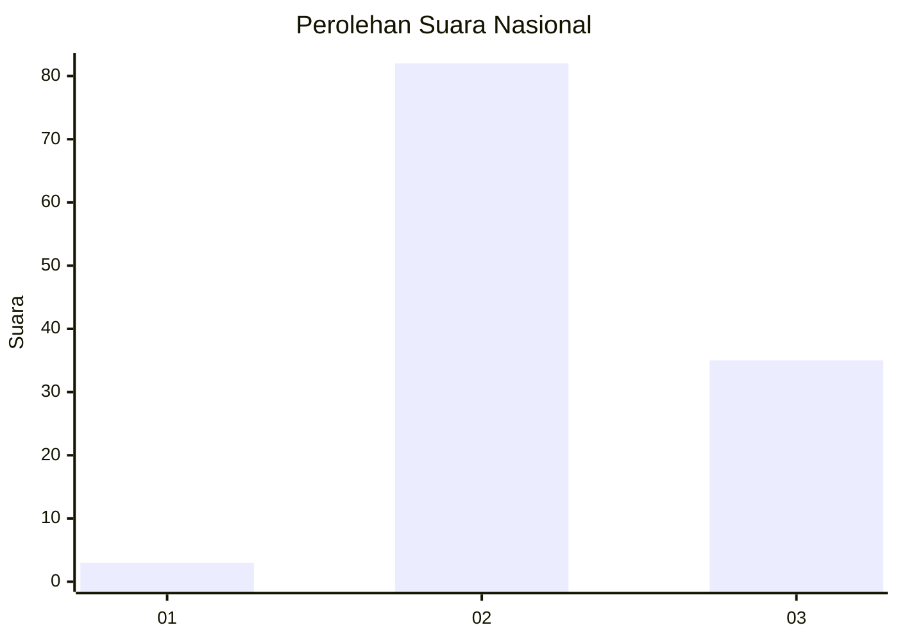
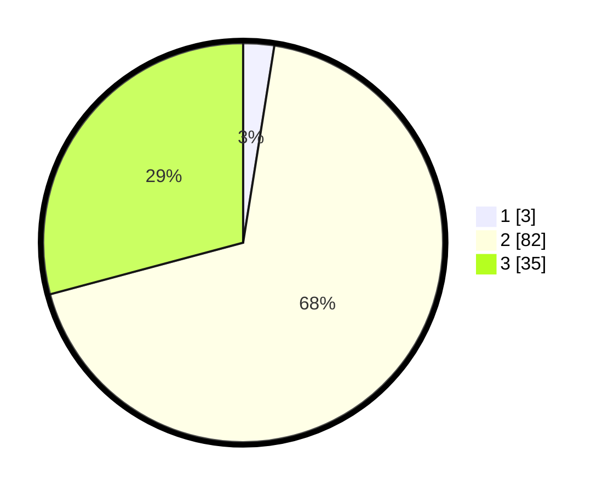

# Hasil

## Grafik

## Tabel

| No. | Nama Paslon    | Suara | Suara (raw) | Persentase |
|:--- |:-------------- | -----:| -----------:| ----------:|
| 1   | ANIES MUHAIMIN | 3     | [3][p-1]    | 2,50       |
| 2   | PRABOWO GIBRAN | 82    | [82][p-2]   | 68,33      |
| 3   | GANJAR MAHFUD  | 35    | [35][p-3]   | 29,17      |

[p-1]: https://github.com/gigit-pemilu/pemilu-2024/blob/main/pilpres/hitung-suara/sub/51-bali/sub/07-karangasem/sub/04-karangasem/sub/1004-karangasem/sub/017-tps/sub/paslon-1.txt
[p-2]: https://github.com/gigit-pemilu/pemilu-2024/blob/main/pilpres/hitung-suara/sub/51-bali/sub/07-karangasem/sub/04-karangasem/sub/1004-karangasem/sub/017-tps/sub/paslon-2.txt
[p-3]: https://github.com/gigit-pemilu/pemilu-2024/blob/main/pilpres/hitung-suara/sub/51-bali/sub/07-karangasem/sub/04-karangasem/sub/1004-karangasem/sub/017-tps/sub/paslon-3.txt

## Foto C Plano

https://sirekap-obj-formc.kpu.go.id/c659/pemilu/ppwp/51/07/04/10/04/5107041004017-20240214-130354--244f43aa-d191-4410-a4a0-234e6163fa7c.jpg

https://sirekap-obj-formc.kpu.go.id/c659/pemilu/ppwp/51/07/04/10/04/5107041004017-20240214-130234--54ebd738-91db-4585-bdce-c57c80131f61.jpg

https://sirekap-obj-formc.kpu.go.id/c659/pemilu/ppwp/51/07/04/10/04/5107041004017-20240214-130257--af181551-7c91-495a-9458-7216e15f653f.jpg

## Metadata

| Key        | Value               |
| ---------- | ------------------- |
| Time Stamp | 2024-02-16 10:30:29 |

## DATA PEMILIH TETAP

Jumlah pemilih dalam DPT: **162**.
 * L: **83**.
 * P: **79**.

## DATA PENGGUNA HAK PILIH

Jumlah pengguna hak pilih dalam DPT: **124**.
 * L: **66**.
 * P: **58**.

Jumlah pengguna hak pilih dalam DPTb: **0**.
 * L: **0**.
 * P: **0**.

Jumlah pengguna hak pilih dalam DPK: **4**.
 * L: **0**.
 * P: **4**.

Jumlah pengguna hak pilih: **128**.
 * L: **66**.
 * P: **62**.

## JUMLAH SUARA SAH DAN TIDAK SAH

JUMLAH SELURUH SUARA SAH: **120**.

JUMLAH SUARA TIDAK SAH: **8**.

JUMLAH SELURUH SUARA SAH DAN SUARA TIDAK SAH: **128**.

