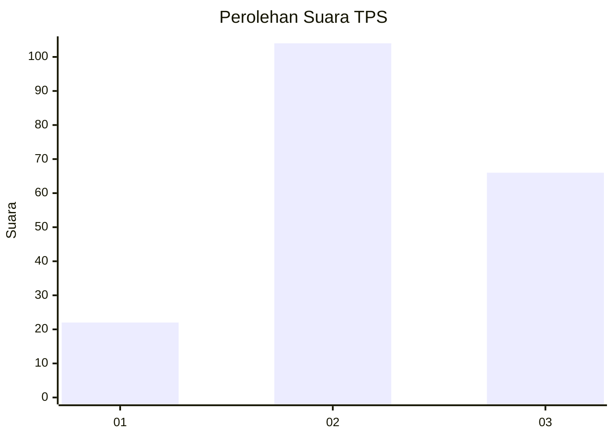
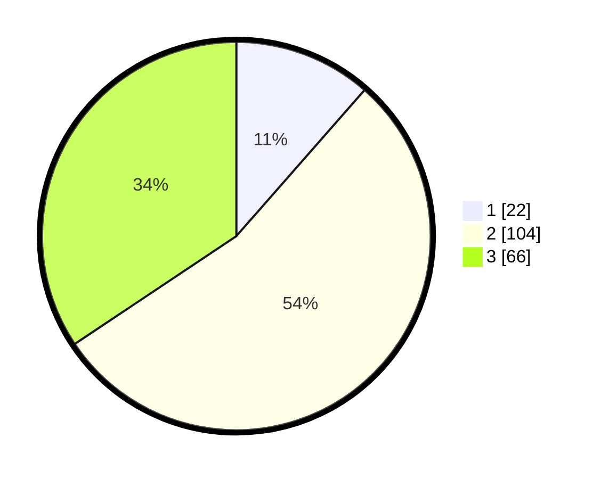

# Hasil

## Grafik

## Tabel

| No. | Nama Paslon    | Suara | Suara (raw) | Persentase |
|:--- |:-------------- | -----:| -----------:| ----------:|
| 1   | ANIES MUHAIMIN | 22    | [22][p-1]   | 11,46      |
| 2   | PRABOWO GIBRAN | 104   | [104][p-2]  | 54,17      |
| 3   | GANJAR MAHFUD  | 66    | [66][p-3]   | 34,38      |

[p-1]: https://github.com/gigit-pemilu/pemilu-2024-51-bali/blob/main/pilpres/hitung-suara/sub/51-bali/sub/07-karangasem/sub/04-karangasem/sub/1004-karangasem/sub/019-tps/sub/paslon-1.txt
[p-2]: https://github.com/gigit-pemilu/pemilu-2024-51-bali/blob/main/pilpres/hitung-suara/sub/51-bali/sub/07-karangasem/sub/04-karangasem/sub/1004-karangasem/sub/019-tps/sub/paslon-2.txt
[p-3]: https://github.com/gigit-pemilu/pemilu-2024-51-bali/blob/main/pilpres/hitung-suara/sub/51-bali/sub/07-karangasem/sub/04-karangasem/sub/1004-karangasem/sub/019-tps/sub/paslon-3.txt

## Foto C Plano

https://sirekap-obj-formc.kpu.go.id/6110/pemilu/ppwp/51/07/04/10/04/5107041004019-20240214-131536--34842dd9-56f1-4498-beca-43b1310d9f58.jpg

https://sirekap-obj-formc.kpu.go.id/6110/pemilu/ppwp/51/07/04/10/04/5107041004019-20240214-131634--10c629af-c2ce-417f-bc40-29e8fa3f7089.jpg

https://sirekap-obj-formc.kpu.go.id/6110/pemilu/ppwp/51/07/04/10/04/5107041004019-20240214-131713--5b8d61d0-e28e-4981-88a5-a6e71c65cf10.jpg

## Metadata

| Key        | Value               |
| ---------- | ------------------- |
| Time Stamp | 2024-02-17 16:00:02 |

