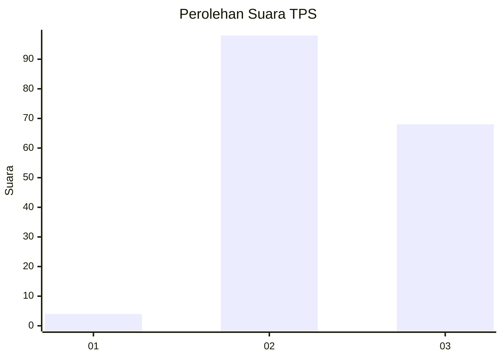
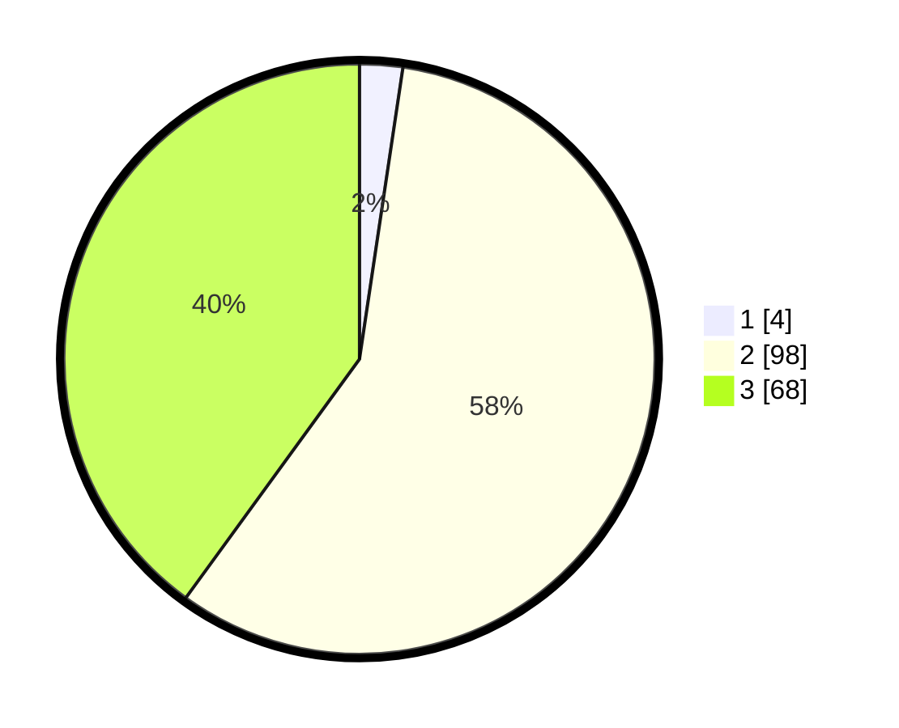

# Hasil

## Grafik

## Tabel

| No. | Nama Paslon    | Suara | Suara (raw) | Persentase |
|:--- |:-------------- | -----:| -----------:| ----------:|
| 1   | ANIES MUHAIMIN | 4     | [4][p-1]    | 2,35       |
| 2   | PRABOWO GIBRAN | 98    | [98][p-2]   | 57,65      |
| 3   | GANJAR MAHFUD  | 68    | [68][p-3]   | 40,00      |

[p-1]: https://github.com/gigit-pemilu/pemilu-2024-51-bali/blob/main/pilpres/hitung-suara/sub/51-bali/sub/07-karangasem/sub/04-karangasem/sub/1004-karangasem/sub/025-tps/sub/paslon-1.txt
[p-2]: https://github.com/gigit-pemilu/pemilu-2024-51-bali/blob/main/pilpres/hitung-suara/sub/51-bali/sub/07-karangasem/sub/04-karangasem/sub/1004-karangasem/sub/025-tps/sub/paslon-2.txt
[p-3]: https://github.com/gigit-pemilu/pemilu-2024-51-bali/blob/main/pilpres/hitung-suara/sub/51-bali/sub/07-karangasem/sub/04-karangasem/sub/1004-karangasem/sub/025-tps/sub/paslon-3.txt

## Foto C Plano

https://sirekap-obj-formc.kpu.go.id/879d/pemilu/ppwp/51/07/04/10/04/5107041004025-20240214-141002--276e6391-54f1-4f9c-bbc5-615e661fa9bf.jpg

https://sirekap-obj-formc.kpu.go.id/879d/pemilu/ppwp/51/07/04/10/04/5107041004025-20240214-141153--3947ec55-e10f-4a0d-ac6a-2956407e183f.jpg

https://sirekap-obj-formc.kpu.go.id/879d/pemilu/ppwp/51/07/04/10/04/5107041004025-20240214-141257--d02276e9-98dc-4bf7-a927-3c6cf89079a2.jpg

## Metadata

| Key        | Value               |
| ---------- | ------------------- |
| Time Stamp | 2024-02-17 16:00:02 |

