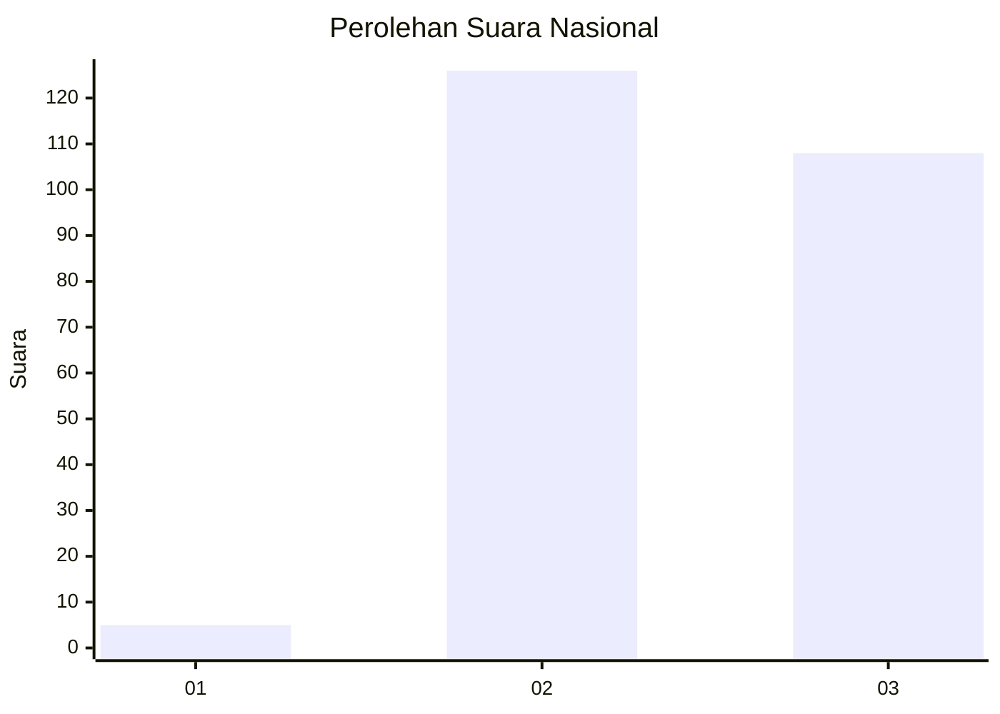
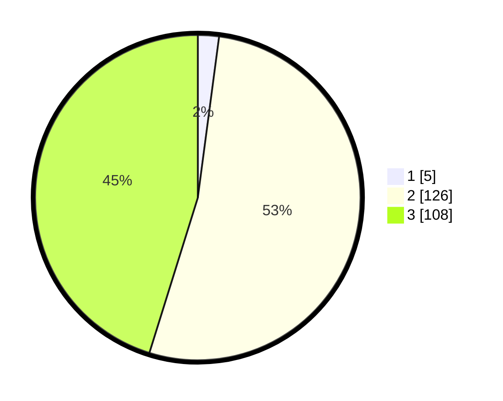

# Hasil

## Grafik

## Tabel

| No. | Nama Paslon    | Suara | Suara (raw) | Persentase |
|:--- |:-------------- | -----:| -----------:| ----------:|
| 1   | ANIES MUHAIMIN | 5     | [5][p-1]    | 2,09       |
| 2   | PRABOWO GIBRAN | 126   | [126][p-2]  | 52,72      |
| 3   | GANJAR MAHFUD  | 108   | [108][p-3]  | 45,19      |

[p-1]: https://github.com/gigit-pemilu/pemilu-2024/blob/main/pilpres/hitung-suara/sub/51-bali/sub/07-karangasem/sub/04-karangasem/sub/1004-karangasem/sub/035-tps/sub/paslon-1.txt
[p-2]: https://github.com/gigit-pemilu/pemilu-2024/blob/main/pilpres/hitung-suara/sub/51-bali/sub/07-karangasem/sub/04-karangasem/sub/1004-karangasem/sub/035-tps/sub/paslon-2.txt
[p-3]: https://github.com/gigit-pemilu/pemilu-2024/blob/main/pilpres/hitung-suara/sub/51-bali/sub/07-karangasem/sub/04-karangasem/sub/1004-karangasem/sub/035-tps/sub/paslon-3.txt

## Foto C Plano

https://sirekap-obj-formc.kpu.go.id/616c/pemilu/ppwp/51/07/04/10/04/5107041004035-20240214-155817--b942bcd6-5452-4e15-be2f-e7c3333e99c3.jpg

https://sirekap-obj-formc.kpu.go.id/616c/pemilu/ppwp/51/07/04/10/04/5107041004035-20240214-155821--c6cc701e-919f-4e77-94f9-1fe0f5275374.jpg

https://sirekap-obj-formc.kpu.go.id/616c/pemilu/ppwp/51/07/04/10/04/5107041004035-20240214-155825--16552721-8b82-47dd-998e-d9ddbf4c10f0.jpg

## Metadata

| Key        | Value               |
| ---------- | ------------------- |
| Time Stamp | 2024-02-19 06:16:00 |

