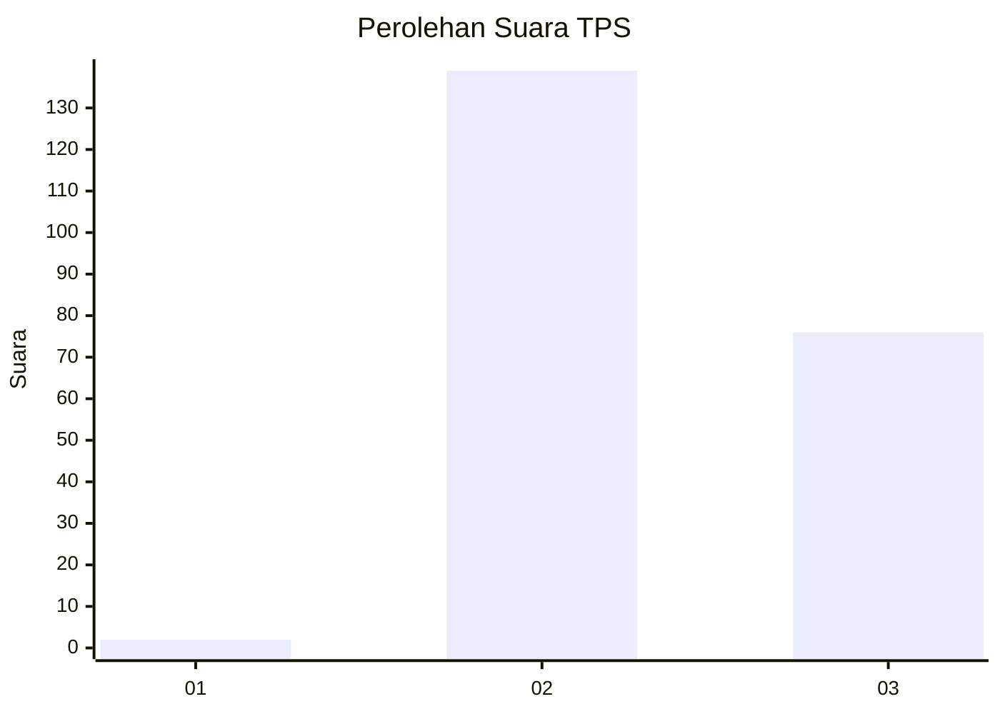
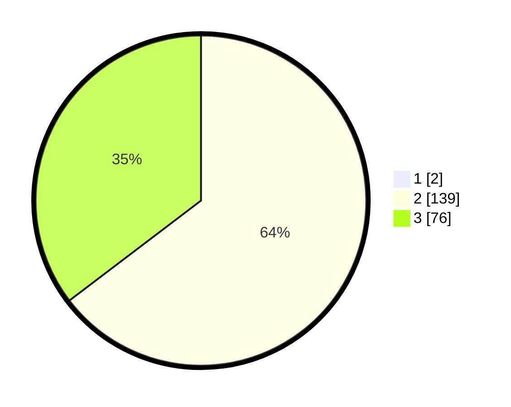

# Hasil

## Grafik

## Tabel

| No. | Nama Paslon    | Suara | Suara (raw) | Persentase |
|:--- |:-------------- | -----:| -----------:| ----------:|
| 1   | ANIES MUHAIMIN | 2     | [2][p-1]    | 0,92       |
| 2   | PRABOWO GIBRAN | 139   | [139][p-2]  | 64,06      |
| 3   | GANJAR MAHFUD  | 76    | [76][p-3]   | 35,02      |

[p-1]: https://github.com/gigit-pemilu/pemilu-2024-51-bali/blob/main/pilpres/hitung-suara/sub/51-bali/sub/07-karangasem/sub/04-karangasem/sub/1004-karangasem/sub/038-tps/sub/paslon-1.txt
[p-2]: https://github.com/gigit-pemilu/pemilu-2024-51-bali/blob/main/pilpres/hitung-suara/sub/51-bali/sub/07-karangasem/sub/04-karangasem/sub/1004-karangasem/sub/038-tps/sub/paslon-2.txt
[p-3]: https://github.com/gigit-pemilu/pemilu-2024-51-bali/blob/main/pilpres/hitung-suara/sub/51-bali/sub/07-karangasem/sub/04-karangasem/sub/1004-karangasem/sub/038-tps/sub/paslon-3.txt

## Foto C Plano

https://sirekap-obj-formc.kpu.go.id/1027/pemilu/ppwp/51/07/04/10/04/5107041004038-20240214-223417--0cb3e240-027d-4628-b593-afc8dbbd4c9a.jpg

https://sirekap-obj-formc.kpu.go.id/1027/pemilu/ppwp/51/07/04/10/04/5107041004038-20240214-223452--620357ad-37d4-4a72-b00d-e3e2b4e72d4b.jpg

https://sirekap-obj-formc.kpu.go.id/1027/pemilu/ppwp/51/07/04/10/04/5107041004038-20240214-223518--62704914-55ee-477d-8239-76d878e9e851.jpg

## Metadata

| Key        | Value               |
| ---------- | ------------------- |
| Time Stamp | 2024-02-19 06:16:00 |

