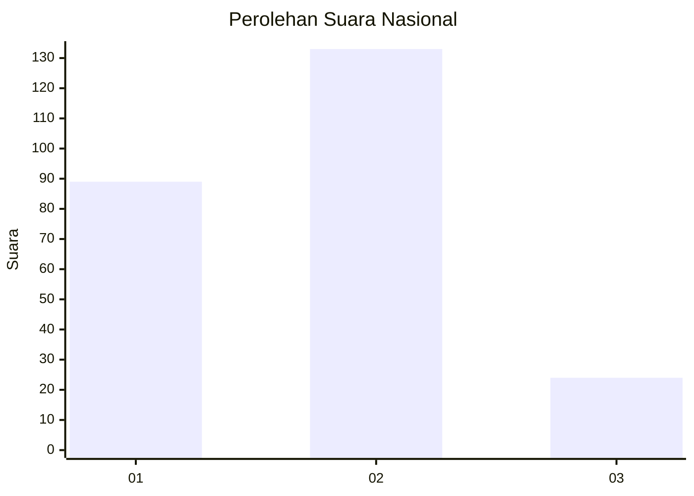

# Hasil

## Grafik

## Tabel

| No. | Nama Paslon    | Suara | Suara (raw) | Persentase |
|:--- |:-------------- | -----:| -----------:| ----------:|
| 1   | ANIES MUHAIMIN | 89    | [89][p-1]   | 36,18      |
| 2   | PRABOWO GIBRAN | 133   | [133][p-2]  | 54,07      |
| 3   | GANJAR MAHFUD  | 24    | [24][p-3]   | 9,76       |

[p-1]: https://github.com/gigit-pemilu/pemilu-2024/blob/main/pilpres/hitung-suara/sub/51-bali/sub/07-karangasem/sub/04-karangasem/sub/1004-karangasem/sub/040-tps/sub/paslon-1.txt
[p-2]: https://github.com/gigit-pemilu/pemilu-2024/blob/main/pilpres/hitung-suara/sub/51-bali/sub/07-karangasem/sub/04-karangasem/sub/1004-karangasem/sub/040-tps/sub/paslon-2.txt
[p-3]: https://github.com/gigit-pemilu/pemilu-2024/blob/main/pilpres/hitung-suara/sub/51-bali/sub/07-karangasem/sub/04-karangasem/sub/1004-karangasem/sub/040-tps/sub/paslon-3.txt

## Foto C Plano

https://sirekap-obj-formc.kpu.go.id/68a1/pemilu/ppwp/51/07/04/10/04/5107041004040-20240214-141144--5c509fc4-5516-45e0-9460-c4b4f339eb8e.jpg

https://sirekap-obj-formc.kpu.go.id/68a1/pemilu/ppwp/51/07/04/10/04/5107041004040-20240214-141207--7a0dec9f-87c2-4b44-bc7e-b371faf7e4fb.jpg

https://sirekap-obj-formc.kpu.go.id/68a1/pemilu/ppwp/51/07/04/10/04/5107041004040-20240214-141530--fb8077d1-240b-497b-8eb4-7f7c5f7600cf.jpg

## Metadata

| Key        | Value               |
| ---------- | ------------------- |
| Time Stamp | 2024-02-16 10:30:29 |

## DATA PEMILIH TETAP

Jumlah pemilih dalam DPT: **270**.
 * L: **143**.
 * P: **127**.

## DATA PENGGUNA HAK PILIH

Jumlah pengguna hak pilih dalam DPT: **248**.
 * L: **131**.
 * P: **117**.

Jumlah pengguna hak pilih dalam DPTb: **0**.
 * L: **0**.
 * P: **0**.

Jumlah pengguna hak pilih dalam DPK: **2**.
 * L: **1**.
 * P: **1**.

Jumlah pengguna hak pilih: **250**.
 * L: **132**.
 * P: **118**.

## JUMLAH SUARA SAH DAN TIDAK SAH

JUMLAH SELURUH SUARA SAH: **246**.

JUMLAH SUARA TIDAK SAH: **4**.

JUMLAH SELURUH SUARA SAH DAN SUARA TIDAK SAH: **250**.

