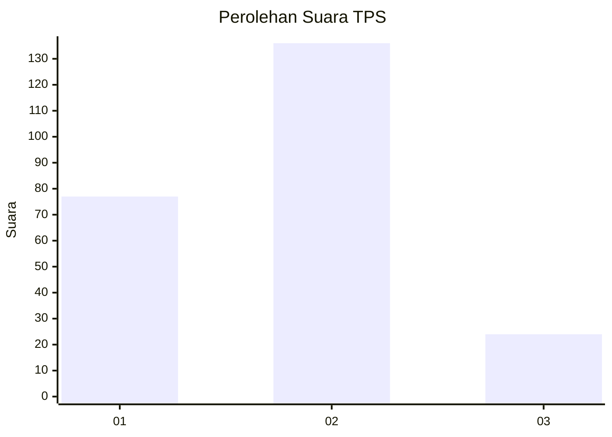
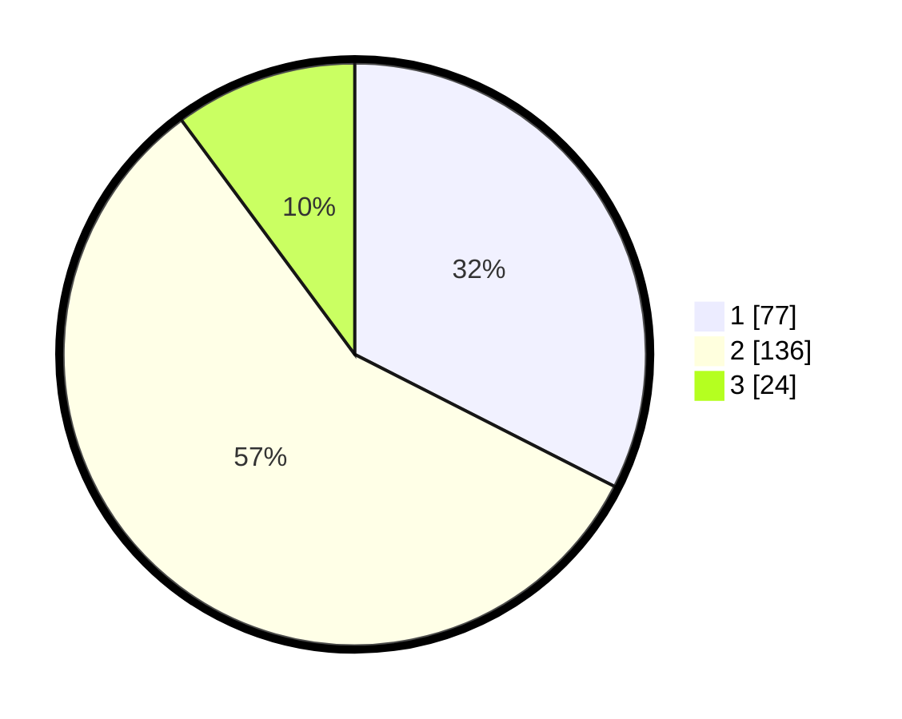

# Hasil

## Grafik

## Tabel

| No. | Nama Paslon    | Suara | Suara (raw) | Persentase |
|:--- |:-------------- | -----:| -----------:| ----------:|
| 1   | ANIES MUHAIMIN | 77    | [77][p-1]   | 32,49      |
| 2   | PRABOWO GIBRAN | 136   | [136][p-2]  | 57,38      |
| 3   | GANJAR MAHFUD  | 24    | [24][p-3]   | 10,13      |

[p-1]: https://github.com/gigit-pemilu/pemilu-2024-51-bali/blob/main/pilpres/hitung-suara/sub/51-bali/sub/07-karangasem/sub/04-karangasem/sub/1004-karangasem/sub/041-tps/sub/paslon-1.txt
[p-2]: https://github.com/gigit-pemilu/pemilu-2024-51-bali/blob/main/pilpres/hitung-suara/sub/51-bali/sub/07-karangasem/sub/04-karangasem/sub/1004-karangasem/sub/041-tps/sub/paslon-2.txt
[p-3]: https://github.com/gigit-pemilu/pemilu-2024-51-bali/blob/main/pilpres/hitung-suara/sub/51-bali/sub/07-karangasem/sub/04-karangasem/sub/1004-karangasem/sub/041-tps/sub/paslon-3.txt

## Foto C Plano

https://sirekap-obj-formc.kpu.go.id/9403/pemilu/ppwp/51/07/04/10/04/5107041004041-20240214-211825--767487ae-584a-4b13-854f-05ef945fe684.jpg

https://sirekap-obj-formc.kpu.go.id/9403/pemilu/ppwp/51/07/04/10/04/5107041004041-20240214-211843--b7788093-6259-4f07-b626-397f5611d0d6.jpg

https://sirekap-obj-formc.kpu.go.id/9403/pemilu/ppwp/51/07/04/10/04/5107041004041-20240214-211853--86c9594e-ae44-4db9-965f-6ab367325578.jpg

## Metadata

| Key        | Value               |
| ---------- | ------------------- |
| Time Stamp | 2024-02-19 06:16:00 |

