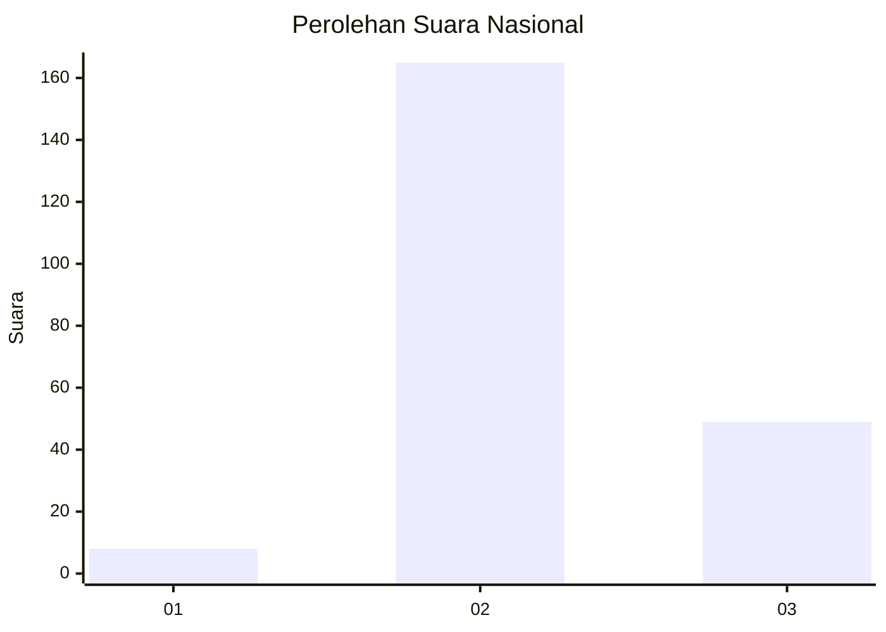

# Hasil

## Grafik

## Tabel

| No. | Nama Paslon    | Suara | Suara (raw) | Persentase |
|:--- |:-------------- | -----:| -----------:| ----------:|
| 1   | ANIES MUHAIMIN | 8     | [8][p-1]    | 3,60       |
| 2   | PRABOWO GIBRAN | 165   | [165][p-2]  | 74,32      |
| 3   | GANJAR MAHFUD  | 49    | [49][p-3]   | 22,07      |

[p-1]: https://github.com/gigit-pemilu/pemilu-2024/blob/main/pilpres/hitung-suara/sub/51-bali/sub/07-karangasem/sub/04-karangasem/sub/1004-karangasem/sub/044-tps/sub/paslon-1.txt
[p-2]: https://github.com/gigit-pemilu/pemilu-2024/blob/main/pilpres/hitung-suara/sub/51-bali/sub/07-karangasem/sub/04-karangasem/sub/1004-karangasem/sub/044-tps/sub/paslon-2.txt
[p-3]: https://github.com/gigit-pemilu/pemilu-2024/blob/main/pilpres/hitung-suara/sub/51-bali/sub/07-karangasem/sub/04-karangasem/sub/1004-karangasem/sub/044-tps/sub/paslon-3.txt

## Foto C Plano

https://sirekap-obj-formc.kpu.go.id/7e57/pemilu/ppwp/51/07/04/10/04/5107041004044-20240214-235623--57514997-e636-42f6-a50f-afd633184648.jpg

https://sirekap-obj-formc.kpu.go.id/7e57/pemilu/ppwp/51/07/04/10/04/5107041004044-20240214-235412--d2e0227b-ec72-4e40-9a58-6b0cc8d3b12e.jpg

https://sirekap-obj-formc.kpu.go.id/7e57/pemilu/ppwp/51/07/04/10/04/5107041004044-20240214-235220--fa49c33c-2390-4728-ab86-f097e4ed4aee.jpg

## Metadata

| Key        | Value               |
| ---------- | ------------------- |
| Time Stamp | 2024-02-15 12:00:28 |

