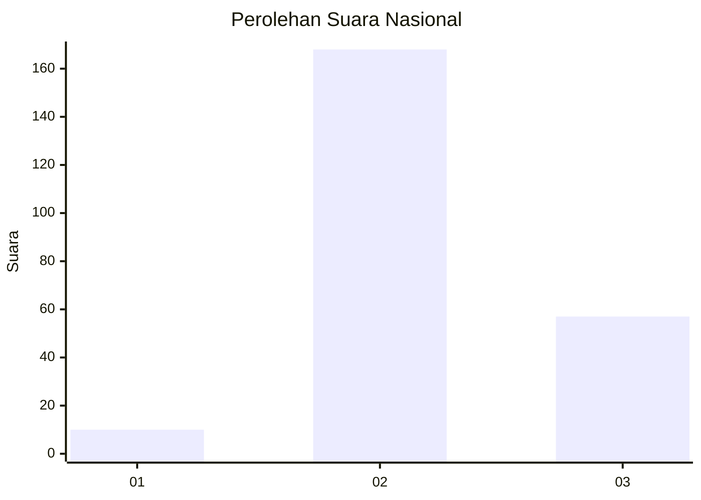
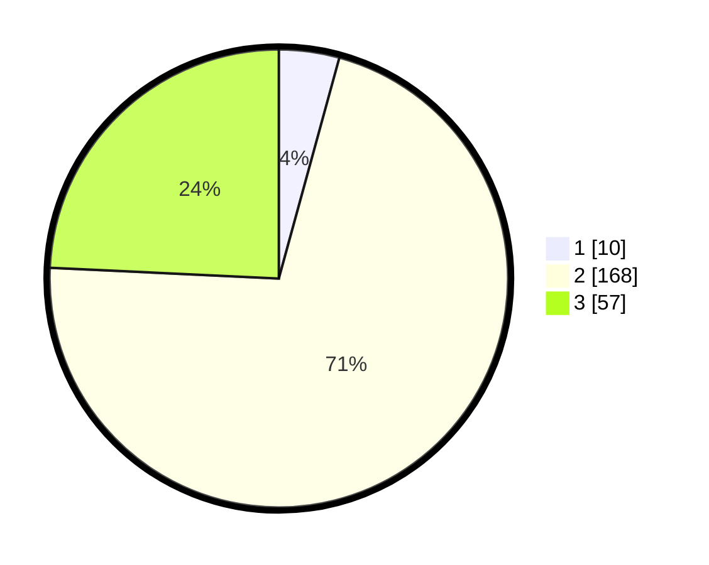

# Hasil

## Grafik

## Tabel

| No. | Nama Paslon    | Suara | Suara (raw) | Persentase |
|:--- |:-------------- | -----:| -----------:| ----------:|
| 1   | ANIES MUHAIMIN | 10    | [10][p-1]   | 4,26       |
| 2   | PRABOWO GIBRAN | 168   | [168][p-2]  | 71,49      |
| 3   | GANJAR MAHFUD  | 57    | [57][p-3]   | 24,26      |

[p-1]: https://github.com/gigit-pemilu/pemilu-2024/blob/main/pilpres/hitung-suara/sub/51-bali/sub/07-karangasem/sub/04-karangasem/sub/1004-karangasem/sub/045-tps/sub/paslon-1.txt
[p-2]: https://github.com/gigit-pemilu/pemilu-2024/blob/main/pilpres/hitung-suara/sub/51-bali/sub/07-karangasem/sub/04-karangasem/sub/1004-karangasem/sub/045-tps/sub/paslon-2.txt
[p-3]: https://github.com/gigit-pemilu/pemilu-2024/blob/main/pilpres/hitung-suara/sub/51-bali/sub/07-karangasem/sub/04-karangasem/sub/1004-karangasem/sub/045-tps/sub/paslon-3.txt

## Foto C Plano

https://sirekap-obj-formc.kpu.go.id/fefc/pemilu/ppwp/51/07/04/10/04/5107041004045-20240217-114706--ef298604-6091-4118-a26a-0ff24a1c9040.jpg

https://sirekap-obj-formc.kpu.go.id/fefc/pemilu/ppwp/51/07/04/10/04/5107041004045-20240217-115706--71aba105-0fd6-41be-97dd-2165e1bc1319.jpg

https://sirekap-obj-formc.kpu.go.id/fefc/pemilu/ppwp/51/07/04/10/04/5107041004045-20240217-115817--f5694727-1ddb-4bb2-b815-93f130451701.jpg

## Metadata

| Key        | Value               |
| ---------- | ------------------- |
| Time Stamp | 2024-02-24 22:31:28 |

