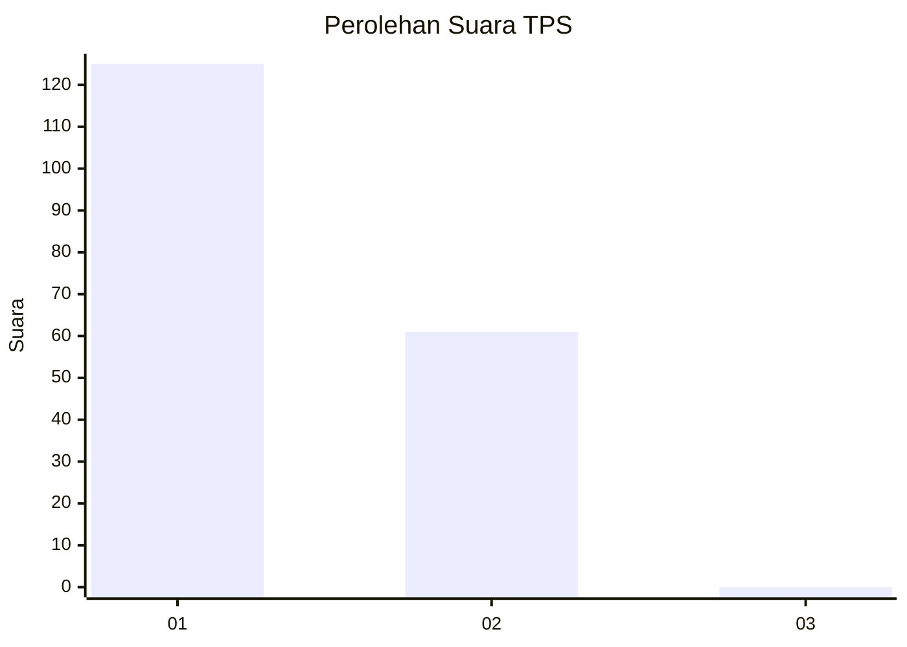
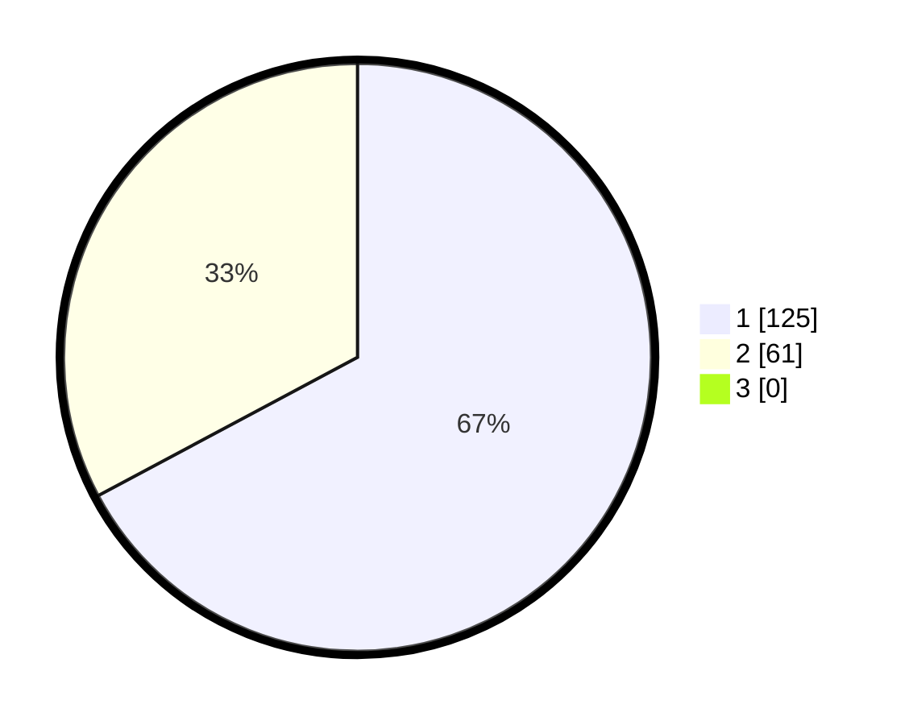

# Hasil

## Grafik

## Tabel

| No. | Nama Paslon    | Suara | Suara (raw) | Persentase |
|:--- |:-------------- | -----:| -----------:| ----------:|
| 1   | ANIES MUHAIMIN | 125   | [125][p-1]  | 67,20      |
| 2   | PRABOWO GIBRAN | 61    | [61][p-2]   | 32,80      |
| 3   | GANJAR MAHFUD  | 0     | [0][p-3]    | 0,00       |

[p-1]: https://github.com/gigit-pemilu/pemilu-2024-51-bali/blob/main/pilpres/hitung-suara/sub/51-bali/sub/07-karangasem/sub/04-karangasem/sub/1004-karangasem/sub/048-tps/sub/paslon-1.txt
[p-2]: https://github.com/gigit-pemilu/pemilu-2024-51-bali/blob/main/pilpres/hitung-suara/sub/51-bali/sub/07-karangasem/sub/04-karangasem/sub/1004-karangasem/sub/048-tps/sub/paslon-2.txt
[p-3]: https://github.com/gigit-pemilu/pemilu-2024-51-bali/blob/main/pilpres/hitung-suara/sub/51-bali/sub/07-karangasem/sub/04-karangasem/sub/1004-karangasem/sub/048-tps/sub/paslon-3.txt

## Foto C Plano

https://sirekap-obj-formc.kpu.go.id/7f6d/pemilu/ppwp/51/07/04/10/04/5107041004048-20240215-004922--e9433453-3550-426d-86d1-3fcb201f88d9.jpg

https://sirekap-obj-formc.kpu.go.id/7f6d/pemilu/ppwp/51/07/04/10/04/5107041004048-20240215-004614--b838f07c-5af5-46e7-9416-98ab8be8238b.jpg

https://sirekap-obj-formc.kpu.go.id/7f6d/pemilu/ppwp/51/07/04/10/04/5107041004048-20240215-004713--730d476f-f365-46c7-8d27-8bc2084e166e.jpg

## Metadata

| Key        | Value               |
| ---------- | ------------------- |
| Time Stamp | 2024-02-19 06:16:00 |

