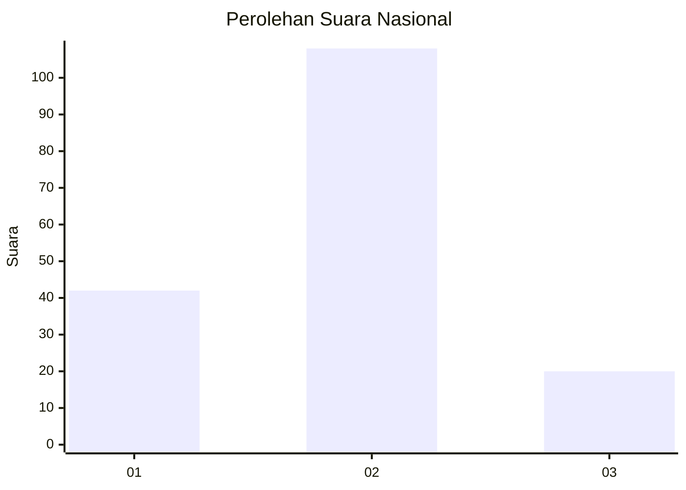
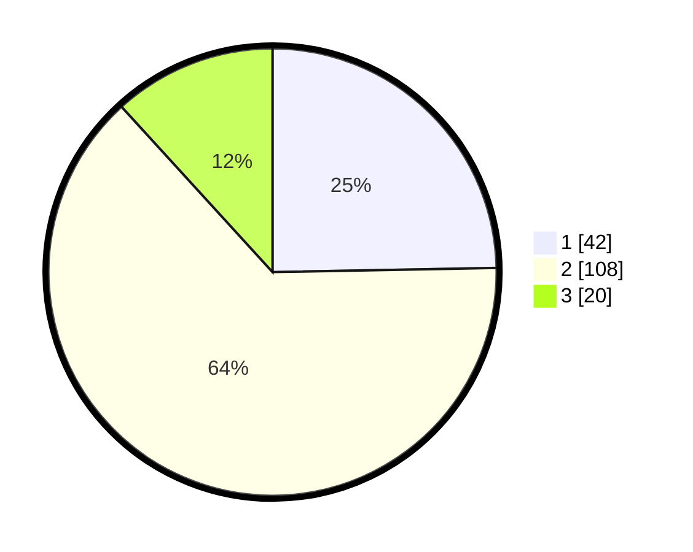

# Hasil

## Grafik

## Tabel

| No. | Nama Paslon    | Suara | Suara (raw) | Persentase |
|:--- |:-------------- | -----:| -----------:| ----------:|
| 1   | ANIES MUHAIMIN | 42    | [42][p-1]   | 24,71      |
| 2   | PRABOWO GIBRAN | 108   | [108][p-2]  | 63,53      |
| 3   | GANJAR MAHFUD  | 20    | [20][p-3]   | 11,76      |

[p-1]: https://github.com/gigit-pemilu/pemilu-2024/blob/main/pilpres/hitung-suara/sub/51-bali/sub/07-karangasem/sub/04-karangasem/sub/1004-karangasem/sub/058-tps/sub/paslon-1.txt
[p-2]: https://github.com/gigit-pemilu/pemilu-2024/blob/main/pilpres/hitung-suara/sub/51-bali/sub/07-karangasem/sub/04-karangasem/sub/1004-karangasem/sub/058-tps/sub/paslon-2.txt
[p-3]: https://github.com/gigit-pemilu/pemilu-2024/blob/main/pilpres/hitung-suara/sub/51-bali/sub/07-karangasem/sub/04-karangasem/sub/1004-karangasem/sub/058-tps/sub/paslon-3.txt

## Foto C Plano

https://sirekap-obj-formc.kpu.go.id/601b/pemilu/ppwp/51/07/04/10/04/5107041004058-20240217-112244--68c13190-ac8a-44f1-8225-9fb46476810d.jpg

https://sirekap-obj-formc.kpu.go.id/601b/pemilu/ppwp/51/07/04/10/04/5107041004058-20240214-190013--ee7883a2-38e2-4c51-8503-9e889d7d32bf.jpg

https://sirekap-obj-formc.kpu.go.id/601b/pemilu/ppwp/51/07/04/10/04/5107041004058-20240214-190019--adc7bf88-0840-4311-85ce-f30cdd643629.jpg

## Metadata

| Key        | Value               |
| ---------- | ------------------- |
| Time Stamp | 2024-02-17 11:30:03 |

## DATA PEMILIH TETAP

Jumlah pemilih dalam DPT: **186**.
 * L: **92**.
 * P: **94**.

## DATA PENGGUNA HAK PILIH

Jumlah pengguna hak pilih dalam DPT: **164**.
 * L: **83**.
 * P: **81**.

Jumlah pengguna hak pilih dalam DPTb: **0**.
 * L: **0**.
 * P: **0**.

Jumlah pengguna hak pilih dalam DPK: **7**.
 * L: **1**.
 * P: **6**.

Jumlah pengguna hak pilih: **171**.
 * L: **84**.
 * P: **87**.

## JUMLAH SUARA SAH DAN TIDAK SAH

JUMLAH SELURUH SUARA SAH: **170**.

JUMLAH SUARA TIDAK SAH: **1**.

JUMLAH SELURUH SUARA SAH DAN SUARA TIDAK SAH: **171**.

