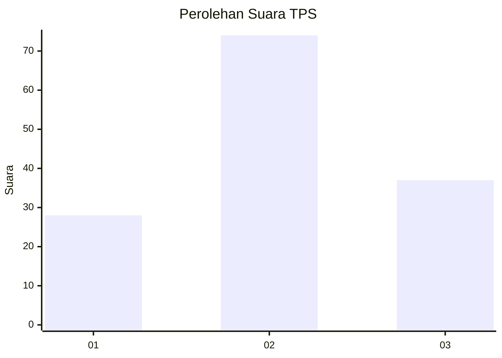
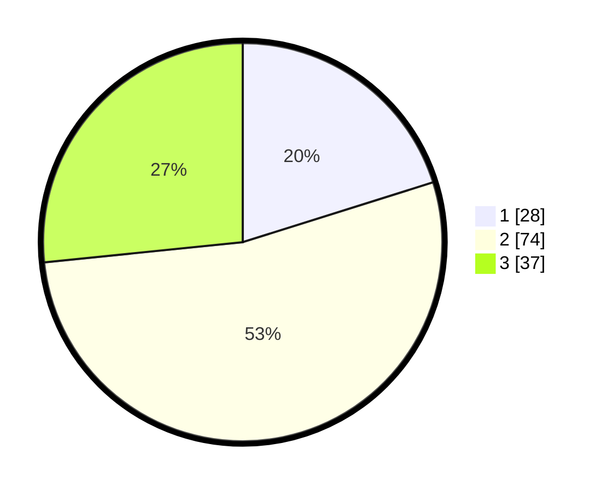

# Hasil

## Grafik

## Tabel

| No. | Nama Paslon    | Suara | Suara (raw) | Persentase |
|:--- |:-------------- | -----:| -----------:| ----------:|
| 1   | ANIES MUHAIMIN | 28    | [28][p-1]   | 20,14      |
| 2   | PRABOWO GIBRAN | 74    | [74][p-2]   | 53,24      |
| 3   | GANJAR MAHFUD  | 37    | [37][p-3]   | 26,62      |

[p-1]: https://github.com/gigit-pemilu/pemilu-2024-51-bali/blob/main/pilpres/hitung-suara/sub/51-bali/sub/07-karangasem/sub/04-karangasem/sub/1004-karangasem/sub/061-tps/sub/paslon-1.txt
[p-2]: https://github.com/gigit-pemilu/pemilu-2024-51-bali/blob/main/pilpres/hitung-suara/sub/51-bali/sub/07-karangasem/sub/04-karangasem/sub/1004-karangasem/sub/061-tps/sub/paslon-2.txt
[p-3]: https://github.com/gigit-pemilu/pemilu-2024-51-bali/blob/main/pilpres/hitung-suara/sub/51-bali/sub/07-karangasem/sub/04-karangasem/sub/1004-karangasem/sub/061-tps/sub/paslon-3.txt

## Foto C Plano

https://sirekap-obj-formc.kpu.go.id/b8d2/pemilu/ppwp/51/07/04/10/04/5107041004061-20240214-214220--c33e7ffd-96e8-475d-8ba3-7c871ea9df4b.jpg

https://sirekap-obj-formc.kpu.go.id/b8d2/pemilu/ppwp/51/07/04/10/04/5107041004061-20240214-214403--cca6c68d-1115-4ea3-8dfe-ac87fd62528b.jpg

https://sirekap-obj-formc.kpu.go.id/b8d2/pemilu/ppwp/51/07/04/10/04/5107041004061-20240214-214540--552e6b90-30cf-4ad5-b299-fb59a424f7c5.jpg

## Metadata

| Key        | Value               |
| ---------- | ------------------- |
| Time Stamp | 2024-02-16 06:30:27 |

