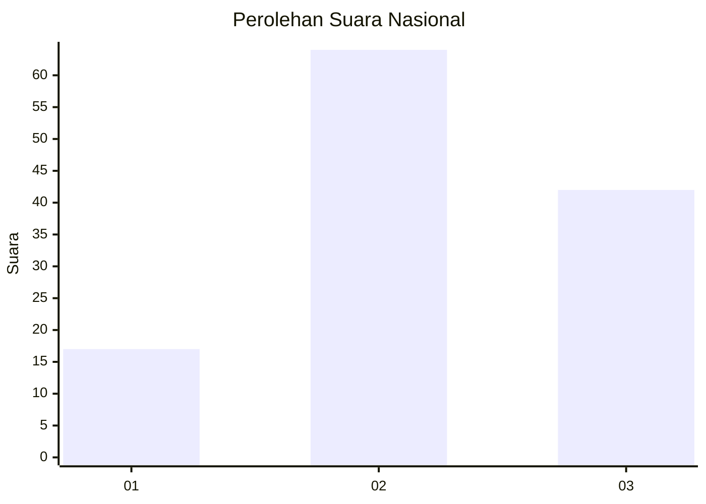
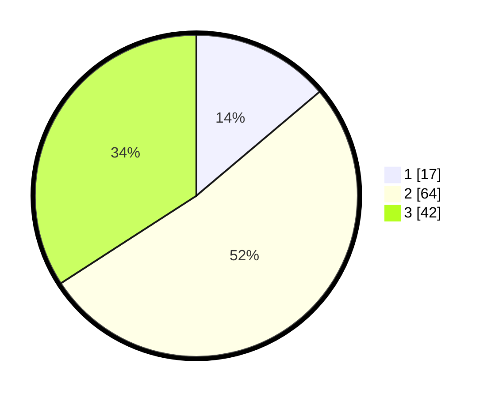

# Hasil

## Grafik

## Tabel

| No. | Nama Paslon    | Suara | Suara (raw) | Persentase |
|:--- |:-------------- | -----:| -----------:| ----------:|
| 1   | ANIES MUHAIMIN | 17    | [17][p-1]   | 13,82      |
| 2   | PRABOWO GIBRAN | 64    | [64][p-2]   | 52,03      |
| 3   | GANJAR MAHFUD  | 42    | [42][p-3]   | 34,15      |

[p-1]: https://github.com/gigit-pemilu/pemilu-2024/blob/main/pilpres/hitung-suara/sub/51-bali/sub/07-karangasem/sub/04-karangasem/sub/1004-karangasem/sub/062-tps/sub/paslon-1.txt
[p-2]: https://github.com/gigit-pemilu/pemilu-2024/blob/main/pilpres/hitung-suara/sub/51-bali/sub/07-karangasem/sub/04-karangasem/sub/1004-karangasem/sub/062-tps/sub/paslon-2.txt
[p-3]: https://github.com/gigit-pemilu/pemilu-2024/blob/main/pilpres/hitung-suara/sub/51-bali/sub/07-karangasem/sub/04-karangasem/sub/1004-karangasem/sub/062-tps/sub/paslon-3.txt

## Foto C Plano

https://sirekap-obj-formc.kpu.go.id/3f9b/pemilu/ppwp/51/07/04/10/04/5107041004062-20240218-163831--f5e54b08-c26d-4fa6-8edd-55947753582b.jpg

https://sirekap-obj-formc.kpu.go.id/3f9b/pemilu/ppwp/51/07/04/10/04/5107041004062-20240218-185542--416530ae-b0be-46dd-a5c8-c3412d34ba70.jpg

https://sirekap-obj-formc.kpu.go.id/3f9b/pemilu/ppwp/51/07/04/10/04/5107041004062-20240218-185753--ccbcccef-10a4-4ea1-b7f1-72286aacd2d2.jpg

## Metadata

| Key        | Value               |
| ---------- | ------------------- |
| Time Stamp | 2024-02-25 09:00:00 |

## DATA PEMILIH TETAP

Jumlah pemilih dalam DPT: **151**.
 * L: **75**.
 * P: **76**.

## DATA PENGGUNA HAK PILIH

Jumlah pengguna hak pilih dalam DPT: **124**.
 * L: **56**.
 * P: **66**.

Jumlah pengguna hak pilih dalam DPTb: **0**.
 * L: **0**.
 * P: **0**.

Jumlah pengguna hak pilih dalam DPK: **0**.
 * L: **0**.
 * P: **0**.

Jumlah pengguna hak pilih: **124**.
 * L: **56**.
 * P: **66**.

## JUMLAH SUARA SAH DAN TIDAK SAH

JUMLAH SELURUH SUARA SAH: **123**.

JUMLAH SUARA TIDAK SAH: **1**.

JUMLAH SELURUH SUARA SAH DAN SUARA TIDAK SAH: **124**.

