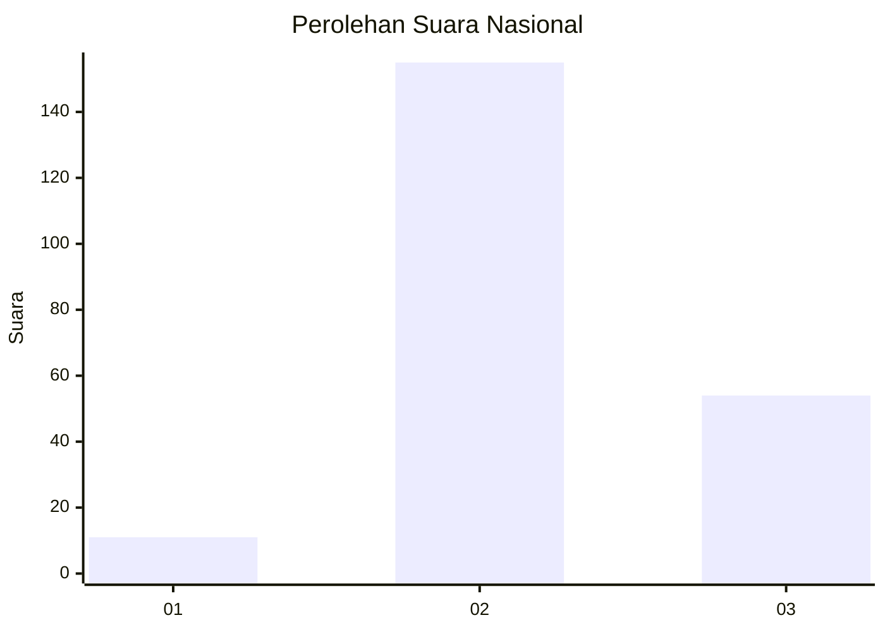
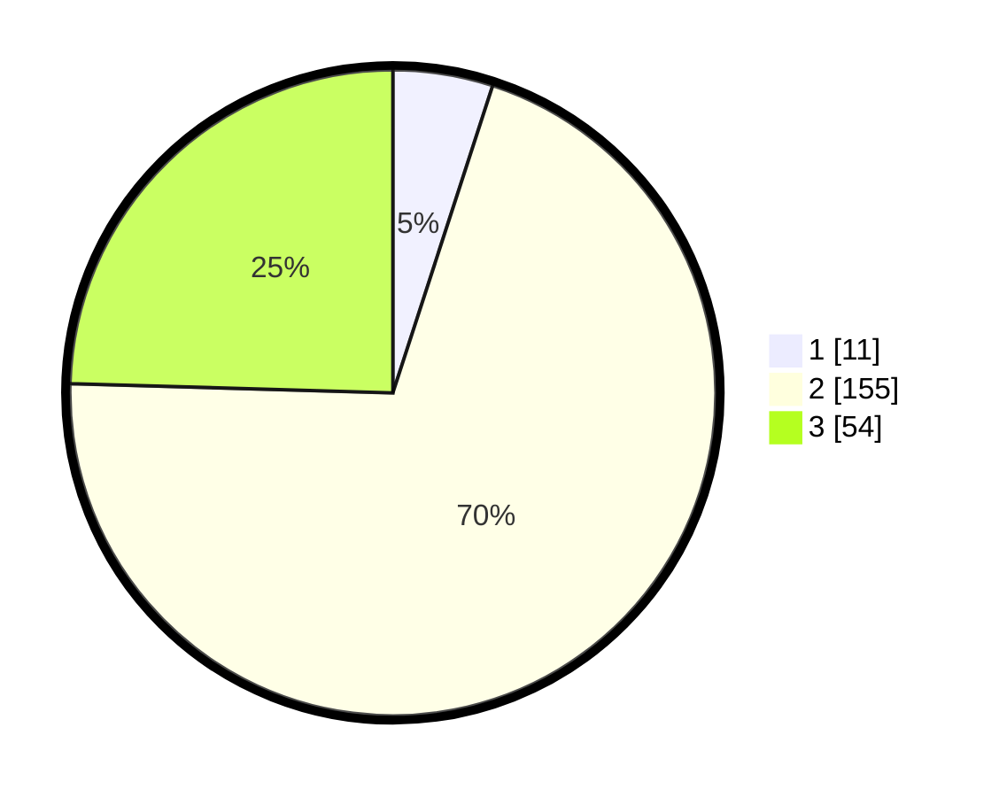

# Hasil

## Grafik

## Tabel

| No. | Nama Paslon    | Suara | Suara (raw) | Persentase |
|:--- |:-------------- | -----:| -----------:| ----------:|
| 1   | ANIES MUHAIMIN | 11    | [11][p-1]   | 5,00       |
| 2   | PRABOWO GIBRAN | 155   | [155][p-2]  | 70,45      |
| 3   | GANJAR MAHFUD  | 54    | [54][p-3]   | 24,55      |

[p-1]: https://github.com/gigit-pemilu/pemilu-2024/blob/main/pilpres/hitung-suara/sub/51-bali/sub/07-karangasem/sub/04-karangasem/sub/1004-karangasem/sub/066-tps/sub/paslon-1.txt
[p-2]: https://github.com/gigit-pemilu/pemilu-2024/blob/main/pilpres/hitung-suara/sub/51-bali/sub/07-karangasem/sub/04-karangasem/sub/1004-karangasem/sub/066-tps/sub/paslon-2.txt
[p-3]: https://github.com/gigit-pemilu/pemilu-2024/blob/main/pilpres/hitung-suara/sub/51-bali/sub/07-karangasem/sub/04-karangasem/sub/1004-karangasem/sub/066-tps/sub/paslon-3.txt

## Foto C Plano

https://sirekap-obj-formc.kpu.go.id/5636/pemilu/ppwp/51/07/04/10/04/5107041004066-20240214-214404--86ca44a4-f3cb-45b3-b768-ef04ba485f3c.jpg

https://sirekap-obj-formc.kpu.go.id/5636/pemilu/ppwp/51/07/04/10/04/5107041004066-20240214-214451--5ad2c2c6-df29-4a8b-978f-6088cd9c1995.jpg

https://sirekap-obj-formc.kpu.go.id/5636/pemilu/ppwp/51/07/04/10/04/5107041004066-20240214-214542--c79e33da-c8f4-4c1c-be1c-a727d319ea37.jpg

## Metadata

| Key        | Value               |
| ---------- | ------------------- |
| Time Stamp | 2024-02-25 14:00:00 |

