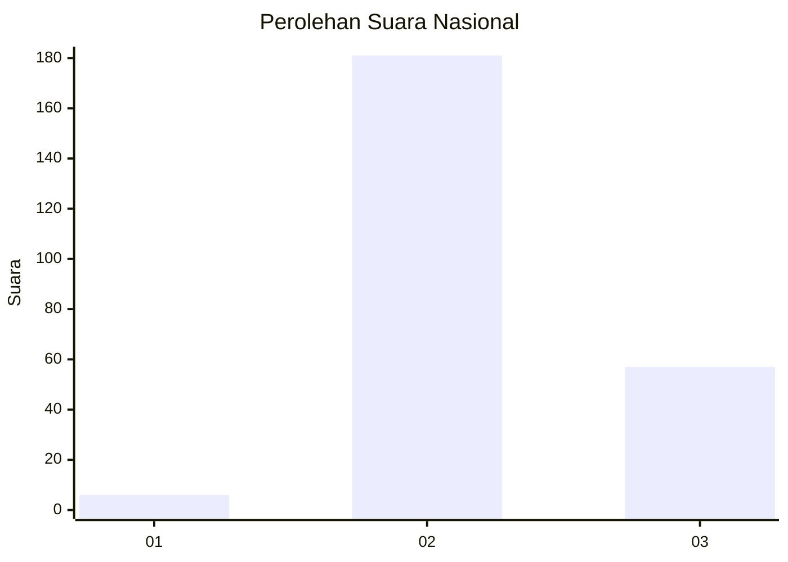
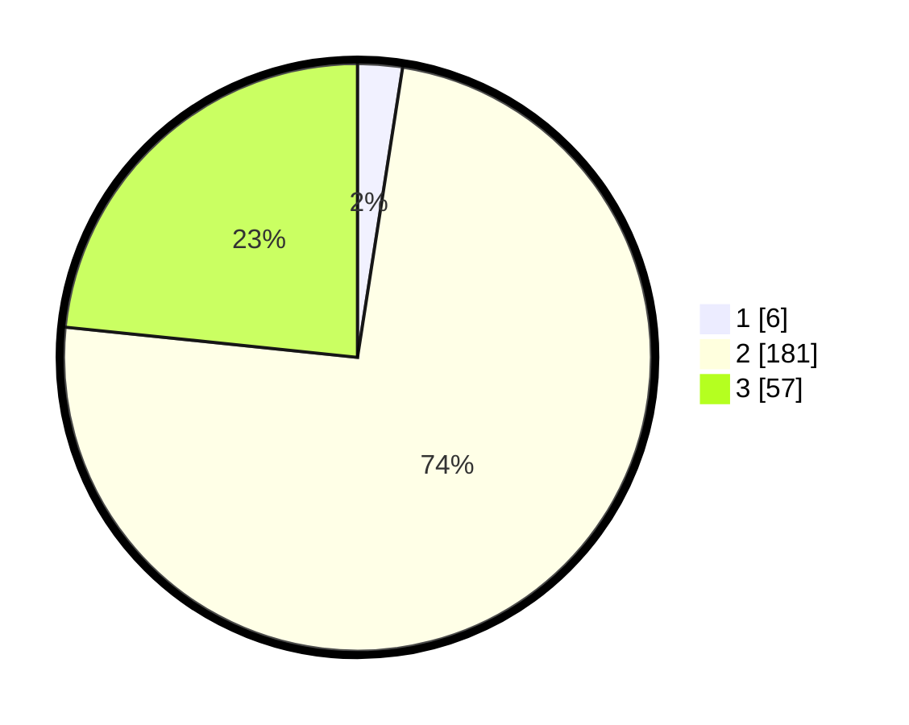

# Hasil

## Grafik

## Tabel

| No. | Nama Paslon    | Suara | Suara (raw) | Persentase |
|:--- |:-------------- | -----:| -----------:| ----------:|
| 1   | ANIES MUHAIMIN | 6     | [6][p-1]    | 2,46       |
| 2   | PRABOWO GIBRAN | 181   | [181][p-2]  | 74,18      |
| 3   | GANJAR MAHFUD  | 57    | [57][p-3]   | 23,36      |

[p-1]: https://github.com/gigit-pemilu/pemilu-2024/blob/main/pilpres/hitung-suara/sub/51-bali/sub/07-karangasem/sub/04-karangasem/sub/1004-karangasem/sub/901-tps/sub/paslon-1.txt
[p-2]: https://github.com/gigit-pemilu/pemilu-2024/blob/main/pilpres/hitung-suara/sub/51-bali/sub/07-karangasem/sub/04-karangasem/sub/1004-karangasem/sub/901-tps/sub/paslon-2.txt
[p-3]: https://github.com/gigit-pemilu/pemilu-2024/blob/main/pilpres/hitung-suara/sub/51-bali/sub/07-karangasem/sub/04-karangasem/sub/1004-karangasem/sub/901-tps/sub/paslon-3.txt

## Foto C Plano

https://sirekap-obj-formc.kpu.go.id/e107/pemilu/ppwp/51/07/04/10/04/5107041004901-20240215-002806--8ad3c900-b1c2-4780-b474-e6704b3cecb0.jpg

https://sirekap-obj-formc.kpu.go.id/e107/pemilu/ppwp/51/07/04/10/04/5107041004901-20240215-002826--5c129161-833f-4c80-94ef-719a29aa595d.jpg

https://sirekap-obj-formc.kpu.go.id/e107/pemilu/ppwp/51/07/04/10/04/5107041004901-20240215-002850--f6ad1ac0-a542-4aa7-aa00-eeafc74fa758.jpg

## Metadata

| Key        | Value               |
| ---------- | ------------------- |
| Time Stamp | 2024-02-15 15:00:29 |

## DATA PEMILIH TETAP

Jumlah pemilih dalam DPT: **253**.
 * L: **229**.
 * P: **24**.

## DATA PENGGUNA HAK PILIH

Jumlah pengguna hak pilih dalam DPT: **167**.
 * L: **154**.
 * P: **13**.

Jumlah pengguna hak pilih dalam DPTb: **88**.
 * L: **81**.
 * P: **7**.

Jumlah pengguna hak pilih dalam DPK: **0**.
 * L: **0**.
 * P: **0**.

Jumlah pengguna hak pilih: **255**.
 * L: **235**.
 * P: **20**.

## JUMLAH SUARA SAH DAN TIDAK SAH

JUMLAH SELURUH SUARA SAH: **244**.

JUMLAH SUARA TIDAK SAH: **11**.

JUMLAH SELURUH SUARA SAH DAN SUARA TIDAK SAH: **255**.

