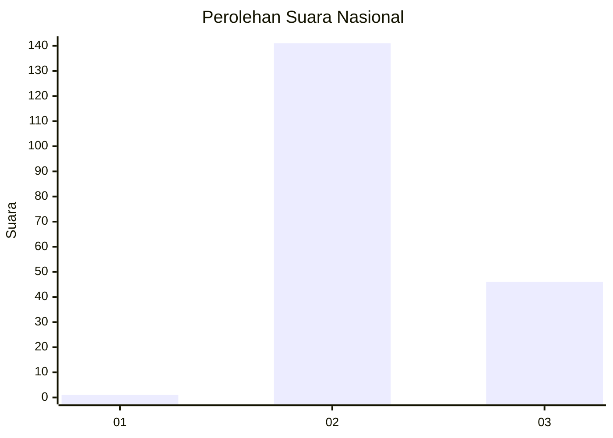
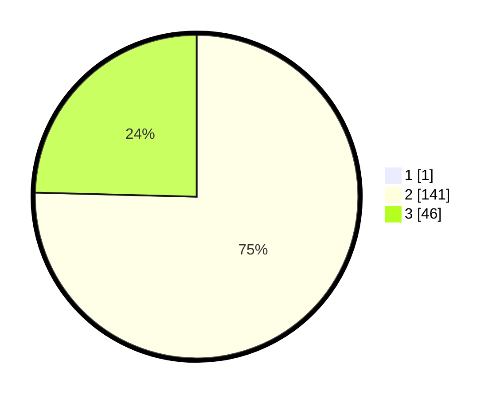

# Hasil

## Grafik

## Tabel

| No. | Nama Paslon    | Suara | Suara (raw) | Persentase |
|:--- |:-------------- | -----:| -----------:| ----------:|
| 1   | ANIES MUHAIMIN | 1     | [1][p-1]    | 0,53       |
| 2   | PRABOWO GIBRAN | 141   | [141][p-2]  | 75,00      |
| 3   | GANJAR MAHFUD  | 46    | [46][p-3]   | 24,47      |

[p-1]: https://github.com/gigit-pemilu/pemilu-2024/blob/main/pilpres/hitung-suara/sub/51-bali/sub/07-karangasem/sub/04-karangasem/sub/2001-bugbug/sub/004-tps/sub/paslon-1.txt
[p-2]: https://github.com/gigit-pemilu/pemilu-2024/blob/main/pilpres/hitung-suara/sub/51-bali/sub/07-karangasem/sub/04-karangasem/sub/2001-bugbug/sub/004-tps/sub/paslon-2.txt
[p-3]: https://github.com/gigit-pemilu/pemilu-2024/blob/main/pilpres/hitung-suara/sub/51-bali/sub/07-karangasem/sub/04-karangasem/sub/2001-bugbug/sub/004-tps/sub/paslon-3.txt

## Foto C Plano

https://sirekap-obj-formc.kpu.go.id/8f81/pemilu/ppwp/51/07/04/20/01/5107042001004-20240214-193830--49f70a14-55a0-4f5e-abd9-56a3ebc690d3.jpg

https://sirekap-obj-formc.kpu.go.id/8f81/pemilu/ppwp/51/07/04/20/01/5107042001004-20240214-193918--f70c2dd4-6db4-48e6-b1c3-75ecee76ea63.jpg

## Metadata

| Key        | Value               |
| ---------- | ------------------- |
| Time Stamp | 2024-02-24 22:31:28 |

