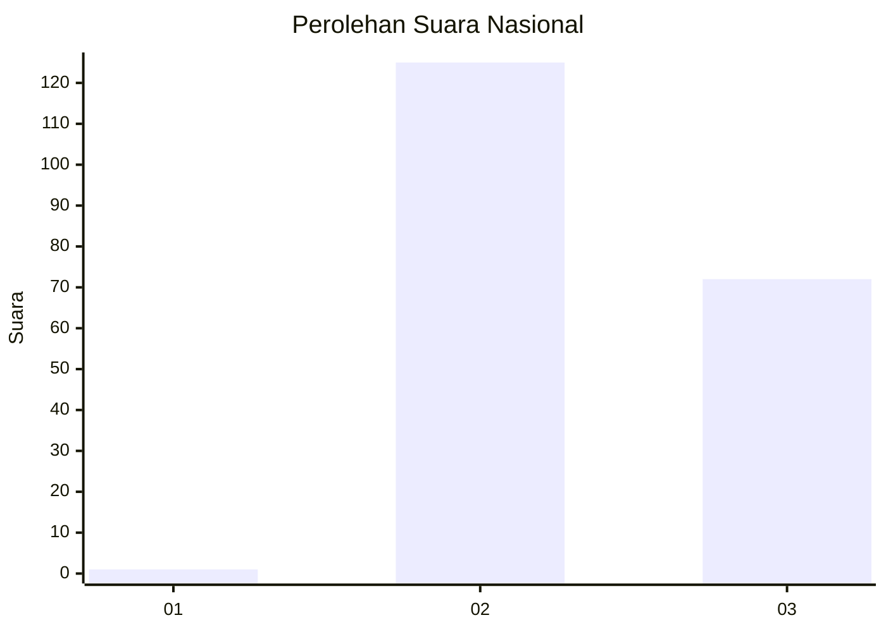
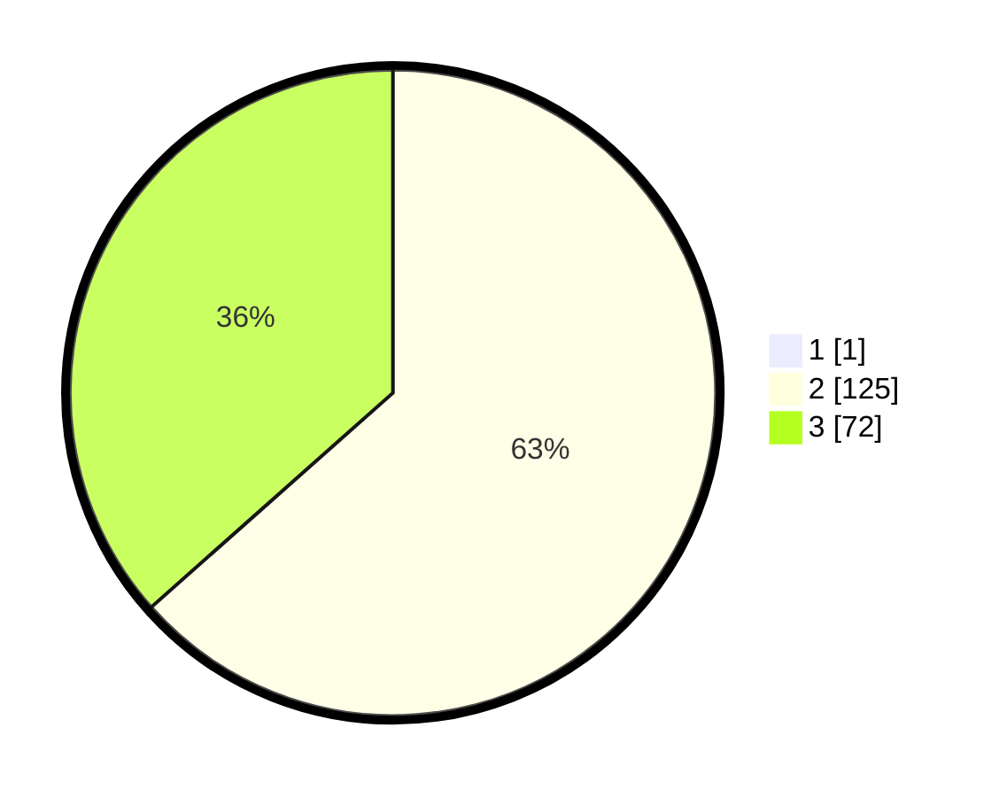

# Hasil

## Grafik

## Tabel

| No. | Nama Paslon    | Suara | Suara (raw) | Persentase |
|:--- |:-------------- | -----:| -----------:| ----------:|
| 1   | ANIES MUHAIMIN | 1     | [1][p-1]    | 0,51       |
| 2   | PRABOWO GIBRAN | 125   | [125][p-2]  | 63,13      |
| 3   | GANJAR MAHFUD  | 72    | [72][p-3]   | 36,36      |

[p-1]: https://github.com/gigit-pemilu/pemilu-2024/blob/main/pilpres/hitung-suara/sub/51-bali/sub/07-karangasem/sub/04-karangasem/sub/2001-bugbug/sub/020-tps/sub/paslon-1.txt
[p-2]: https://github.com/gigit-pemilu/pemilu-2024/blob/main/pilpres/hitung-suara/sub/51-bali/sub/07-karangasem/sub/04-karangasem/sub/2001-bugbug/sub/020-tps/sub/paslon-2.txt
[p-3]: https://github.com/gigit-pemilu/pemilu-2024/blob/main/pilpres/hitung-suara/sub/51-bali/sub/07-karangasem/sub/04-karangasem/sub/2001-bugbug/sub/020-tps/sub/paslon-3.txt

## Foto C Plano

https://sirekap-obj-formc.kpu.go.id/09ea/pemilu/ppwp/51/07/04/20/01/5107042001020-20240214-155505--e371cd12-aa6f-49c0-aec9-94258cacd57d.jpg

https://sirekap-obj-formc.kpu.go.id/09ea/pemilu/ppwp/51/07/04/20/01/5107042001020-20240214-155536--3afaa38f-1fce-4fb6-a0b5-8c476f713757.jpg

https://sirekap-obj-formc.kpu.go.id/09ea/pemilu/ppwp/51/07/04/20/01/5107042001020-20240214-155559--ba75e20f-e4fa-4105-9e46-a6d5f3a03570.jpg

## Metadata

| Key        | Value               |
| ---------- | ------------------- |
| Time Stamp | 2024-02-24 22:31:28 |

