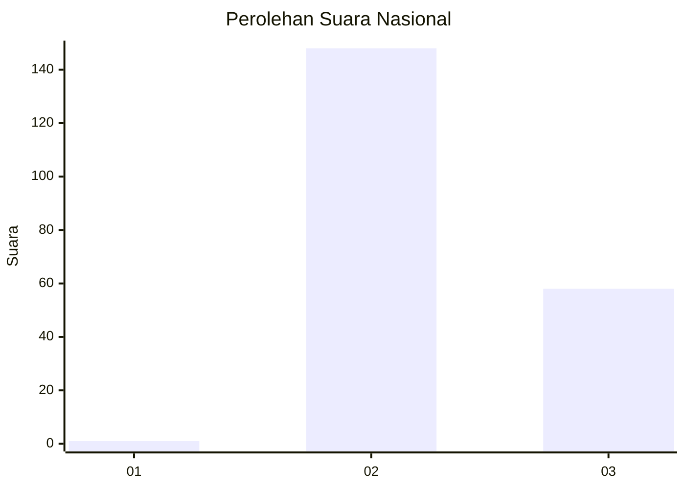
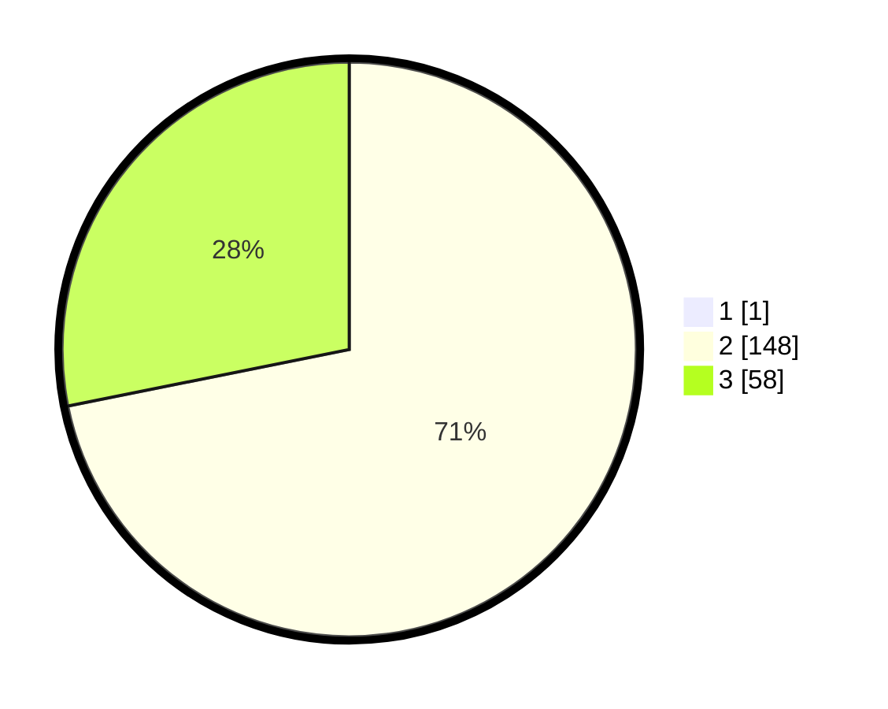

# Hasil

## Grafik

## Tabel

| No. | Nama Paslon    | Suara | Suara (raw) | Persentase |
|:--- |:-------------- | -----:| -----------:| ----------:|
| 1   | ANIES MUHAIMIN | 1     | [1][p-1]    | 0,48       |
| 2   | PRABOWO GIBRAN | 148   | [148][p-2]  | 71,50      |
| 3   | GANJAR MAHFUD  | 58    | [58][p-3]   | 28,02      |

[p-1]: https://github.com/gigit-pemilu/pemilu-2024/blob/main/pilpres/hitung-suara/sub/51-bali/sub/07-karangasem/sub/04-karangasem/sub/2001-bugbug/sub/026-tps/sub/paslon-1.txt
[p-2]: https://github.com/gigit-pemilu/pemilu-2024/blob/main/pilpres/hitung-suara/sub/51-bali/sub/07-karangasem/sub/04-karangasem/sub/2001-bugbug/sub/026-tps/sub/paslon-2.txt
[p-3]: https://github.com/gigit-pemilu/pemilu-2024/blob/main/pilpres/hitung-suara/sub/51-bali/sub/07-karangasem/sub/04-karangasem/sub/2001-bugbug/sub/026-tps/sub/paslon-3.txt

## Foto C Plano

https://sirekap-obj-formc.kpu.go.id/2d08/pemilu/ppwp/51/07/04/20/01/5107042001026-20240215-004356--40c6e808-a8ed-4c7b-b6d5-959d902cdb81.jpg

https://sirekap-obj-formc.kpu.go.id/2d08/pemilu/ppwp/51/07/04/20/01/5107042001026-20240215-004406--2841ffbe-f6ad-41c2-87a2-053a37d7e102.jpg

https://sirekap-obj-formc.kpu.go.id/2d08/pemilu/ppwp/51/07/04/20/01/5107042001026-20240215-004415--2b7f63ee-7f68-4d22-9549-77490c2ee9cc.jpg

## Metadata

| Key        | Value               |
| ---------- | ------------------- |
| Time Stamp | 2024-02-19 06:16:00 |

