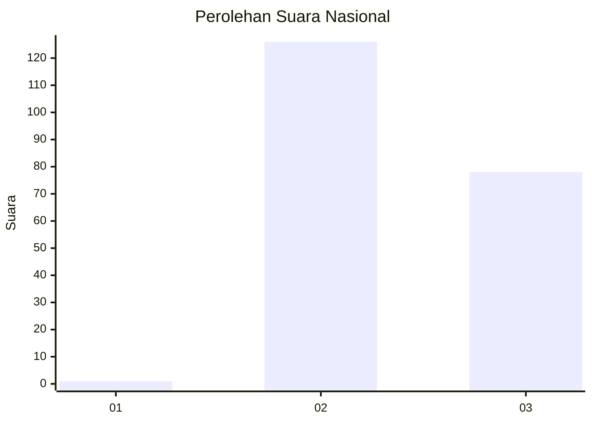
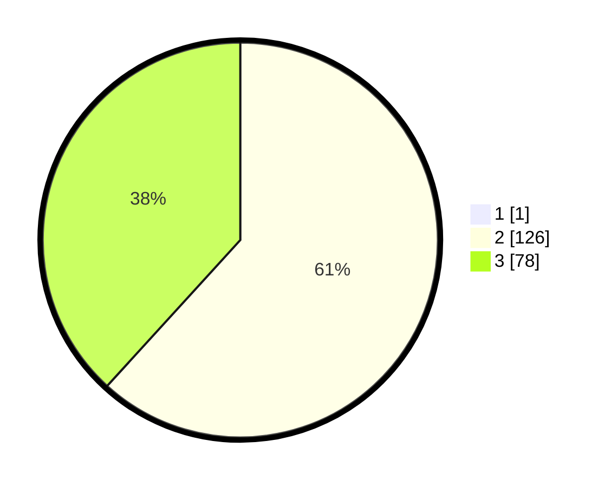

# Hasil

## Grafik

## Tabel

| No. | Nama Paslon    | Suara | Suara (raw) | Persentase |
|:--- |:-------------- | -----:| -----------:| ----------:|
| 1   | ANIES MUHAIMIN | 1     | [1][p-1]    | 0,49       |
| 2   | PRABOWO GIBRAN | 126   | [126][p-2]  | 61,46      |
| 3   | GANJAR MAHFUD  | 78    | [78][p-3]   | 38,05      |

[p-1]: https://github.com/gigit-pemilu/pemilu-2024/blob/main/pilpres/hitung-suara/sub/51-bali/sub/07-karangasem/sub/04-karangasem/sub/2001-bugbug/sub/029-tps/sub/paslon-1.txt
[p-2]: https://github.com/gigit-pemilu/pemilu-2024/blob/main/pilpres/hitung-suara/sub/51-bali/sub/07-karangasem/sub/04-karangasem/sub/2001-bugbug/sub/029-tps/sub/paslon-2.txt
[p-3]: https://github.com/gigit-pemilu/pemilu-2024/blob/main/pilpres/hitung-suara/sub/51-bali/sub/07-karangasem/sub/04-karangasem/sub/2001-bugbug/sub/029-tps/sub/paslon-3.txt

## Foto C Plano

https://sirekap-obj-formc.kpu.go.id/b928/pemilu/ppwp/51/07/04/20/01/5107042001029-20240217-095155--e85d1bab-8f9c-4188-a168-e3a9ad756cdf.jpg

https://sirekap-obj-formc.kpu.go.id/b928/pemilu/ppwp/51/07/04/20/01/5107042001029-20240217-095210--dc05c829-899e-4f50-a783-38878de4e1ea.jpg

https://sirekap-obj-formc.kpu.go.id/b928/pemilu/ppwp/51/07/04/20/01/5107042001029-20240217-095248--296b52d8-14f1-44fb-a5b5-98b536bf0b11.jpg

## Metadata

| Key        | Value               |
| ---------- | ------------------- |
| Time Stamp | 2024-02-19 06:16:00 |

