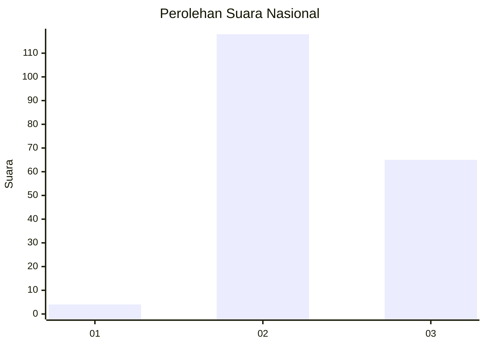
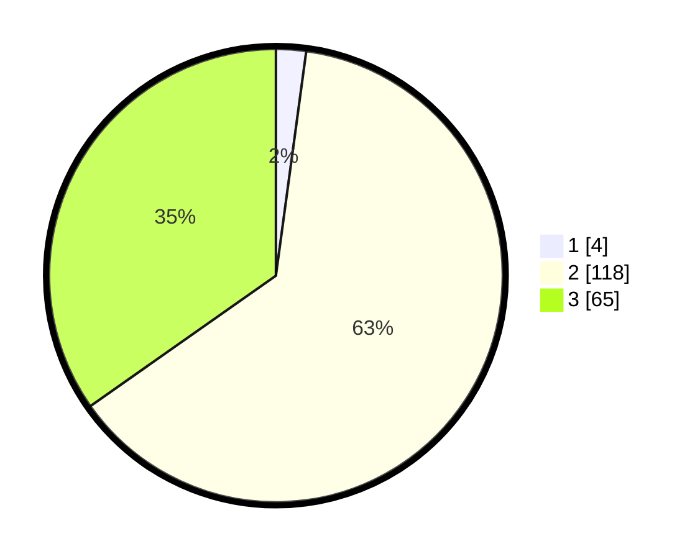

# Hasil

## Grafik

## Tabel

| No. | Nama Paslon    | Suara | Suara (raw) | Persentase |
|:--- |:-------------- | -----:| -----------:| ----------:|
| 1   | ANIES MUHAIMIN | 4     | [4][p-1]    | 2,14       |
| 2   | PRABOWO GIBRAN | 118   | [118][p-2]  | 63,10      |
| 3   | GANJAR MAHFUD  | 65    | [65][p-3]   | 34,76      |

[p-1]: https://github.com/gigit-pemilu/pemilu-2024/blob/main/pilpres/hitung-suara/sub/51-bali/sub/07-karangasem/sub/04-karangasem/sub/2005-tumbu/sub/005-tps/sub/paslon-1.txt
[p-2]: https://github.com/gigit-pemilu/pemilu-2024/blob/main/pilpres/hitung-suara/sub/51-bali/sub/07-karangasem/sub/04-karangasem/sub/2005-tumbu/sub/005-tps/sub/paslon-2.txt
[p-3]: https://github.com/gigit-pemilu/pemilu-2024/blob/main/pilpres/hitung-suara/sub/51-bali/sub/07-karangasem/sub/04-karangasem/sub/2005-tumbu/sub/005-tps/sub/paslon-3.txt

## Foto C Plano

https://sirekap-obj-formc.kpu.go.id/2028/pemilu/ppwp/51/07/04/20/05/5107042005005-20240214-133419--ac12366b-c933-450d-a8a0-c8710409b19b.jpg

https://sirekap-obj-formc.kpu.go.id/2028/pemilu/ppwp/51/07/04/20/05/5107042005005-20240214-133019--9b35d0b8-2760-4ecd-af38-988c9634c404.jpg

## Metadata

| Key        | Value               |
| ---------- | ------------------- |
| Time Stamp | 2024-02-24 22:31:28 |

