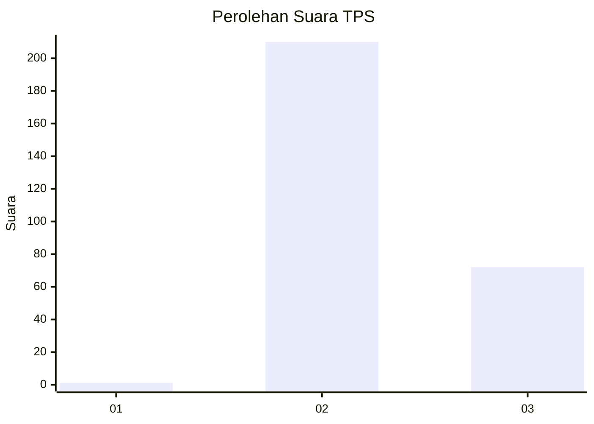
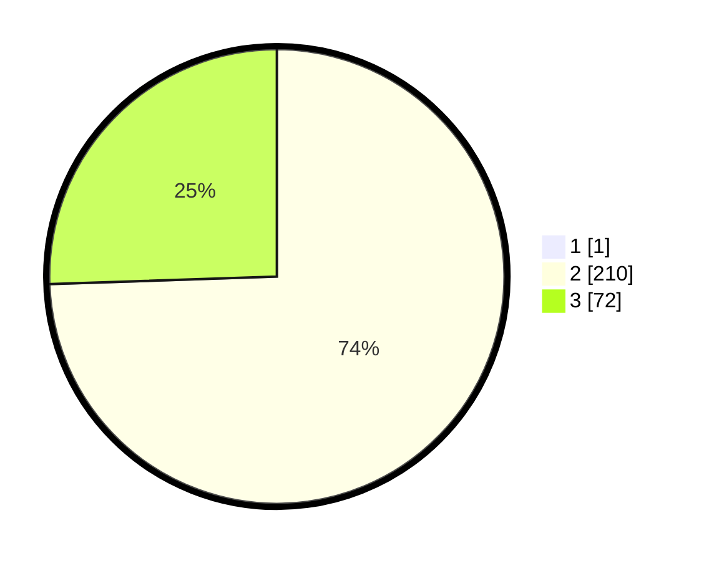

# Hasil

## Grafik

## Tabel

| No. | Nama Paslon    | Suara | Suara (raw) | Persentase |
|:--- |:-------------- | -----:| -----------:| ----------:|
| 1   | ANIES MUHAIMIN | 1     | [1][p-1]    | 0,35       |
| 2   | PRABOWO GIBRAN | 210   | [210][p-2]  | 74,20      |
| 3   | GANJAR MAHFUD  | 72    | [72][p-3]   | 25,44      |

[p-1]: https://github.com/gigit-pemilu/pemilu-2024-51-bali/blob/main/pilpres/hitung-suara/sub/51-bali/sub/07-karangasem/sub/04-karangasem/sub/2005-tumbu/sub/010-tps/sub/paslon-1.txt
[p-2]: https://github.com/gigit-pemilu/pemilu-2024-51-bali/blob/main/pilpres/hitung-suara/sub/51-bali/sub/07-karangasem/sub/04-karangasem/sub/2005-tumbu/sub/010-tps/sub/paslon-2.txt
[p-3]: https://github.com/gigit-pemilu/pemilu-2024-51-bali/blob/main/pilpres/hitung-suara/sub/51-bali/sub/07-karangasem/sub/04-karangasem/sub/2005-tumbu/sub/010-tps/sub/paslon-3.txt

## Foto C Plano

https://sirekap-obj-formc.kpu.go.id/8d40/pemilu/ppwp/51/07/04/20/05/5107042005010-20240214-190442--7b241e44-fd34-433a-8ee2-491f04f6b428.jpg

https://sirekap-obj-formc.kpu.go.id/8d40/pemilu/ppwp/51/07/04/20/05/5107042005010-20240214-190520--88a9ddd9-d8bf-4bf3-b7ba-866a0d32c19d.jpg

https://sirekap-obj-formc.kpu.go.id/8d40/pemilu/ppwp/51/07/04/20/05/5107042005010-20240214-190614--030b1933-d22c-45b2-83fd-47520d2815a8.jpg

## Metadata

| Key        | Value               |
| ---------- | ------------------- |
| Time Stamp | 2024-02-19 06:16:00 |

