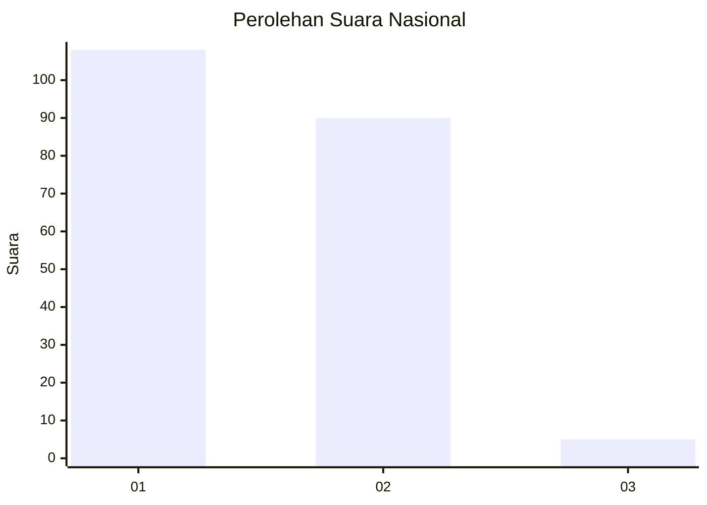
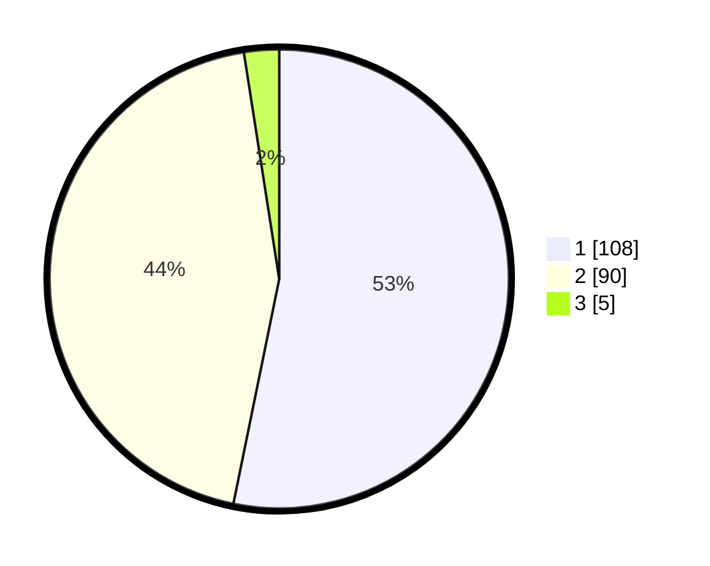

# Hasil

## Grafik

## Tabel

| No. | Nama Paslon    | Suara | Suara (raw) | Persentase |
|:--- |:-------------- | -----:| -----------:| ----------:|
| 1   | ANIES MUHAIMIN | 108   | [108][p-1]  | 53,20      |
| 2   | PRABOWO GIBRAN | 90    | [90][p-2]   | 44,33      |
| 3   | GANJAR MAHFUD  | 5     | [5][p-3]    | 2,46       |

[p-1]: https://github.com/gigit-pemilu/pemilu-2024/blob/main/pilpres/hitung-suara/sub/51-bali/sub/07-karangasem/sub/04-karangasem/sub/2005-tumbu/sub/012-tps/sub/paslon-1.txt
[p-2]: https://github.com/gigit-pemilu/pemilu-2024/blob/main/pilpres/hitung-suara/sub/51-bali/sub/07-karangasem/sub/04-karangasem/sub/2005-tumbu/sub/012-tps/sub/paslon-2.txt
[p-3]: https://github.com/gigit-pemilu/pemilu-2024/blob/main/pilpres/hitung-suara/sub/51-bali/sub/07-karangasem/sub/04-karangasem/sub/2005-tumbu/sub/012-tps/sub/paslon-3.txt

## Foto C Plano

https://sirekap-obj-formc.kpu.go.id/6254/pemilu/ppwp/51/07/04/20/05/5107042005012-20240214-141332--bd468fae-59cd-44ad-b16d-2e4d3824590e.jpg

https://sirekap-obj-formc.kpu.go.id/6254/pemilu/ppwp/51/07/04/20/05/5107042005012-20240214-140935--a3b5749d-dbda-4986-87d8-ab3c4f54014c.jpg

https://sirekap-obj-formc.kpu.go.id/6254/pemilu/ppwp/51/07/04/20/05/5107042005012-20240214-212912--257543e2-198e-460a-8df3-f82f1cdc7492.jpg

## Metadata

| Key        | Value               |
| ---------- | ------------------- |
| Time Stamp | 2024-02-15 00:41:44 |

