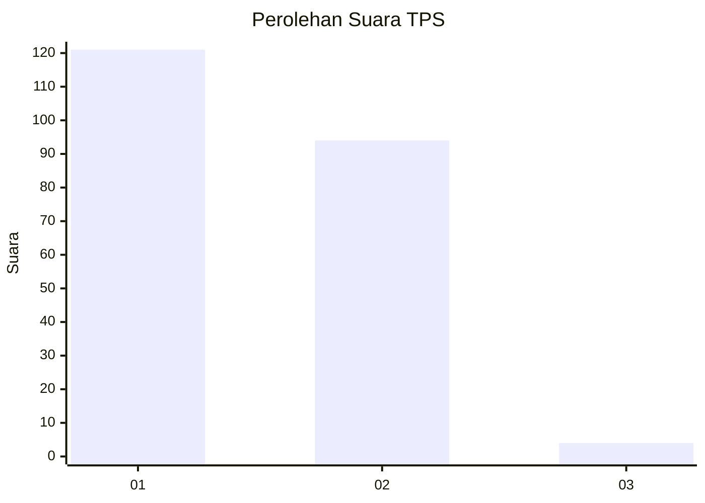
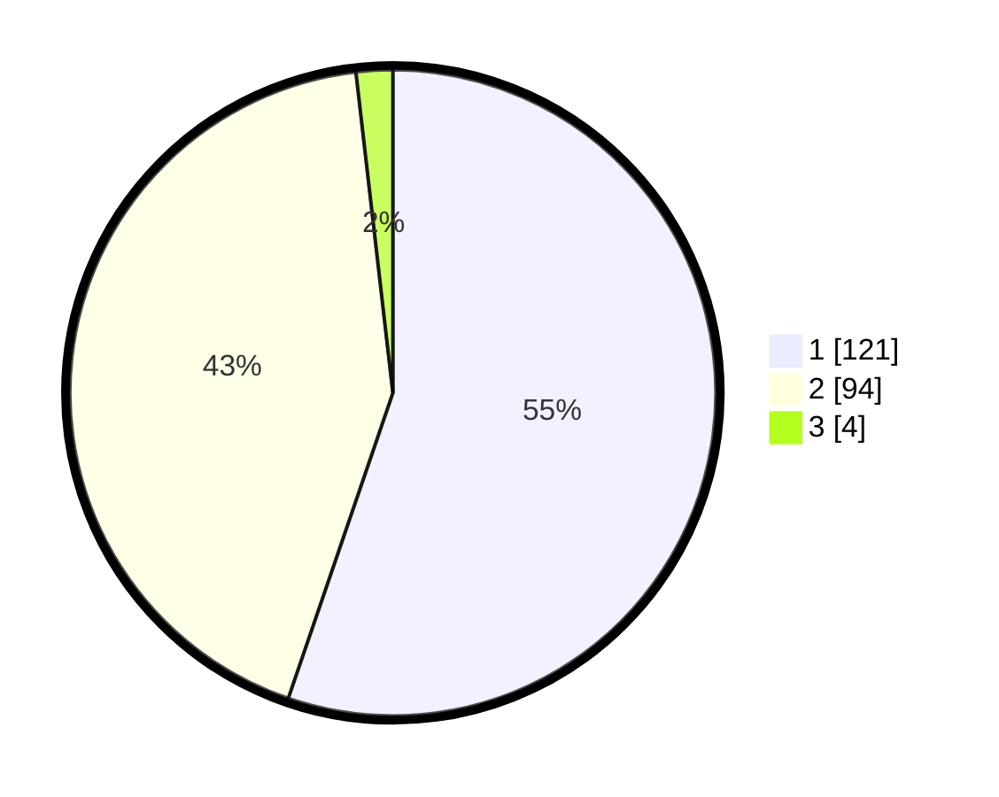

# Hasil

## Grafik

## Tabel

| No. | Nama Paslon    | Suara | Suara (raw) | Persentase |
|:--- |:-------------- | -----:| -----------:| ----------:|
| 1   | ANIES MUHAIMIN | 121   | [121][p-1]  | 55,25      |
| 2   | PRABOWO GIBRAN | 94    | [94][p-2]   | 42,92      |
| 3   | GANJAR MAHFUD  | 4     | [4][p-3]    | 1,83       |

[p-1]: https://github.com/gigit-pemilu/pemilu-2024-51-bali/blob/main/pilpres/hitung-suara/sub/51-bali/sub/07-karangasem/sub/04-karangasem/sub/2005-tumbu/sub/013-tps/sub/paslon-1.txt
[p-2]: https://github.com/gigit-pemilu/pemilu-2024-51-bali/blob/main/pilpres/hitung-suara/sub/51-bali/sub/07-karangasem/sub/04-karangasem/sub/2005-tumbu/sub/013-tps/sub/paslon-2.txt
[p-3]: https://github.com/gigit-pemilu/pemilu-2024-51-bali/blob/main/pilpres/hitung-suara/sub/51-bali/sub/07-karangasem/sub/04-karangasem/sub/2005-tumbu/sub/013-tps/sub/paslon-3.txt

## Foto C Plano

https://sirekap-obj-formc.kpu.go.id/dae1/pemilu/ppwp/51/07/04/20/05/5107042005013-20240215-011339--46536500-8bae-4ebb-9723-4fea1967114c.jpg

https://sirekap-obj-formc.kpu.go.id/dae1/pemilu/ppwp/51/07/04/20/05/5107042005013-20240215-011524--076374b1-666e-45d0-b11d-2e44c02e04b7.jpg

https://sirekap-obj-formc.kpu.go.id/dae1/pemilu/ppwp/51/07/04/20/05/5107042005013-20240215-011528--7c19e3d7-8bcd-43aa-af73-12e0463d8772.jpg

## Metadata

| Key        | Value               |
| ---------- | ------------------- |
| Time Stamp | 2024-02-19 06:16:00 |

